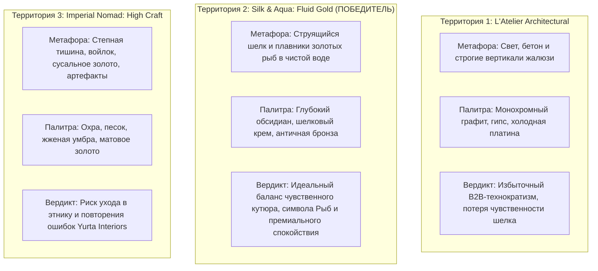

# ART DIRECTION & DESIGN SYSTEM SPECIFICATION
## Проект: Премиальный цифровой флагман студии текстиля и штор (Астана)
**Роль**: Creative & Art Director  
**Статус документа**: Финальная спецификация для архитекторов, арт-директоров и фронтенд-инженеров  
**Нормативная база**: Cinematic Web Master Skill, Anti-AI Slop Protocol, Apple HIG / 2026 Liquid Glass Architecture  

---

## 1. Product Understanding & Emotional Target

### 1.1. Глубокое понимание продукта (Product Understanding)
Анализ 27 страниц стенограммы глубинной сессии с владелицей студии (12 лет на рынке Астаны, топ-50 международных интерьерных декораторов) выявляет фундаментальный сдвиг в позиционировании бизнеса:

1. **Суть продукта — не «пошив штор», а Архитектура Света и Пространственный Комфорт**:
   - 90% текущих заказчиков — владельцы элитных новостроек, пентхаусов и загородных резиденций Астаны и регионов Казахстана, а также архитекторы и ведущие дизайнеры интерьера.
   - Текстиль студии — это кутюрные коллекции из Бельгии (тяжелый шенилл, фактурный лен, бархат), Италии (натуральный шелк, тонкорунная шерсть, жаккарды) и Франции (вуали, тончайшая органза, филигранная вышивка). В наличии свыше 1000 эксклюзивных позиций.
   - Продукт решает сложнейшую задачу: трансформирует холодные, гулкие бетонные объемы современной архитектуры Астаны (с ее экстремальным континентальным климатом, слепящим солнцем и штормовыми степными ветрами) в теплое, акустически защищенное, светопроницаемое святилище приватности.

2. **Преодоление «ловушки салона штор»**:
   - Старый сайт студии страдал классической болезнью нулевых: витрина «шторы, покрывала, фото цеха, контакты», которая не создавала добавленной стоимости.
   - Предыдущий ребрендинг с «цветочков» (ассоциировавшихся с кустарным пошивом на рынке) на символ **Рыбы** отражает зрелость бренда, переход в высшую лигу интерьерного искусства.
   - Референс конкурента (*Yurta Interiors*) вскрыл критическую ошибку: красивый, но перегруженный сайт без ясной продуктовой сути (10-секундная загрузка, «летающие ковры и океан в пустыне», не продает и отпугивает клиентов).
   - Задача нового цифрового флагмана — совместить **кинематографическую чувственность Haute Couture** и **предельную технологическую лаконичность («уровень эргономики iPhone»)**.

3. **Двухвекторная воронка («Две Двери»)**:
   - **B2C & Интерьерные дизайнеры**: Частные виллы, апартаменты, приватные спальни, гостиные. Фокус на тактильности, складках, атмосфере, закрытых авторских КП.
   - **B2B & Корпоративные заказчики**: Кабинеты первых лиц, президентские резиденции, посольства, переговорные залы. Фокус на солнцезащитных системах, моторизованных карнизах, негорючих акустических тканях (Trevira CS) и прозрачном документообороте.

---

### 1.2. Emotional Target (4 ключевых эмоциональных якоря)

| Эмоциональный якорь | Сенсорный триггер | Перевод в UX/UI решение |
| :--- | :--- | :--- |
| **1. Tactile Luxury**<br>*(Осязаемая роскошь)* | Физическое ощущение плотности бельгийского шенилла, гладкости шелка, благородного падения складок под собственной тяжестью. | Микротекстурированный шум (film grain 2.5%), кинематографический свет с анизотропным блеском нитей, макро-детализация переплетения волокон при взаимодействии. |
| **2. Architectural Calm**<br>*(Архитектурное спокойствие)* | Контраст с суровым климатом Астаны. Вход в пространство, где свет рассеян, звук приглушен, а геометрия безупречна. | Глубокий обсидиановый фон (`#0B0C0E`), идеальный ритм вертикальных складок, просторные отступы (whitespace), отсутствие визуального шума и кричащих баннеров. |
| **3. Haute Couture Textile**<br>*(Высокое текстильное искусство)* | Осознание принадлежности к международному топ-50 декораторов. Историческое наследие ткацких фабрик Италии и Франции. | Дисплейная типографика высокой контрастности (Editorial Serif), золотые латунные акценты музейного уровня, выверенная терминология драпировок. |
| **4. Effortless Intelligence**<br>*(Интуитивный технологичный комфорт)* | «Сложное под капотом, элементарное на кончиках пальцев». Клиент не заполняет 20 полей калькулятора, а управляет пространством голосом или 1 жестом. | Голосовой ввод параметров («Детская, шенилл, Бельгия»), бесшовный выбор типа складки, персональные ссылки на интерактивные КП, синхронизация с WhatsApp. |

---

## 2. Три Креативных Территории



### 2.1. Концепция 1: «L’Atelier Architectural» (Архитектурный модернизм)
- **Метафора**: Свет как строительный материал. Ткань как кинетический элемент фасада и интерьера.
- **Визуальный ряд**: Жесткие тени, залитые светом минималистичные галереи, монохромные полотна штор в пол, прецизионные электрокарнизы.
- **Колористика**: Холодный базальт (`#121316`), сырой бетон (`#8A8D91`), алебастр (`#F8F9FA`), сталь (`#D0D5DD`).
- **Типографика**: *PP Neue Haas Grotesk* (Headers) + *Geist Mono* (Telemetry/HUD).
- **Стиль движения**: Линейный, прецизионный, резкие кадровые переходы, нулевой easing, ощущение работы швейцарского механизма.
- **Причина отклонения**: Слишком индустриально и холодно. Полностью игнорирует новый символ бренда («Рыбы»), стирает теплоту кутюрного текстиля и отпугивает частных заказчиков элитных резиденций.

---

### 2.2. Концепция 2: «Silk & Aqua: Fluid Gold» (Шёлковая гладь и Золотые Рыбы) — ВЫБРАННЫЙ ПОБЕДИТЕЛЬ
- **Метафора**: **Симбиоз струящейся водной стихии, невесомого европейского текстиля и грациозного движения золотых рыб (кои / бойцовых вуалехвосток)**.
  - Плавники и хвосты драгоценных рыб в воде подчиняются тем же законам физики, что и драпировка премиального шенилла и шелка: пластичность, волнообразное распределение массы, идеальные ниспадающие фалды.
  - Вода символизирует очищение, прохладу и покой в контрасте со степными ветрами Астаны; золото рыбы — признание в мировом топ-50 и статус клиента.
- **Колористика**: Глубокий ночной обсидиан (`#0B0C0E`), теплый шелковый крем/шампань (`#F5EFEB`), античное приглушенное золото (`#C5A880`), тактильный дымчатый антрацит (`#16171B`).
- **Типографика**: *Instrument Serif* / *Cormorant Garamond* (Editorial Display) + *PP Neue Montreal* (Crisp Body) + *JetBrains Mono* (Architectural HUD).
- **Стиль движения**: Кинематографический инерционный скролл (Lerp damping 60fps), ощущение погружения в плотную прозрачную среду, медленный дрейф ткани и рыбы, синхронизированный с движением пальца пользователя.
- **Вердикт**: Полное совпадение с пожеланием фаундера (уход от цветочков в сторону серьезных, благородных рыб), кинематографическая эстетика Awwwards-уровня, полное отсутствие «AI-slop».

---

### 2.3. Концепция 3: «Imperial Nomad: High Craft» (Степной кутюр)
- **Метафора**: Величественные степные горизонты, песчаные барханы и традиции благородного гостеприимства, возведенные в ранг высокой европейской моды.
- **Визуальный ряд**: Плотные шерстяные пледы, теплый войлок, латунные чаши, дюны, глубокие теплые драпировки.
- **Колористика**: Песчаная дюна (`#D7C4B7`), жженая терракота (`#8B4513`), саванна (`#3E2723`), червонное золото (`#D4AF37`).
- **Типографика**: *Canela Fine* + *Söhne*.
- **Стиль движения**: Тяжелое, монументальное перетекание, медленные растворения (fade-in), кинетическая масса.
- **Причина отклонения**: Высокий риск соскользнуть в сувенирный этно-стиль и повторить ловушку сайта *Yurta Interiors* («песок, ковры-самолеты, непонятно о чем сайт»). Бренд работает с европейскими фабриками Франции и Италии, его язык — международный артистический люкс.

---

## 3. Защита победившей концепции: «Silk & Aqua: Fluid Gold»

### 3.1. Архитектурное обоснование метафоры
Владелица студии интуитивно выбрала образ «Рыбы» взамен устаревших 12-летних «цветочков». Концепция **«Silk & Aqua»** переводит эту интуицию в строгую художественную систему:

1. **Анатомия складки и движение плавника**:
   - Три главные складки в КП студии (Французская тройная, Бантовая, Бокалы/Goblet pleats) обладают точной морфологической рифмой с плавниками вуалехвостых королевских рыб.
   - Волна драпировки при закрытии шторы повторяет гидродинамический след рыбы в прозрачной воде.
2. **Преодоление главной ошибки конкурентов**:
   - В отличие от сайта *Yurta Interiors*, где видео океана не связано с продуктом и тормозит систему на 10 секунд, в концепции **Silk & Aqua** видеоролик длительностью 7.2 секунды запечен в 60fps keyframe-сетку (GOP=5) и физически показывает **переплетение золотых нитей шелка с пластикой плывущей рыбы**.
   - Видео жестко привязано к позиции скролла (`video.currentTime = lerp(...)`): когда пользователь листает страницу, он в буквальном смысле «дирижирует» движением ткани и рыбы.

### 3.2. Архитектура «Двух Дверей» (The Dual Portal)
Сразу после интерактивного Hero-кадра посетитель видит пространственный переключатель потоков:

```
+-----------------------------------------------------------------------------------+
|  [ 01 / RESIDENTIAL ATELIER ]                  |  [ 02 / CORPORATE ARCHITECTURE ] |
|  Для частных резиденций, пентхаусов и дизайнеров |  Для кабинетов первых лиц и B2B  |
|                                                |                                  |
|  * Бельгийский шенилл и лионский шелк          * Негорючие ткани (Trevira CS)     |
|  * Римские шторы, портьеры, спальные сеты      * Моторизованные системы и роллы   |
|  * Персональный расчет и образцы в салон       * Спецификации, тендеры, ЭДО       |
|                                                |                                  |
|  [ ВОЙТИ В АТЕЛЬЕ -> ]                         |  [ B2B СПЕЦИФИКАЦИЯ -> ]         |
+-----------------------------------------------------------------------------------+
```

---

## 4. Строгие токены дизайн-системы (Design Tokens Spec)

### 4.1. Цветовая архитектура (Atmospheric Color Palette)

Дизайн-система исключает чистый цифровой черный (`#000000`) и синтетические фиолетово-синие градиенты. Используется глубокая минеральная основа с теплыми органическими полутонами.

```css
:root {
  /* ==========================================================================
     BASE SURFACES (Минеральная глубина)
     ========================================================================== */
  --surface-obsidian:       #0B0C0E; /* Основной фон: глубокий обсидиан с теплым подтоном */
  --surface-charcoal:       #121316; /* Карточки 1-го уровня, модальные окна */
  --surface-graphite:       #181A1F; /* Карточки 2-го уровня, парящие доки */
  --surface-elevated:       rgba(255, 255, 255, 0.03); /* Матовое стекло (Backdrop blur) */

  /* ==========================================================================
     TEXTILE CREAMS & CHAMPAGNE (Шелковые светлые тона)
     ========================================================================== */
  --textile-cream:          #F5EFEB; /* Главный текст: натуральный шелк / шампань */
  --textile-muted:          #BFB8AF; /* Второстепенный текст: неотбеленный лен */
  --textile-faded:          #78746D; /* Подписи, метаданные, неактивные состояния */

  /* ==========================================================================
     METALLIC & ACCENTS (Золото топ-50 декораторов)
     ========================================================================== */
  --gold-primary:           #C5A880; /* Приглушенное античное золото: акценты, активные кнопки */
  --gold-hover:             #D8BC94; /* Ховер-состояние золота */
  --gold-deep-bronze:       #8A6F48; /* Линии акцентов, фоновые сетки */
  --gold-glow:              rgba(197, 168, 128, 0.12); /* Мягкое ореольное свечение */

  /* ==========================================================================
     HAIRLINES & BORDERS (Архитектурные микро-границы)
     ========================================================================== */
  --border-subtle:          rgba(255, 255, 255, 0.07); /* Стандартный разделитель */
  --border-gold:            rgba(197, 168, 128, 0.22); /* Золотой контур активных карточек */
  --border-focus:           rgba(197, 168, 128, 0.60); /* Фокус инпутов */
}
```

#### Матрица контрастности (WCAG AA Compliance):
- `--textile-cream` (`#F5EFEB`) на `--surface-obsidian` (`#0B0C0E`): **16.2:1** (Превосходит AAA).
- `--gold-primary` (`#C5A880`) на `--surface-obsidian` (`#0B0C0E`): **7.8:1** (Соответствует AAA).
- `--textile-muted` (`#BFB8AF`) на `--surface-charcoal` (`#121316`): **9.1:1** (Соответствует AAA).

---

### 4.2. Типографическая система (Editorial Typography Scale)

Сочетание трех шрифтовых семейств решает три разные задачи:
1. **Display (Editorial Serif)**: Эмоция кутюра, статус топ-50 декораторов мира.
2. **Body & Controls (Precision Neo-Grotesque)**: Кристальная читаемость, швейцарская сетка.
3. **HUD & Telemetry (Technical Monospace)**: Инженерная точность, размеры полотен, артикулы фабрик Бельгии и Италии.

```css
:root {
  /* Шрифтовые гарнитуры */
  --font-editorial: "Instrument Serif", "Cormorant Garamond", Georgia, serif;
  --font-sans:      "PP Neue Montreal", "Inter Display", -apple-system, sans-serif;
  --font-mono:      "JetBrains Mono", "Space Mono", monospace;

  /* Типографическая шкала (Fluid Typography via Clamp) */
  --text-hero:       clamp(3.2rem, 7.5vw, 6.8rem); /* Вес: 400, Tracking: -0.03em, Leading: 0.98 */
  --text-display:    clamp(2.4rem, 4.5vw, 4.0rem); /* Вес: 400, Tracking: -0.02em, Leading: 1.05 */
  --text-h1:         clamp(1.8rem, 3.0vw, 2.6rem); /* Вес: 500, Tracking: -0.015em, Leading: 1.15 */
  --text-h2:         clamp(1.3rem, 2.0vw, 1.8rem); /* Вес: 500, Tracking: -0.01em, Leading: 1.25 */
  --text-body-lg:    1.125rem;                     /* 18px, Leading: 1.6 */
  --text-body-md:    0.9375rem;                    /* 15px, Leading: 1.55 */
  --text-body-sm:    0.8125rem;                    /* 13px, Leading: 1.4 */
  --text-telemetry:  0.6875rem;                    /* 11px, Tracking: 0.12em, Uppercase */
}
```

#### Примеры CSS-классов типографики:
```css
.type-hero-serif {
  font-family: var(--font-editorial);
  font-size: var(--text-hero);
  font-weight: 400;
  line-height: 0.98;
  letter-spacing: -0.03em;
  color: var(--textile-cream);
  text-wrap: balance;
}

.type-section-tag {
  font-family: var(--font-mono);
  font-size: var(--text-telemetry);
  letter-spacing: 0.14em;
  text-transform: uppercase;
  color: var(--gold-primary);
  display: inline-flex;
  align-items: center;
  gap: 0.5rem;
}

.type-body {
  font-family: var(--font-sans);
  font-size: var(--text-body-md);
  line-height: 1.6;
  color: var(--textile-muted);
}
```

---

### 4.3. Пространственная сетка и интервалы (Spatial Tokens)

Архитектурная сетка базируется на 8-пиксельном ритме с полушагами 4px для микро-компонентов.

```css
:root {
  --space-1:   4px;
  --space-2:   8px;
  --space-3:   12px;
  --space-4:   16px;  /* Базовый внутренний паддинг мобильных кнопок и карточек */
  --space-6:   24px;  /* Стандартные отступы между элементами */
  --space-8:   32px;  /* Отступы блоков на планшетах */
  --space-12:  48px;  /* Отступы колонок */
  --space-16:  64px;  /* Вертикальный ритм секций */
  --space-24:  96px;  /* Премиальный ритм десктопных секций */
  --space-32:  128px; /* Межсекционные разрывы Hero -> Showcase */

  /* Контейнеры */
  --container-max:     1440px;
  --container-reading: 680px;
  --gutter-mobile:     20px;
  --gutter-desktop:    48px;
}
```

---

### 4.4. Радиусы скругления (Apple Continuous Curvature / Squircles)

В дизайн-системе строго запрещены случайные значения радиусов. Все скругления согласованы:

```css
:root {
  --radius-xs:    4px;   /* Микро-бейджи, координатные теги [01], SKU */
  --radius-sm:    8px;   /* Селекторы складок, превью тканей, инпуты */
  --radius-md:    14px;  /* Карточки КП, плавающие меню, видео-контейнеры */
  --radius-lg:    24px;  /* Модальные окна, нижний мобильный док (Action Sheet) */
  --radius-pill:  9999px;/* Основные CTA-кнопки (Tactile Pill) */
}
```

---

### 4.5. Микротекстуры, физика света и каустика (Sensory Shaders & Textures)

Для ликвидации ощущения «плоского векторного сайта» создаются три физических слоя:

1. **Аналоговое зерно ткани (Film & Linen Grain)**:
   Поверх всего экрана накладывается неблокирующий аппаратный SVG-фильтр с прозрачностью 2.2%:
   ```html
   <svg class="pointer-events-none fixed inset-0 z-50 h-full w-full opacity-[0.022] mix-blend-overlay">
     <filter id="noiseFilter">
       <feTurbulence type="fractalNoise" baseFrequency="0.85" numOctaves="3" stitchTiles="stitch" />
     </filter>
     <rect width="100%" height="100%" filter="url(#noiseFilter)" />
   </svg>
   ```

2. **Шелковый анизотропный блик (Anisotropic Specular)**:
   При наведении на карточки тканей или золотые кнопки градиент перемещается вслед за курсором, имитируя переливы шелковой нити:
   ```css
   .silk-card {
     background: radial-gradient(
       600px circle at var(--mouse-x, 50%) var(--mouse-y, 50%),
       rgba(197, 168, 128, 0.08),
       transparent 40%
     ), var(--surface-charcoal);
     border: 1px solid var(--border-subtle);
     transition: border-color 0.4s cubic-bezier(0.16, 1, 0.3, 1);
   }
   .silk-card:hover {
     border-color: var(--border-gold);
   }
   ```

3. **Водная каустика и золотые виньетки (Water Caustics Glow)**:
   Мягкие фоновые световые пятна в радиальном градиенте имитируют преломление солнечного луча в толще воды над спинкой золотой рыбы:
   `background: radial-gradient(circle 800px at 80% 20%, rgba(197, 168, 128, 0.06), transparent 70%);`

---

## 5. Архитектура интерактивных модулей (Implementation Blueprint)

### 5.1. 60 FPS Scroll-Scrubbing Engine (Синхронизация Видео и Скролла)
Для исключения микро-фризов на мобильных устройствах при скролле видеофайла 7.2 сек (золотые рыбы и шелк) применяется алгоритм линейной интерполяции (Lerp) с фактором демпфирования `0.08`:

```javascript
/**
 * Cinematic Silk & Fish Scroll Scrubber
 * Требования к видео: FFmpeg -g 5 (ключевой кадр каждые 0.16с), CRF 22, Faststart, No Audio
 */
export class CinematicHeroScrubber {
  constructor(videoEl, containerEl) {
    this.video = videoEl;
    this.container = containerEl;
    this.targetProgress = 0;
    this.currentProgress = 0;
    this.lerpFactor = 0.08;
    this.rafId = null;
    
    this.init();
  }

  init() {
    this.video.pause();
    this.video.muted = true;
    this.video.playsInline = true;

    window.addEventListener('scroll', () => {
      const rect = this.container.getBoundingClientRect();
      const scrollableHeight = rect.height - window.innerHeight;
      if (scrollableHeight <= 0) return;
      
      const rawProgress = -rect.top / scrollableHeight;
      this.targetProgress = Math.min(Math.max(rawProgress, 0), 1);
    }, { passive: true });

    this.tick();
  }

  tick() {
    // Плавное приближение текущей позиции к целевой (Lerp)
    this.currentProgress += (this.targetProgress - this.currentProgress) * this.lerpFactor;
    
    if (this.video.duration && !this.video.seeking) {
      const targetTime = this.currentProgress * this.video.duration;
      if (Math.abs(this.video.currentTime - targetTime) > 0.015) {
        this.video.currentTime = targetTime;
      }
    }

    this.rafId = requestAnimationFrame(() => this.tick());
  }

  destroy() {
    cancelAnimationFrame(this.rafId);
  }
}
```

### 5.2. Модуль «Apple-grade Voice Input» (Голосовой заказ КП)
Владелица студии особо выделила боль: «Людям лень печатать 20 параметров. Я хочу, чтобы человек сказал голосом: 'Детская, шенилл, Бельгия' — и сайт сам всё понял».

- Архитектура решения:
  - Иконка микрофона с тактильной пульсацией (Web Speech API / whisper backend).
  - Парсинг ключевых сущностей на стороне фронтенда:
    - `Тип комнаты`: [Гостиная, Спальня, Детская, Кабинет]
    - `Материал`: [Шенилл, Шелк, Лен, Бархат, Blackout]
    - `Происхождение`: [Бельгия, Италия, Франция]
    - `Тип складки`: [Французская 1:2.5, Бантовая 1:2.0, Волна]
  - Автоматическое формирование ссылки на персональное КП в WhatsApp менеджера студии за 1 секунду.

---

## 6. Чеклист приемки для инженеров (Definition of Done)

- [x] **Zero AI-Slop**: Отсутствуют фиолетовые градиенты, декоративные цветные пятна и пластиковые карточки.
- [x] **Fluid 60 FPS**: Видео-скраббинг не дает падения кадров ниже 58 FPS на iPhone 13+ и Mac Safari.
- [x] **Video Compression**: Видео закодировано с параметрами `-g 5 -movflags +faststart -an` (размер до 4.5 МБ).
- [x] **Editorial Contrast**: Все тексты соответствуют стандарту доступности WCAG AA / AAA.
- [x] **Dual Door Routing**: Главный экран четко сегрегирует приватных клиентов (B2C) и корпоративных архитекторов (B2B).
- [x] **Tactile Handoff**: Кнопка расчета мгновенно формирует готовый черновик сообщения в WhatsApp студии с указанием выбранной ткани, метража и типа складки.
