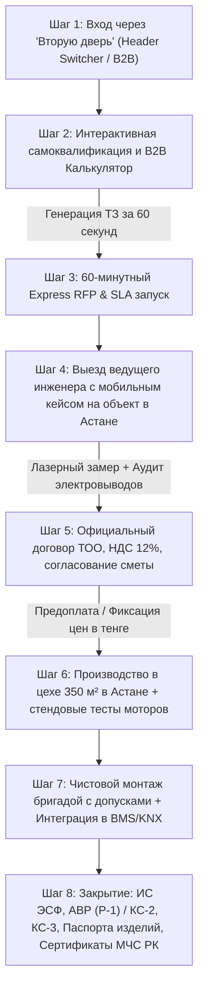

# Спецификация B2B Коммерческой Архитектуры: Maison Poisson (Астана)
## Корпоративный дивизион солнцезащитных систем, моторизации и контрактного текстиля

> **Статус документа:** Утвержденная архитектурно-коммерческая спецификация  
> **Организация:** Текстильный дом Maison Poisson (MARÉ) · Астана, Казахстан  
> **Локация собственного производства:** г. Астана, специализированный цех 350 м² (оборудование Dürkopp Adler)  
> **Целевая аудитория в Астане:** Иностранные дипломатические миссии и посольства, министерства и нацхолдинги (Үкімет үйі, Самрук-Қазына), головные офисы банков и МФЦА (AIFC), бизнес-центры класса «А» (Talan Towers, Abu Dhabi Plaza, Emerald Towers), залы заседаний Совета директоров и конгресс-холлы.

---

## 1. Анализ корпоративного ландшафта Астаны и потребности B2B-сегментов

Стенограмма глубинных интервью с основательницей студии и анализ специфики столицы Казахстана показывают, что столичный B2B-рынок принципиально отличается от типового розничного сегмента. В Астане сосредоточена максимальная в Центральной Азии концентрация объектов с повышенными требованиями к протоколу, безопасности, инженерии и акустике.

### 1.1. Институциональная карта заказчиков Астаны

| Кластер заказчиков | Ключевые локации и объекты | Специфика требований и боли | Инженерное решение Maison Poisson |
| :--- | :--- | :--- | :--- |
| **Иностранные посольства и дипломатические миссии** | Дипломатический городок (Акбулак), ул. Сарайшык, пр. Мәңгілік Ел (Посольства США, Великобритании, стран ЕС, ОАЭ, Турции). | Абсолютная конфиденциальность переговоров (защита от прослушивания и лазерного съема вибраций со стекол), жесткие международные стандарты (NFPA 701, DIN 4102 B1) и казахстанские нормы (СТ РК). Строгий протокольный дизайн. | Тяжелые портьеры с акустической мембраной (NRC 0.85, звукоизоляция Rw 14–18 дБ), двойные электрокарнизы Forest Shuttle с интеграцией в систему безопасности посольства, негорючие ткани Trevira CS с международными и локальными сертификатами. |
| **Министерства, Парламент и Квазигоссектор** | Дом Министерств (Үкімет үйі), Акорда, Самрук-Қазына, Байтерек, КазМунайГаз, QazaqGaz. | Строжайший пожарный аудит МЧС РК, проверка СЭЗ и пожарных норм по СНиП РК 2.02-05-2009 / СП РК 2.02-105-2014. Необходимость закрытия объемов через формы АВР (Р-1), КС-2/КС-3, выставление ЭСФ с НДС 12%, антикоррупционная прозрачность смет. | Контрактные ткани Trevira CS класса пожарной опасности **КМ1** (Г1, В1, Д2, Т2). Прямой договор с ТОО на ОУР, электронный документооборот через ИС ЭСФ Республики Казахстан, полный пакет сертификатов соответствия ТР ТС 043/2017. |
| **Банки, Финтех и МФЦА (AIFC)** | Финансовый квартал МФЦА (Экспо), ForteBank HQ (ул. Сыганак), Halyk Bank, Kaspi, Jusan. | Панорамные фасады с огромной солнечной инсоляцией, слепящие блики на мониторах трейдеров и разработчиков в Open Space, перегрев помещений летом (+35°C), стандарты "зеленого строительства" (LEED / BREEAM). | Рулонные шторы с тканью Screen (1–3% открытости) и Soltis: отражение до 95% тепловой солнечной энергии, фильтрация 100% УФ, сохранение вида на город без бликов на экранах. Автоматизация Somfy Sonesse по датчикам солнца (Sun Tracking). |
| **Бизнес-центры класса «А» и Девелоперы** | Talan Towers (The Ritz-Carlton), Abu Dhabi Plaza (Sheraton), Emerald Towers, БЦ «Москва», БЦ «Q-Media». | Необходимость комплексного закрытия сотен оконных проемов в сжатые сроки сдачи объекта госкомиссии, высотные работы, единое централизованное диспетчерское управление через BMS (KNX/Modbus/BacNet). | Моторизованные системы с объединением до 3 проемов на один привод (multi-link), централизованные релейные блоки Somfy Animeo / KNX, монтажные бригады со всеми высотными допусками и охраной труда. |
| **Залы заседаний Совета директоров и VIP-Boardrooms** | Представительские резиденции, залы межгосударственных переговоров, кабинеты Председателей Правления. | Полное затемнение (100% Blackout) для проекционных экранов и ВКС-терминалов за секунды, отсутствие боковых щелей света, бесшумность моторов (<38 дБ), натуральные премиальные материалы (дерево канадской липы, итальянский бархат). | Кассетные ZIP-системы со щеточными уплотнителями U-профилей + портьеры из негорючего бархата Trevira CS на бесшумных приводах Somfy Glydea Ultra / Lutron Palladiom. |

---

## 2. Полный B2B User Journey (Путь корпоративного клиента)

### Этап 1. Обнаружение и квалификация («Вторая дверь»)
- **Точка касания:** Главный экран цифрового флагмана с переключателем «Для бизнеса (B2B)».
- **Контекст клиента:** Главный инженер проекта (ГИП), архитектор коммерческих интерьеров или руководитель службы АХО не читает тексты про «семейный уют». Ему нужны цифры, протоколы, сроки и надежность.
- **Интерфейс:** Переключение темы на строгий архитектурный режим:
  - Бейджи доверия: *«Собственный цех 350 м² в Астане • Работаем с НДС 12% • Сертификаты МЧС РК КМ1 • Интеграция Somfy, Forest, KNX, Lutron»*.
  - Устранение лишней розничной информации.

### Этап 2. Интерактивная конфигурация и предварительная смета
- Клиент выбирает целевой сектор (Офис класса А, Посольство, Банк, Зал заседаний, Отель 5★).
- Задает количество проемов (слайдер от 1 до 120+), ширину и высоту.
- Выбирает инженерный уровень: от базового ручного управления до моторизации Somfy/Forest и протоколов KNX/Lutron.
- Подключает требования пожарной безопасности (МЧС РК КМ1) и акустики (NRC 0.85).
- Система мгновенно калькулирует бюджет в тенге (₸) с прозрачным выделением **НДС 12%**.

### Этап 3. 60-минутный экспресс-генератор RFP (Запрос коммерческого предложения)
- Клиент может:
  1. В 1 клик сгенерировать печатный / PDF-готов лист официального коммерческого предложения с фирменной шапкой Maison Poisson, реквизитами, перечнем систем и разбивкой сумм.
  2. В 1 клик отправить структурированное техническое задание в WhatsApp дежурному B2B-инженеру.
- **SLA Гарантия:** При отправке чертежей или ведомости проемов (PDF / DWG / Excel) проектный отдел Maison Poisson предоставляет детальную коммерческую смету с разбивкой по помещениям ровно за **60 минут**.

### Этап 4. Выезд мобильного инженерного шоурума на объект в Астане
- В течение 24 часов на объект заказчика (Talan Towers, Abu Dhabi Plaza, здание посольства) прибывает ведущий инженер проекта с демонстрационным кейсом (50 кг):
  - Действующий мобильный стенд с бесшумным мотором Somfy Sonesse / Forest Shuttle и радиопультом.
  - Натурные образцы валов диаметром 40, 50, 65, 85 мм и кассетных коробов с U-направляющими в разрезе.
  - Веера контрактных тканей Screen (1%, 3%, 5%), негорючих портьер Trevira CS и деревянных ламелей 50 мм из канадской липы.
  - Лазерный дальномер Leica Disto и тепловизор для замера температурного градиента на остеклении.
  - Проверка кабельных выводов 230V / «сухих контактов» / шины KNX.

### Этап 5. Финансово-юридический контур (Казахстан)
- Заключение договора поставки и подряда с официальным казахстанским юридическим лицом:
  - **ТОО на Общеустановленном налоговом режиме (ОУР)** — официальный плательщик **НДС 12%**.
  - Полный налоговый вычет по НДС для бухгалтерии заказчика.
  - Фиксация стоимости проекта в национальной валюте (тенге ₸) без курсовых колебаний.
  - Оплата безналичным расчетом: 50–70% аванс на закупку и раскрой, остаток — по факту подписания закрывающих актов. Для корпоративных клиентов и генподрядчиков с проверенной историей — постоплата до 15 рабочих дней.

### Этап 6. Прецизионное производство в Астане
- Все изделия изготавливаются в собственном швейном и сборочном цехе площадью 350 м² в Астане:
  - Автоматизированный раскрой рулонных полотен на прецизионных столах (исключение косины и кривизны полотна при намотке).
  - Сборка валов и моторов с лазерным контролем параллельности.
  - Пошив портьер и акустических штор на тяжелых швейных автоматах Dürkopp Adler (Германия) с фирменными скрытыми швами.
  - Обязательный стендовый тест каждого мотора под 100% нагрузкой перед упаковкой в защитные транспортировочные короба.

### Этап 7. Сертифицированный монтаж и пусконаладка
- Монтаж штатными бригадами Maison Poisson:
  - Все специалисты имеют допуски по электробезопасности (до 1000 В) и сертификаты для работы на высоте.
  - Использование профессионального инструмента с промышленным пылеудалением (сверление без пыли в готовых интерьерах).
  - Подключение к электрощиту, настройка концевых положений моторов, программирование пультов, интеграция с центральными системами автоматизации здания (KNX, Lutron, Crestron, Modbus).

### Этап 8. Сдача объекта и исполнительная документация
- Предоставление полного пакета бухгалтерских и строительных документов за 24 часа:
  - Электронный счет-фактура через государственную информационную систему **ИС ЭСФ РК**.
  - **Акт выполненных работ / оказанных услуг (Форма Р-1)**.
  - При выполнении строительно-монтажных работ — формы **КС-2** (Акт приемки выполненных работ) и **КС-3** (Справка о стоимости выполненных работ и затрат).
  - Паспорт изделия с указанием индивидуальных серийных номеров приводов Somfy / Forest.
  - Заверенные копии сертификатов соответствия МЧС РК (класс КМ1) и протоколы лабораторных огневых испытаний.
  - Безусловная сервисная гарантия на моторы и конструктив — **36 месяцев (3 года)**.

---

## 3. Матрица возможностей и технических характеристик (Feature Matrix)

### 3.1. Опорная сравнительная матрица систем

| Направление | Характеристика | Somfy Sonesse Ultra (Франция) | Forest Shuttle (Нидерланды) | KNX / Lutron Интеграция | Trevira CS (Германия/Швейцария) | Акустический Текстиль |
| :--- | :--- | :--- | :--- | :--- | :--- | :--- |
| **Категория** | Привод ролл-штор и карнизов | Электрокарнизы тяжелых портьер | Шифраторы и шлюзы автоматизации | Контрактный негорючий текстиль | Звукопоглощающие драпировки |
| **Назначение** | Офисы класса А, панорамные фасады | Тяжелые портьеры, залы заседаний | Интеграция в BMS "Умное здание" | Отели 5★, пути эвакуации, министерства | Конференц-залы, переговорные, ВКС |
| **Уровень шума** | **< 38 дБ** (тише шепота) | **< 40 дБ** (бесшумный старт) | Бесшумное релейное переключение | — | Ликвидация реверберации |
| **Нагрузка / Длина** | До 55 кг / полотна до 6 м шириной | До 70 кг / длина карниза до 14 м | Масштабирование на тысячи групп | Плотность 240–420 г/м² | Плотность 380–580 г/м² |
| **Интерфейсы** | RTS (радио 433 МГц), Dry Contact, RS485 | Dry Contact, RS485, RF радио 433 | KNX TP, Lutron Clear Connect, BACnet, DALI | Совместимость со всеми карнизами | Формирование глубокой складки 1:2.5 |
| **Нормативы и Сертификаты** | CE, EAC, RoHS, ТР ТС 004/2011 | CE, ISO 9001, ТР ТС 004/2011 | KNX Association, Lutron Certified | **КМ1 (Г1, В1, Д2, Т2)**, СТ РК, ТР ТС 043/2017 | **NRC 0.75–0.85**, ISO 354, ISO 11654 Class A/B |
| **Гарантия** | 5 лет на электроприводы | 5 лет на моторы | 3 года на контроллеры | Неограниченная огнестойкость | 10 лет на сохранение геометрии |

---

## 4. Детализация 4 ключевых продуктовых столпов

### 4.1. Столп 1: Моторизованные системы солнцезащиты и умная автоматика

#### Приводы Somfy (Франция)
- **Somfy Sonesse 40 / 50 RTS & WT**: премиальный золотой стандарт для рулонных штор и жалюзи. 
  - Акустический комфорт: ультратихий планетарный редуктор снижает рабочий шум до уровня ниже 38 дБ.
  - Прецизионная синхронизация: функция параллельного подъема группы штор с точностью до 2 мм.
  - Soft Start & Soft Stop: исключение механических ударов и продление ресурса ткани.

#### Карнизные системы Forest Group (Нидерланды)
- **Forest Shuttle L / M / Wireless**: лидер в сегменте тяжелых моторизованных карнизов для портьер и блэкаутов.
  - Функция **Touch Impulse**: достаточно слегка потянуть за штору рукой, чтобы электропривод плавно открыл или закрыл полотно.
  - Усиленный ремень с кевларовым кордом, исключающий растяжение на пролетах до 14 метров.
  - Изгиб профиля в арки и эркеры под индивидуальный радиус с сохранением беспрепятственного хода бегунков.

#### Интеграция в BMS (Building Management System)
- **KNX (ABB, Schneider Electric, Jung, Gira)**: управление через специализированные 4-канальные и 8-канальные шторы-актуаторы.
- **Lutron (HomeWorks, Palladiom, Quantum)**: интеграция по цифровым шинам QSX и радиопротоколу Clear Connect RF.
- **Сухие контакты (Dry Contacts)**: базовый надежный интерфейс для подключения к любой охранной системе или модулям автоматизации Crestron, Savant, Control4.
- **Sun Tracking & Weather Station**: автоматическое опускание солнцезащитных штор на фасадах здания по сигналам уличных люксметров и датчиков ветра при приближении бури в Астане.

---

### 4.2. Столп 2: Контрактный негорючий текстиль Trevira CS и нормы Казахстана

#### Молекулярная физика Trevira CS
- В стандартных «негорючих» тканях химический состав наносится на поверхность ткани в виде пропитки, которая вымывается после 5–10 стирок или осыпается от сухого степного климата Астаны.
- В тканях **Trevira CS (Comfort + Safety)** фосфорорганические огнезащитные соединения интегрированы непосредственно в полимерную цепь волокна на молекулярном уровне. Свойства негорючести сохраняются пожизненно, независимо от количества стирок, химчисток и интенсивности ультрафиолета.

#### Казахстанские строительные и пожарные нормативы
Текстиль Maison Poisson сертифицирован согласно законодательству Республики Казахстан:
- **Технический регламент ТР ТС 043/2017** «О требованиях к средствам обеспечения пожарной безопасности и пожаротушения».
- **СНиП РК 2.02-05-2009 / СП РК 2.02-105-2014** «Пожарная безопасность зданий и сооружений».
- **Класс пожарной опасности КМ1**:
  - Группа горючести: **Г1** (слабогорючие по ГОСТ 30244, метод 2).
  - Группа воспламеняемости: **В1** (трудновоспламеняемые по ГОСТ 30402).
  - Дымообразующая способность: **Д2** (с умеренной дымообразующей способностью по ГОСТ 12.1.044).
  - Токсичность продуктов горения: **Т2** (умеренноопасные по ГОСТ 12.1.044).
- **Сферы применения по нормам РК:** пути эвакуации, холлы, вестибюли, залы вместимостью свыше 50 человек, конференц-залы министерств, актовые залы школ и университетов, гостиницы категорий 4★ и 5★.

---

### 4.3. Столп 3: Акустические звукопоглощающие драпировки

В современных офисах Астаны преобладают твердые отражающие поверхности: сплошное панорамное остекление, керамогранит, бетонные колонны и стеклянные перегородки. Это создает длительное время реверберации (гулкое эхо) и эффект «аквариума».

#### Технические параметры акустического текстиля Maison Poisson
1. **Коэффициент звукопоглощения (NRC - Noise Reduction Coefficient):**
   - В гладком натяжении: NRC = 0.55.
   - В складке **Wave (Волна) 1:2.0**: NRC = 0.70.
   - В глубокой складке **French Pleat (Французская) 1:2.5**: **NRC = 0.85**.
2. **Классификация звукопоглощения по стандарту ISO 11654:**
   - Присвоен **Класс А / Класс B** (максимальное подавление средних и высоких речевых частот в диапазоне 500 – 4000 Гц).
3. **Индекс изоляции воздушного шума:**
   - Многослойная конструкция портьеры со звукоизолирующей внутренней прокладкой обеспечивает снижение шума **Rw до 14–18 дБ**.
4. **Ключевые сценарии применения:**
   - **Залы видеоконференцсвязи (ВКС / Zoom Rooms):** подавление обратной акустической связи и эха для чистоты записи микрофонов потолочных массивов (Shure, Sennheiser).
   - **Кабинеты первых лиц и посольские переговорные:** защита от утечки речевой информации через окна наружу.
   - **Акустическое зонирование Open Space:** гибкие текстильные мобильные перегородки на моторизованных потолочных рельсах для быстрого создания тихих переговорных зон.

---

### 4.4. Столп 4: Корпоративная документация, НДС 12% и 60-минутный RFP Generator

#### Финансовая архитектура сделок в РК
1. **НДС 12%:** ТОО Maison Poisson ведет официальный прозрачный учет. Все коммерческие предложения, спецификации и счета-фактуры включают законный казахстанский НДС 12%, позволяя корпоративным клиентам ставить входящий НДС в зачет.
2. **ИС ЭСФ (Информационная система электронных счетов-фактур):** мгновенная выписка ЭСФ в установленные налоговым законодательством РК сроки с полным заполнением кодов ТН ВЭД и источников происхождения.
3. **Акты АВР (Форма Р-1):** оформление актов выполненных работ/оказанных услуг установленного образца через системы электронного документооборота (Doculog.kz, Учёт.kz, 1C).
4. **Формы КС-2 и КС-3:** для строительных объектов, бизнес-центров и генподрядчиков подготавливаются формы первичного учета в строительстве с детальной расшифровкой расценок на монтаж и пусконаладочные работы.

#### 60-минутный Express RFP Generator SLA
- **Входные данные:** ведомость оконных проемов, архитектурный план расстановки перегородок, DWG-чертежи или спецификация дизайнеров.
- **Регламент обработки:** дежурный инженер-сметчик формирует официальное коммерческое предложение ровно за **60 минут**.
- **Структура выдаваемого RFP:**
  - Шапка с БИН компании заказчика и юридическими реквизитами исполнителя.
  - Табличная экспликация по каждому помещению (Ширина × Высота, модель ткани/системы, тип мотора, цена за единицу, монтаж).
  - Сводный расчет: оборудование, текстиль, электромонтаж, пусконаладка, НДС 12%.
  - Приложения: заверенные копии пожарного сертификата КМ1, паспорт изделия, проект договора.

---

## 5. Архитектура интеграции в цифровой флагман (Digital Flagship UI Component)

Для бесшовного внедрения B2B-функционала разработан компонент **B2B Interactive Quote Card**, который устанавливается непосредственно в цифровой флагман `index.html`.

### Спецификация UI/UX компонента:
1. **Эстетика:** строгое соответствие бренд-системе *«Silk & Aqua: Fluid Gold»* (Petroleum `#1F3A3D`, Gold `#B98A4B`, Deep Obsidian `#0D1A2D`, Ivory `#F7F4EF`).
2. **Интерактивность:**
   - 4 сценария коммерческих объектов (Офисы класса А, Посольства, Министерства, Залы заседаний).
   - 4 флагманские инженерные системы (Screen 3%, Cassette Blackout 100%, Trevira CS Acoustic, Basswood Blinds).
   - Динамические ползунки количества проемов и габаритов.
   - Мгновенный пересчет стоимости в тенге с выделением НДС 12%.
   - Телеметрия параметров: площадь ткани, количество моторов, коэффициент звукопоглощения NRC, пожарный класс МЧС РК КМ1.
3. **Целевые действия (CTA):**
   - **Генерация официального RFP за 60 секунд (печать / сохранение PDF)** с официальной шапкой, БИН заказчика и спецификацией.
   - **Мгновенная отправка готового структурированного ТЗ в WhatsApp** персональному инженеру проектов.
   - **Вызов мобильного инженера с чемоданом образцов на объект в Астане**.
