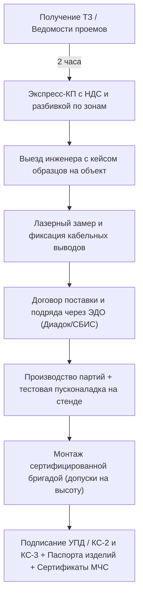

# Архитектура B2B-секции и воронки «Вторая дверь» (Корпоративный портал солнцезащиты и контрактного текстиля)

> **Статус**: Готово к интеграции и верстке  
> **Роль**: B2B Commercial Architect  
> **Целевая аудитория**: Корпоративные заказчики, девелоперы, архитекторы коммерческих интерьеров, отельеры (HoReCa), генподрядчики и службы АХО.

---

## 1. Стратегическое позиционирование и концепция «Второй двери»

### 1.1. Механика переключения «Вторая дверь» (Hero & Header Switcher)
В шапке сайта и первом экране реализован бесшовный переключатель аудиторий:
- **[ Для частных интерьеров ]** — эстетика, уют, премиальные ткани, готовые шторы для квартир и загородных домов.
- **[ Корпоративным клиентам и B2B ]** — язык цифр, технических регламентов, пожарных сертификатов, проектных скидок, НДС и соблюдения сроков по договору подряда.

При клике на вкладку **B2B** страница плавно адаптирует визуальный ряд и УТП:
- Домашние интерьеры сменяются панорамными офисами класса «А», конгресс-холлами, номерами отелей 5★ и представительскими кабинетами.
- Меняется верхняя строка преимуществ: *«Работаем с НДС 20% • КП за 2 часа по ведомости • Ткани КМ1/Trevira CS • ЭДО Диадок / СБИС»*.

---

### 1.2. Сегментированные офферы и матрица ценностей (UVP Matrix)

| Сегмент заказчика | Ключевая боль / Потребность | B2B Оффер / Решение | Триггер доверия (Proof) |
| :--- | :--- | :--- | :--- |
| **Офисы, Корпорации, IT-компании, Банки** | Блики на экранах в Open Space, перегрев кабинетов на солнечной стороне, конфиденциальность в переговорных со стеклом. | Моторизованные ролл-шторы Screen (1–5% прозрачности) с антибликовым эффектом + кассетный Blackout 100% с боковыми направляющими для переговорных комнат и кабинетов CEO. | Интеграция с настенными пультами Somfy и центральной системой BMS / Умный дом; гарантия 3 года. |
| **Отели, Апартаменты, HoReCa** | Строгие пожарные нормы МЧС, порча штор гостями, частые химчистки, необходимость полной темноты для сна гостей. | Контрактный негорючий текстиль Trevira CS (КМ1) и блэкаут плотностью от 280 г/м². Устойчивость к стирке при 60°C, защита от усадки и потери противопожарных свойств. | Пожарные сертификаты РФ (ФЗ-123), протоколы испытаний на истираемость по Мартиндейлу (>50 000 циклов). |
| **Архитекторы и Дизайнеры коммерческой недвижимости** | Сложные узлы примыкания, скрытые ниши, интеграция автоматики в инженерные системы, риск ошибки в чертежах. | Полная инженерная поддержка: 3D-модели (Revit, 3ds Max, DWG), расчет нагрузок на перекрытия, схемы кабельной разводки для электриков, защита проекта и авторское вознаграждение. | Предоставление бесплатных каталогов, вееров тканей и образцов профилей в архитектурное бюро; совместный шеф-монтаж. |
| **Девелоперы и Генподрядчики (ЖК, БЦ, ТЦ)** | Соблюдение графика сдачи объекта, согласование смет, бюрократия, формы КС-2/КС-3, риск срыва госкомиссии. | Комплексное закрытие объемов солнцезащиты «под ключ»: поставка, монтаж бригадами с допусками, исполнительная документация, закрытие через КС-2/КС-3 с НДС. | Фиксация цен в договоре в рублях, штрафные санкции за каждый день просрочки, работа через спецсчета при необходимости. |

---

## 2. Продуктовая линейка B2B (Технический каталог)

### 2.1. Солнцезащитные моторизованные ролл-шторы (Architectural Roller Systems)
- **Приводы и автоматика**:
  - **Somfy (Франция)**: серии *Sonesse 40 / 50* (бесшумные моторы с уровнем шума до 38 дБ).
  - **Dooya / Raex**: надежный промышленный стандарт для масштабных площадей остекления.
  - **Протоколы интеграции**: сухое контактное управление (Dry Contacts), фазное управление 230V, RS-485, KNX, DALI, Modbus, Zigbee 3.0.
- **Инженерные ткани Screen & Soltis**:
  - Композитный состав: стекловолокно + ПВХ / полиэстер высокой прочности.
  - Коэффициент открытости (OF): **1%**, **3%**, **5%**, **10%**. Обеспечивают видимость улицы изнутри, блокируя до 95% солнечного тепла и 100% УФ-лучей, устраняя паразитные блики на мониторах сотрудников.
- **Конструктив повышенной жесткости**:
  - Алюминиевые экструдированные валы диаметром 40, 50, 65, 85 и 110 мм с ребрами жесткости против провисания полотна на проемах шириной до 6 метров.
  - Возможность объединения до 3-х полотен на один электропривод (multi-link) для снижения стоимости за квадратный метр.

### 2.2. Архитектурные жалюзи и системы 100% Blackout для переговорных и кабинетов директоров
- **Кассетные ZIP-системы и Blackout со светоулавливающими профилями**:
  - U-образные боковые направляющие со щеточными уплотнителями, полностью исключающие боковые просветы.
  - Применение: залы видеоконференцсвязи (ВКС), переговорные с мультимедиа-проекторами, домашние кинотеатры топ-менеджеров.
- **Архитектурные алюминиевые жалюзи 50 мм**:
  - Усиленная ламель из пружинящего алюминиевого сплава с матовым анодированием или порошковой покраской в любой цвет по шкале RAL/NCS.
  - Ламели с перфорацией для создания мягкого рассеянного света в кабинетах.
- **Деревянные жалюзи 50 мм (Executive Wood)**:
  - Натуральная канадская липа (Basswood) или бамбук с защитным матовым лаком с UV-фильтром.
  - Премиальный акцент для кабинетов генеральных директоров, статусных зон приема гостей и залов заседаний совета директоров.

### 2.3. Контрактный негорючий текстиль (Trevira CS с пожарными сертификатами)
- **Технология Trevira CS**:
  - В отличие от поверхностных химических пропиток, фосфорорганические антипирены интегрированы напрямую в полимерную цепочку волокна на молекулярном уровне. Свойства негорючести сохраняются после десятков циклов промышленной стирки и химчистки.
- **Нормативное соответствие**:
  - Федеральный закон РФ № 123-ФЗ «Технический регламент о требованиях пожарной безопасности».
  - Показатели: Группа горючести **Г1** (слабогорючие), воспламеняемости **В1** (трудновоспламеняемые), дымообразующей способности **Д2** (с умеренной способностью), токсичности продуктов горения **Т2** (умеренноопасные).
  - Класс пожарной опасности материала: **КМ1 / КМ2** (разрешено для применения в путях эвакуации, холлах, ресторанах, отелях и детских учреждениях).
- **Акустический текстиль (Acoustic Curtain Fabrics)**:
  - Звукопоглощающие портьерные ткани с коэффициентом NRC до 0.8–0.85 для подавления эха и реверберации в помещениях с высокими потолками и сплошным панорамным остеклением.

---

## 3. Специфика работы с юрлицами (Corporate Trust & Workflow)



### 3.1. Финансово-юридический стандарт
1. **Расчет с НДС 20%**:
   - Официальное юрлицо на ОСНО. Возможность возмещения входящего НДС корпоративным клиентом в полном объеме. Предоставление смет также по УСН при запросе.
2. **Экспресс-КП за 2 часа**:
   - При отправке дизайн-проекта, ведомости отделки, планировки или чертежей в форматах PDF / Excel / DWG менеджер проекта готовит детальный расчет за 120 минут.
   - Спецификация формируется с разбивкой по каждому помещению (наименование, размеры, тип управления, модель ткани/ламелей, единичные расценки, монтаж).
3. **Мобильный шоурум на объекте**:
   - Выезд ведущего инженера и проект-менеджера прямо на стройплощадку или в офис заказчика с профессиональным кейсом:
     - Рабочий стенд мотора с радиопультом.
     - Натуральные образцы валов и кассетных профилей в разрезе.
     - Веера негорючих тканей Trevira CS, образцов Screen и ламелей 50 мм.
4. **Полный пакет закрывающих документов**:
   - Мгновенный обмен юридически значимыми документами через **ЭДО** (Диадок / СБИС).
   - Для поставок: Универсальный передаточный документ (**УПД со статусом 1**).
   - Для монтажных и пусконаладочных работ: Акт о приемке выполненных работ (**форма КС-2**) и Справка о стоимости работ и затрат (**форма КС-3**).
   - Паспорта на изделия с серийными номерами приводов и заверенные копии пожарных сертификатов соответствия МЧС РФ.
5. **Условия расчетов**:
   - Аванс 50–70% на запуск в производство, остаток по факту подписания КС-2 / УПД.
   - Для проверенных генподрядчиков и корпоративных сетей предусмотрена отсрочка платежа до 15 банковских дней.

---

## 4. Интерактивный B2B Калькулятор & Форма экспресс-запроса КП

### 4.1. Архитектура параметров калькулятора (B2B Logic Engine)
Калькулятор ориентирован на профессионалов (не тратит время на мелкие декоративные детали, сразу считает объемы и технические узлы):

1. **Тип объекта**:
   - Бизнес-центр / Офис
   - Отель / HoReCa / Апартаменты
   - Кабинет руководителя / Зал заседаний
   - Ресторан / Общественное пространство
   - Медицинский / Учебный центр
2. **Тип солнцезащитных систем**:
   - Моторизованные ролл-шторы Screen (антиблик)
   - Системы 100% Blackout с направляющими (для видеоконференций)
   - Архитектурные жалюзи 50 мм (алюминий / дерево)
   - Контрактные портьеры Trevira CS на электрокарнизах
3. **Объем остекления**:
   - Количество световых проемов (слайдер от 3 до 200+)
   - Средняя высота проема (до 2.5 м, 2.5–4 м, панорамные от 4 до 7 м)
   - Суммарная площадь остекления, м²
4. **Управление и автоматизация**:
   - Централизованное управление Somfy (пульты + настенные радиокнопки)
   - Интеграция в диспетчеризацию здания / BMS (сухие контакты, RS485, KNX)
   - Ручное цепочное управление (для вспомогательных помещений)
5. **Требования к пожарной безопасности**:
   - Требуется обязательный сертификат КМ1 (ФЗ-123) для проверок МЧС
   - Стандартный негорючий класс
6. **Вывод расчета**:
   - Индикативный ценовой коридор «под ключ» с учетом автоматики, комплектующих и монтажа с НДС 20%.
   - Кнопка: **«Зафиксировать расчет и получить спецификацию с НДС за 2 часа»**.

### 4.2. Экспресс-форма «Загрузить ТЗ / Ведомость» с мгновенной отправкой
- **Поля формы**:
  - `ИНН компании` (автоматическая подгрузка названия юрлица и КПП через DaData API)
  - `Имя и должность контактного лица` (ГИП, дизайнер, инженер АХО, директор)
  - `Телефон / WhatsApp`
  - `Корпоративный Email`
  - `Drag-and-Drop зона загрузки файлов`: поддержка PDF, DWG, XLSX, ZIP размером до 50 МБ.
  - `Чекбокс выбора мессенджера для оперативного контакта`: [ ] Отправить расчет в Telegram, [ ] Отправить в WhatsApp, [ ] Продублировать на Email.
- **Интеграция бэкенда**:
  - Мгновенная генерация лида в CRM (Битрикс24 / amoCRM) с тегом `#B2B_Tender`.
  - Отправка уведомления дежурному инженеру и РОПу в корпоративный Telegram-бот:
    ```text
    🔔 НОВЫЙ B2B ЗАПРОС НА КП!
    🏢 Компания: ООО "СпецСтройПроект" (ИНН 7701234567)
    👤 Контакт: Алексей (Главный инженер проекта)
    📞 Телефон: +7 (999) 123-45-67 [Написать в WhatsApp / Telegram]
    📊 Параметры: Офис класса А, 28 проемов, Моторизация Somfy RS485, Ткань Screen 3% KM1
    📁 Прикреплено ТЗ: vedomost_proemov_blok_B.xlsx (1.8 MB)
    ⏱ Таймер SLA: 2 часа на отправку КП
    ```

---

## 5. Структура посадочной страницы (Wireframe & Page Blueprint)

```
[ Header: Логотип | [Частным] [ДЛЯ БИЗНЕСА И ЮРЛИЦ (active)] | Меню: Каталог B2B, Кейсы, Документы, Калькулятор | +7 (800) ... | "Запросить КП" ]
-----------------------------------------------------------------------------------------------------------------------------------------
[ Hero B2B Section ]
  - Бейдж: "Комплексное солнцезащитное оснащение коммерческой недвижимости с НДС 20%"
  - Заголовок: Профессиональные солнцезащитные системы и контрактный текстиль для офисов, отелей и девелоперов
  - Подзаголовок: Проектирование, поставка и монтаж моторизованных систем Somfy, архитектурных жалюзи и тканей Trevira CS с сертификатом КМ1.
  - CTA кнопки: [Рассчитать смету проекта] [Загрузить ТЗ в WhatsApp/Telegram]
  - 4 фактоида-триггера: [КП за 2 часа] [Работа через ЭДО / НДС] [Кейс образцов на объект] [Гарантия 36 месяцев]
-----------------------------------------------------------------------------------------------------------------------------------------
[ Секция сегментов: "Решения под задачи вашего бизнеса" ]
  - 4 интерактивные карточки:
    1. Офисы и Open Space (антиблик, термокомфорт, моторизация)
    2. Переговорные и Кабинеты CEO (100% Blackout, звукопоглощение, ламели 50мм)
    3. Отели и HoReCa (негорючий текстиль Trevira CS, КМ1, высокая износостойкость)
    4. Девелоперы и Архитекторы (узлы в DWG/Revit, закрытие объемов КС-2/КС-3)
-----------------------------------------------------------------------------------------------------------------------------------------
[ Продуктовая витрина B2B с техническими паспортами ]
  - Вкладка 1: Ролл-шторы Screen & Soltis с моторами Somfy (интеграция KNX/BMS)
  - Вкладка 2: ZIP-системы и Blackout со светоулавливающими профилями
  - Вкладка 3: Горизонтальные жалюзи 50мм (Алюминий RAL / Дерево Basswood)
  - Вкладка 4: Контрактные ткани Trevira CS (Пожарный класс КМ1/КМ2)
-----------------------------------------------------------------------------------------------------------------------------------------
[ Интерактивный B2B Калькулятор & Конфигуратор проекта ]
  - Шаги: Тип объекта -> Площадь / Проемы -> Тип системы -> Автоматика -> Расчет
  - Моментальный ориентир стоимости + Форма загрузки проектной документации
-----------------------------------------------------------------------------------------------------------------------------------------
[ Блок юридической и финансовой надежности: "Бизнес с нами — это прозрачно" ]
  - Официальный расчет с НДС 20%
  - Электронный документооборот (Диадок, СБИС)
  - Закрывающие формы КС-2 и КС-3 на монтаж
  - Сертификаты соответствия ФЗ-123 и пожарные протоколы испытаний
  - Бесплатный выезд инженера с чемоданом образцов материалов
-----------------------------------------------------------------------------------------------------------------------------------------
[ Интерактивная форма экспресс-запроса КП за 2 часа ]
  - Загрузка чертежей/ведомости (Drag-and-Drop)
  - Ввод ИНН с автозаполнением реквизитов
  - Выбор канала связи (WhatsApp, Telegram, Email)
-----------------------------------------------------------------------------------------------------------------------------------------
[ Footer с реквизитами юрлица, ссылками на скачивание типового договора, сертификатов КМ1 и реквизитов ]
```
