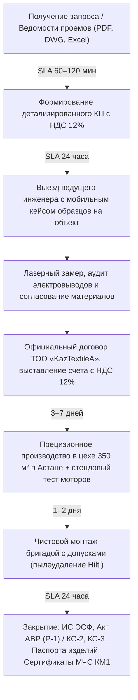

# B2B Досье и Коммерческая Спецификация ТОО «KazTextileА»
## Корпоративный дивизион солнцезащитных систем, моторизации и контрактного текстиля в г. Астана

> **Юридическое лицо:** ТОО «KazTextileА»  
> **БИН:** 140940019744  
> **Юридический / Фактический адрес:** Республика Казахстан, г. Астана, район Есиль, ул. Керей, Жәнибек хандар, дом 50/1, ВП 18  
> **Налоговый режим:** Общеустановленный режим налогообложения (ОУР) с официальным плательщиком НДС 12%  
> **Электронный документооборот:** ИС ЭСФ Республики Казахстан, АВР (Р-1), КС-2 / КС-3 в течение 24 часов  
> **Производственный комплекс:** г. Астана, специализированный цех 350 м² (швейные автоматы Dürkopp Adler, Jack, раскройные прецизионные комплексы)  
> **Официальный статус:** 1 место ведущего декоратора Жанель Есимовой в премии **Golden Textile Award 2026** (номинация «Текстиль для коммерческих помещений»)  
> **Целевые клиенты в Астане:** БЦ класса «А» (Talan Towers, Abu Dhabi Plaza, Emerald Towers), МФЦА (AIFC), банки (ForteBank HQ, Halyk Bank), посольства и дипмиссии (Акбулак), министерства и квазигоссектор (Үкімет үйі, Самрук-Қазына), загородные резиденции (Garden Village, Акбулак).

---

## Раздел 1. Юридический, налоговый и финансовый паспорт компании

### 1.1. Полные регистрационные реквизиты контрагента
| Параметр | Значение |
| :--- | :--- |
| **Официальное наименование** | Товарищество с ограниченной ответственностью «KazTextileА» |
| **БИН** | **140940019744** |
| **Свидетельство о госрегистрации** | Выдано Департаментом юстиции г. Астана |
| **Юридический адрес** | 010000, Республика Казахстан, г. Астана, район Есиль, ул. Керей, Жәнибек хандар, д. 50/1, ВП 18 |
| **Фактический салон & Шоурум** | г. Астана, ул. Керей, Жәнибек хандар, 50/1 (Салон интерьерного и контрактного текстиля MUAR A) |
| **Собственный цех сборки и пошива** | г. Астана, производственная зона, специализированный цех 350 м² |
| **Контакты B2B-отдела** | +7 (771) 055-15-15 (Дежурный инженер проектов) · +7 (777) 384-55-17 (Проектный отдел) |
| **E-mail / Web** | b2b@muara.kz · www.muara.kz |

### 1.2. Налоговый статус и финансовые преимущества для B2B-клиентов
1. **Общеустановленный режим налогообложения (ОУР):**
   - ТОО «KazTextileА» осуществляет деятельность на общеустановленном режиме налогообложения (ОУР) без применения специальных льготных режимов или ограничений по обороту.
2. **Официальный плательщик НДС 12%:**
   - Все коммерческие предложения, спецификации, договоры подряда и счета на оплату выставляются с законным выделением казахстанского **НДС 12%**.
   - **Экономическая выгода для бухгалтерии заказчика:** сумма входящего НДС 12% в полном объеме принимается к вычету (в зачет) при расчете корпоративного налога на добавленную стоимость, что снижает реальную налоговую нагрузку заказчика на 12%.
3. **Электронный документооборот (ИС ЭСФ):**
   - Выписка электронных счетов-фактур осуществляется строго через государственную информационную систему **ИС ЭСФ КГД МФ РК** с точным заполнением кодов ТН ВЭД ЕАЭС, источников происхождения и признаков происхождения товаров.
   - Срок формирования и отправки ЭСФ — **в течение 24 часов** с момента подписания актов приема-передачи.
4. **Акты выполненных работ и строительные формы (Р-1, КС-2, КС-3):**
   - **Акт АВР (Форма Р-1):** оформление акта выполненных работ/оказанных услуг установленного образца согласно Приказу Министра финансов Республики Казахстан.
   - **Формы КС-2 и КС-3:** при выполнении строительно-монтажных, высотных и пусконаладочных работ на объектах девелоперов и генподрядчиков формируются:
     * Акт приемки выполненных строительно-монтажных работ (Форма КС-2) с полистовой расшифровкой сметных объемов, трудозатрат и расценок.
     * Справка о стоимости выполненных работ и затрат (Форма КС-3).
   - Подписание документов через системы ЭДО: **Doculog.kz**, **Учёт.kz**, **1С:ЭДО** или в бумажном виде с гербовой печатью организации.
5. **Фиксация сметы в национальной валюте (тенге ₸):**
   - Договорная стоимость фиксируется в тенге на весь период поставки и монтажа, исключая валютные риски заказчика при колебаниях курсов EUR/USD.
   - Условия расчетов: аванс 50–70% на резервирование комплектующих и раскрой полотен, окончательный расчет — по факту подписания закрывающих актов. Для аккредитованных корпоративных партнеров и генподрядчиков возможна постоплата до 15 банковских дней.

---

## Раздел 2. Подтверждение профессионального статуса и экспертизы

```
┌────────────────────────────────────────────────────────────────────────┐
│                      GOLDEN TEXTILE AWARD 2026                         │
│                           ГЛАВНЫЙ ПРИЗ                                 │
│                                                                        │
│                       1 МЕСТО В НОМИНАЦИИ                              │
│              «ТЕКСТИЛЬ ДЛЯ КОММЕРЧЕСКИХ ПОМЕЩЕНИЙ»                     │
│                                                                        │
│               Ведущий декоратор: ЖАНЕЛЬ ЕСИМОВА                        │
│                 ТОО «KazTextileА» (Салон MUAR A)                       │
└────────────────────────────────────────────────────────────────────────┘
```

### 2.1. Официальный триумф на Golden Textile Award 2026
Проектный отдел ТОО «KazTextileА» подтвердил лидерство в индустрии контрактного текстиля Казахстана:
- **Награда:** 1 место в номинации **«Текстиль для коммерческих помещений»** всероссийской и центральноазиатской профессиональной премии **Golden Textile Award 2026**.
- **Лауреат:** ведущий декоратор проектного направления **Жанель Есимова** (4+ года проектной практики, реализовано свыше 80 статусных объектов в Астане, профессиональное обучение у признанных мэтров текстильного дизайна Анастасии Пронской и Ирины Масловой).
- **Критерии оценки жюри:** прецизионная инженерная интеграция солнцезащитных систем в архитектурные узлы, идеальное соответствие пожарным нормам (КМ1), акустическая оптимизация переговорных пространств и безупречная посадка текстиля по государственным стандартам.

### 2.2. Производственные мощности в г. Астана
- **Собственный цех 350 м²:** полный цикл производства без привлечения сторонних надомниц и субподрядчиков.
- **Парк оборудования:**
  * Тяжелые швейные автоматы **Dürkopp Adler** (Германия) с дифференциальным транспортером для беспосадочной строчки тяжелых блэкаутов и негорючего бархата.
  * Промышленные машины **Jack** для скоростной обработки кромок и посадки шторной ленты.
  * Прецизионные раскройные столы с вакуумным прижимом и направляющими шинами (исключение перекоса нитей утка и основы при раскрое рулонных штор высотой до 7 метров).
  * Испытательный стенд электроприводов: 100% входной и выходной контроль моторов Somfy и Forest под статической нагрузкой перед упаковкой.
- **Стандартизация:** участие ведущих специалистов студии в разработке текстильных стандартов ГОСТ Республики Казахстан. Заводская маркировка каждого изделия с паспортом и серийным номером привода.

---

## Раздел 3. Инженерная матрица 5 ключевых направлений B2B

| № | Направление | Ключевые параметры | Объектное назначение | Нормативы / Сертификаты |
| :- | :--- | :--- | :--- | :--- |
| **1** | **Солнцезащита Screen 1–5%** | Перфорация 1%, 3%, 5%, отражение 95% тепла, фильтр 100% УФ | Open Space, панорамные фасады БЦ, трейдинг-румы | СТ РК, ISO 9001, СанПиН РК (рабочие места) |
| **2** | **Кассетный Blackout 100%** | ZIP-системы, U-направляющие, щеточные уплотнители, 0% щелей | Переговорные, VIP Boardrooms, залы ВКС | 100% затемнение, DIN EN 14501 |
| **3** | **Алюминиевые жалюзи 50 мм по RAL** | Магниево-алюминиевая ламель 0.23 мм, порошковая покраска RAL | Кабинеты CEO, перегородки, витражное остекление | Стойкость к UV, устойчивость к деформациям |
| **4** | **Негорючий текстиль Trevira CS** | Молекулярная негорючесть, плотность 260–420 г/м², NRC 0.85 | Пути эвакуации, отели 5★, министерства, театры | **КМ1 (Г1, В1, Д2, Т2)**, ТР ТС 043/2017, СНиП РК |
| **5** | **Лифт-системы карнизов (6–8 м)** | Опускание балки на тросах до 1.2–1.5 м, грузоподъемность до 80 кг | Окна второго света, атриумы, загородные виллы | CE, EN 60335, запас прочности тросов 10:1 |

---

### Подробная инженерная детализация каждого направления

#### 1. Солнцезащита Screen 1–5% для Open Space и панорамных фасадов
- **Техническая сущность:** Рулонные системы на базе композитных полотен Screen (переплетение стекловолоконных нитей, покрытых поливинилхлоридом, в соотношении 36% стекловолокно / 64% ПВХ).
- **Коэффициенты открытости плетения (Openness Factor):**
  * **1%** — максимальная защита от слепящего солнца для юго-западных и западных фасадов Астаны;
  * **3%** — баланс термозащиты и оптической связи с городом;
  * **5%** — максимальная прозрачность для северных и восточных витражей.
- **Инженерный эффект:**
  * **Термобарьер:** отражает до 95% лучистой солнечной энергии (Solar Heat Gain Coefficient g_tot < 0.15), снижая температуру воздуха у остекления на 6–8°C и снимая пиковую нагрузку с климатических установок (HVAC) здания до 30%.
  * **Антибликовая защита экранов:** полностью ликвидирует солнечные блики на мониторах трейдеров, программистов и офисных сотрудников без затемнения зала до «пещерного» состояния (соответствие требованиям СанПиН РК к освещенности рабочих мест с ЭВМ).
  * **Односторонняя прозрачность:** изнутри сотрудники видят панораму города, снаружи проем выглядит монолитным непроницаемым зеркальным полотном.
- **Механический контур:** Алюминиевые валы Ø50, Ø65, Ø85 мм с внутренними ребрами жесткости, исключающие V-образный прогиб полотна на проемах шириной до 5.5 м. Бесшумные электроприводы Somfy Sonesse 40/50 RTS или WT.

#### 2. Кассетный Blackout 100% для переговорных комнат и залов заседаний
- **Техническая сущность:** Светонепроницаемые кассетные системы с боковыми П-образными (U-образными) алюминиевыми направляющими и щеточными демпферами.
- **Светопроницаемость:** абсолютный 0% светового потока. Ткань Blackout с 3-слойным полимерным акриловым барьером полностью отсекает видимый спектр света.
- **Ликвидация краевых паразитных засветов:**
  * В обычных рулонных шторах боковые щели между тканью и откосом составляют от 18 до 25 мм, что делает невозможной контрастную проекцию.
  * В кассетных системах ТОО «KazTextileА» край полотна глубоко заходит в пазы направляющих, обеспечивая герметичность контура.
- **Сценарии применения:** Залы заседаний Совета директоров (VIP Boardrooms), помещения видеоконференцсвязи (ВКС / Cisco Webex / Zoom Rooms), ситуационные центры министерств и ведомств.
- **Интеграция:** Мгновенный перевод помещения в презентационный режим: одно нажатие клавиши на панели Crestron / KNX синхронно опускает шторы Blackout, активирует проектор и приглушает освещение.

#### 3. Архитектурные алюминиевые жалюзи 50 мм с окраской по шкале RAL
- **Техническая сущность:** Горизонтальные жалюзи с увеличенной шириной ламели 50 мм из пружинящего магниево-алюминиевого сплава (толщина ленты 0.23 мм).
- **Порошковая окраска по каталогу RAL:**
  * Заводское термопорошковое напыление в любой оттенок европейской палитры RAL (Classic, Design, Metallic) с выбором фактуры (глубокий мат, полумат, сатин, муар).
  * Идеальное колористическое слияние с фасадными стоечно-ригельными системами Schuco, Reynaers, Alutech или перегородками из закаленного стекла.
- **Эксплуатационные свойства:**
  * Ламели не деформируются при резких перепадах температур и сухости воздуха Астаны (в отличие от пластика и дешевого алюминия толщиной 0.16 мм).
  * Влагостойкость и простота антистатической обработки.
- **Управление:** Ручной редуктор с поворотным прутом/шнуром или моторизованный привод 230V Somfy с шагом юстировки угла наклона ламелей 1°, позволяющий точно дозировать световой поток на рабочие столы.

#### 4. Контрактный негорючий текстиль Trevira CS (Класс пожарной опасности КМ1)
- **Молекулярная физика полимера:**
  * В отличие от дешевых тканей с поверхностной солевой пропиткой, которая вымывается после 5–8 стирок или осыпается от сухого климата, волокно **Trevira CS (Comfort + Safety)** содержит модифицированные фосфорорганические цепочки, интегрированные в полимерную решетку на молекулярном уровне.
  * Негорючесть сохраняется на протяжении всего срока службы изделия, независимо от химчисток, воздействия ультрафиолета и стирок при температуре 60°C.
- **Сертификаты и строительные нормы Республики Казахстан:**
  * Соответствие **ТР ТС 043/2017** «О требованиях к средствам обеспечения пожарной безопасности и пожаротушения».
  * Соответствие **СНиП РК 2.02-05-2009 / СП РК 2.02-105-2014** «Пожарная безопасность зданий и сооружений».
  * **Класс пожарной опасности КМ1:**
    * Группа горючести: **Г1** (слабогорючие по ГОСТ 30244);
    * Группа воспламеняемости: **В1** (трудновоспламеняемые по ГОСТ 30402);
    * Дымообразующая способность: **Д2** (с умеренной способностью по ГОСТ 12.1.044);
    * Токсичность продуктов горения: **Т2** (умеренноопасные по ГОСТ 12.1.044).
  * Предоставление протоколов лабораторных огневых испытаний для органов противопожарного аудита МЧС РК.
- **Акустический комфорт:** Плотность полотен от 280 до 450 г/м² обеспечивает коэффициент звукопоглощения **NRC 0.75–0.85** (поглощение среднечастотного речевого гула и эха в помещениях со сплошным стеклом и твердыми полами).

#### 5. Лифт-системы с электроприводом для окон второго света (6–8 метров)
- **Проблема высоких проемов:** В загородных резиденциях (Garden Village, Акбулак, BI Village), залах представительских приемов и атриумах с высотой потолков 6–8 метров регулярное обслуживание штор представляет колоссальную проблему:
  * Необходимость заноса и сборки строительных лесов прямо на паркете жилого дома;
  * Риск повреждения дорогой итальянской мебели, мраморных полов и люстр;
  * Риск травматизма обслуживающего персонала;
  * Высокая стоимость вызова промышленных альпинистов (от 150 000 ₸ за один выезд).
- **Инженерное решение ТОО «KazTextileА»:**
  * Карнизная балка монтируется на специализированную лифтовую подъемную траверсу с электроприводом.
  * Несущие авиационные тросы из высоколегированной нержавеющей стали с 10-кратным запасом прочности по нагрузке.
  * По нажатию кнопки на пульте дистанционного управления или смартфоне вся карнизная система с портьерами плавно и бесшумно опускается вниз на уровень 1.2–1.5 метра от пола (уровень груди).
  * Снятие, навеска, глажка или замена текстиля выполняется силами одного человека за 15 минут в комфортных и безопасных условиях.
  * После клининга балка автоматически поднимается на исходную отметку (до 8 метров) и жестко фиксируется концевыми упорами.
- **Проверено практикой:** Система успешно эксплуатируется на загородных виллах и дипломатических резиденциях в Астане.

---

## Раздел 4. Регламенты SLA и клиентский путь корпоративного заказчика



### Регламентные стандарты SLA:
1. **SLA-1: Экспресс-смета за 60–120 минут:**
   - При предоставлении проектной документации, ведомости проемов, чертежей Autocad или дизайн-проекта коммерческий отдел формирует спецификацию с детальной разбивкой по позициям строго в течение двух часов.
2. **SLA-2: Выезд мобильного инженерного кейса за 24 часа:**
   - Ведущий инженер проекта прибывает на объект в Астане (Talan Towers, Abu Dhabi Plaza, здание посольства, стройплощадка) с демонстрационным чемоданом:
     * Действующий стенд мотора Somfy / Forest с пультом управления;
     * Натуральные срезы валов Ø50, Ø65, Ø85 мм и кассетных направляющих;
     * Веера образцов Screen (1%, 3%, 5%), негорючих портьер Trevira CS и ламелей жалюзи RAL;
     * Лазерный дальномер Leica Disto и тепловизор для замера температурного градиента остекления.
3. **SLA-3: Собственное производство в Астане (3–7 рабочих дней):**
   - Раскрой полотен на прецизионных столах, сборка валов с лазерным контролем геометрии, стендовое тестирование каждого электропривода.
4. **SLA-4: Чистовой беспылевой монтаж:**
   - Монтажные бригады имеют аттестацию по электробезопасности (до 1000 В) и допуски к высотным работам.
   - Сверление выполняется перфораторами с промышленными системами вакуумного пылеудаления Hilti (чистота в готовых интерьерах).
5. **SLA-5: Закрытие документов за 24 часа:**
   - Выписка ЭСФ через ИС ЭСФ РК, формирование актов АВР (форма Р-1) или КС-2 / КС-3 в день сдачи объекта.
   - Официальная безусловная гарантия: **36 месяцев** на моторы и профильные системы, **12 месяцев** на текстиль и пошив.

---

## Раздел 5. Персональное B2B-досье Коммерческого Предложения (Эталонный шаблон)

### 5.1. Официальное сопроводительное письмо-обращение

```
ТОО «KazTextileА»
Республика Казахстан, г. Астана, район Есиль,
ул. Керей, Жәнибек хандар, дом 50/1, ВП 18
БИН: 140940019744
Тел.: +7 (771) 055-15-15, +7 (777) 384-55-17
E-mail: b2b@muara.kz

Исх. № КП-B2B-2026/048
Дата: 23 сентября 2026 г.
Срок действия предложения: 30 календарных дней

Кому: Руководству строительного департамента / 
Службе главного инженера (ГИП) /
Архитектурно-проектному бюро
Объект: Бизнес-центр класса «А» / Офисный комплекс, г. Астана


УВАЖАЕМЫЕ ГОСПОДА!

ТОО «KazTextileА» (проектное подразделение студии интерьерного текстиля MUAR A) свидетельствует Вам свое уважение и направляет коммерческое предложение на комплексное оснащение оконных проемов Вашего объекта профессиональными солнцезащитными системами, моторизованными карнизами и контрактным негорючим текстилем.

ПОЧЕМУ ВЕДУЩИЕ ДЕВЕЛОПЕРЫ И КОРПОРАТИВНЫЕ ЗАКАЗЧИКИ АСТАНЫ ВЫБИРАЮТ ТОО «KazTextileА»:

1. ОФИЦИАЛЬНЫЙ СТАТУС И ПРИЗНАНИЕ ИНДУСТРИИ:
   В 2026 году проектный отдел компании удостоен 1 МЕСТА в номинации «Текстиль для коммерческих помещений» престижной премии Golden Textile Award 2026 (ведущий декоратор проекта — Жанель Есимова). Мы гарантируем эталонный архитектурный уровень исполнения.

2. ЮРИДИЧЕСКАЯ И НАЛОГОВАЯ ЧИСТОТА (КАЗАХСТАН):
   ТОО «KazTextileА» (БИН 140940019744) работает на Общеустановленном режиме налогообложения (ОУР) и является официальным плательщиком НДС 12%. Входящий НДС принимается Вашей бухгалтерией к полному зачету. Все закрывающие документы (ЭСФ в ИС ЭСФ, Акт АВР Р-1, формы КС-2 и КС-3) предоставляются в течение 24 часов.

3. СОБСТВЕННОЕ ПРОИЗВОДСТВО 350 М² В АСТАНЕ:
   Все изделия изготавливаются на нашем специализированном производстве в г. Астана на немецком оборудовании Dürkopp Adler. Никаких надомниц или переразмещения заказов. Срок реализации партий — от 3 рабочих дней.

4. СООТВЕТСТВИЕ ПОЖАРНЫМ НОРМАМ РК (КЛАСС КМ1):
   Используемые материалы сертифицированы согласно ТР ТС 043/2017 и СНиП РК 2.02-05-2009 (группы горючести Г1, воспламеняемости В1, дымообразования Д2, токсичности Т2). Предоставляем полный пакет пожарных сертификатов и протоколов для МЧС РК.

5. БЕСШУМНАЯ АВТОМАТИЗАЦИЯ И СИСТЕМЫ УМНОГО ЗДАНИЯ:
   Прямое партнерство с Somfy (Франция) и Forest (Нидерланды). Приводы с уровнем шума менее 38 дБ, интеграция в протоколы KNX, Lutron, Modbus, BMS. Гарантия на оборудование — 3 года (36 месяцев).
```

---

### 5.2. Сводная сметная экспликация (Типовой расчет на 14 проемов Open Space & Boardroom)

| № | Наименование системы и комплектации | Размеры (Ш × В, м) | Кол-во | Площадь, м² | Цена за ед. с НДС 12%, ₸ | Сумма с НДС 12%, ₸ |
| :- | :--- | :-: | :-: | :-: | :-: | :-: |
| **1** | **Рулонная система Screen 3% (Антиблик)**<br><small>Полотно Screen 3% (Франция), термобарьер 95%, вал Ø65 мм, бесшумный электропривод Somfy Sonesse 40 RTS (<38 дБ), радиопульт</small> | 2.80 × 3.20 | 10 шт | 89.60 м² | 118 500 ₸ | 1 185 000 ₸ |
| **2** | **Кассетный Blackout 100% (Boardroom / ВКС)**<br><small>Светонепроницаемое полотно Blackout, кассета + боковые U-направляющие со щеточными уплотнителями (0% щелей), мотор Somfy WT (KNX интеграция)</small> | 3.00 × 3.20 | 2 шт | 19.20 м² | 148 000 ₸ | 296 000 ₸ |
| **3** | **Алюминиевые жалюзи 50 мм по RAL (Кабинет CEO)**<br><small>Усиленная магниево-алюминиевая ламель 0.23 мм, индивидуальная порошковая окраска по RAL 7016 в тон фасадного профиля, мотор Dooya 230V</small> | 2.40 × 3.00 | 2 шт | 14.40 м² | 94 000 ₸ | 188 000 ₸ |
| **4** | **Комплектация автоматики и интеграции**<br><small>Многоканальные настенные радиопередатчики Somfy Smoove, релейные модули сопряжения с пожарной сигнализацией и шиной KNX</small> | Комплект | 1 компл | — | 165 000 ₸ | 165 000 ₸ |
| **5** | **Монтажные и пусконаладочные работы в г. Астана**<br><small>Чистовой монтаж бригадой с допусками (пылеудаление Hilti), юстировка концевых положений, фазировка, программирование пультов</small> | Услуга | 14 проемов | 123.20 м² | 18 000 ₸/пр | 252 000 ₸ |
| **ИТОГО** | **ИТОГО по проекту под ключ:** | | **14 проемов** | **123.20 м²** | | **2 086 000 ₸** |
| | *В том числе законный казахстанский НДС 12% (к налоговому вычету):* | | | | | **223 500 ₸** |

---

### 5.3. Юридические условия поставки и гарантийный регламент
1. **Срок выполнения работ:**
   - Поставка оборудования, раскрой и сборка в цехе г. Астана: **5 рабочих дней**.
   - Монтаж и пусконаладка на объекте: **1–2 рабочих дня** (возможна работа в ночные смены или выходные дни для исключения помех офисным процессам).
2. **Порядок оплаты:**
   - 60% — авансовый платеж после подписания официального договора поставки и подряда;
   - 40% — окончательный расчет в течение 5 банковских дней после подписания Акта АВР (Р-1) или форм КС-2 / КС-3 и выставления ЭСФ в ИС ЭСФ.
3. **Гарантийные обязательства ТОО «KazTextileА»:**
   - Электроприводы и автоматика Somfy / Forest: **36 месяцев (3 года)**;
   - Алюминиевые профили, кассеты и валы: **36 месяцев**;
   - Пошив и крепление текстильных полотен по стандартам ГОСТ РК: **12 месяцев**.
   - Регламент сервисной службы: выезд инженера по гарантийному обращению в г. Астана в течение **4 рабочих часов**.

---

## Раздел 6. Эталонные тексты для B2B-блоков веб-ресурса

### 6.1. Заголовочный комплекс секции B2B
- **Eyebrow:** `Для юридических лиц, архитекторов и девелоперов`
- **H2 Заголовок:** `Солнцезащитные системы, моторизация и контрактный текстиль`
- **Подзаголовок (Lead):** `Специализированный B2B-дивизион ТОО «KazTextileА» в Астане. Собственное производство 350 м², официальная работа на ОУР с НДС 12%, закрывающие акты КС-2/КС-3 за 24 часа. Победители премии Golden Textile Award 2026 за лучший коммерческий текстиль.`

### 6.2. Тексты карточек ключевых направлений (B2B Features Grid)

#### Карточка 1: Солнцезащита Screen 1–5% (Open Space)
- **Иконка:** `☀`
- **Заголовок:** `Солнцезащита Screen 1–5% для Open Space`
- **Текст:** `Рулонные системы с полотнами Screen (1%, 3%, 5%). Отражают до 95% солнечного тепла, устраняют слепящие блики на экранах компьютеров и сохраняют панорамный вид на Астану снаружи.`

#### Карточка 2: Кассетный Blackout 100% (Переговорные)
- **Иконка:** `🌑`
- **Заголовок:** `Кассетный Blackout 100% для переговорных`
- **Текст:** `Светонепроницаемые системы с боковыми U-образными направляющими со щеточными уплотнителями. Абсолютная блокировка света (0% щелей) для залов заседаний Совета директоров, видеоконференций и проекторов.`

#### Карточка 3: Алюминиевые жалюзи 50 мм по RAL
- **Иконка:** `📐`
- **Заголовок:** `Алюминиевые жалюзи 50 мм по каталогу RAL`
- **Текст:** `Усиленная магниево-алюминиевая ламель (0.23 мм) с заводской порошковой окраской в любой цвет по RAL в точный тон оконных витражей. Архитектурная геометрия для статусных кабинетов руководства.`

#### Карточка 4: Негорючий текстиль Trevira CS (КМ1)
- **Иконка:** `🛡`
- **Заголовок:** `Негорючий текстиль Trevira CS (Класс КМ1)`
- **Текст:** `Пожизненная молекулярная огнестойкость (класс КМ1: Г1, В1, Д2, Т2) по ТР ТС 043/2017 и СНиП РК. Не смывается при стирках. Протоколы испытаний для МЧС РК, путей эвакуации, отелей и конференц-залов.`

#### Карточка 5: Моторизация Somfy & Forest (BMS / KNX)
- **Иконка:** `⚡`
- **Заголовок:** `Моторизация Somfy & Forest в системы BMS`
- **Текст:** `Бесшумные электроприводы Somfy Sonesse (< 38 дБ) и карнизы Forest Shuttle. Управление с пультов, настенных клавиш и интеграция в протоколы «Умного Здания» KNX, Lutron, Modbus.`

#### Карточка 6: Проектный монтаж и высотные работы
- **Иконка:** `⚙`
- **Заголовок:** `Монтаж бригадами с допусками и пылеудалением`
- **Текст:** `Штатные специалисты с допусками по электробезопасности и работе на высоте. Чистовой монтаж с промышленным пылеудалением Hilti без строительной пыли в готовых интерьерах.`

#### Featured-карточка во всю ширину: Лифт-системы карнизов (6–8 м)
- **Иконка:** `🏗`
- **Заголовок:** `Лифт-системы с электроприводом для окон второго света (6–8 м)`
- **Текст:** `Инженерное решение для двусветных резиденций, вилл и атриумов с высотой проемов 6–8 метров. Вся карнизная балка на авиационных стальных тросах плавно опускается до уровня груди нажатием кнопки — безопасная навеска и сезонный клининг штор за 15 минут без строительных лесов, стремянок и риска падения.`
- **Бейдж доказательства:** `✓ Протестировано и реализовано на загородных резиденциях Астаны (Garden Village, коттеджный городок Акбулак)`
- **Медиа-элемент:** Видеоролик демонстрации опускания балки (`assets/muar/villa-lift-system.mp4`).

### 6.3. Тексты блока юридической надежности (B2B Legal Box)
- **Eyebrow:** `Юридический и финансовый контур`
- **H3:** `ТОО «KazTextileА»`
- **Адресная строка:** `БИН 140940019744 · г. Астана, ул. Керей, Жәнибек хандар, 50/1`
- **Список ключевых гарантий (Trust List):**
  * `Официальный плательщик НДС 12% на ОУР (Общеустановленный режим) — полный входящий зачет для бухгалтерии`
  * `Выписка ЭСФ через ИС ЭСФ, акты АВР (Р-1) и строительные формы КС-2 / КС-3 в течение 24 часов`
  * `1 место ведущего декоратора Жанель Есимовой в Golden Textile Award 2026 («Текстиль для коммерческих помещений»)`
  * `Сертификаты пожарной безопасности МЧС РК (класс КМ1) и пошив по стандартам ГОСТ РК`
  * `Собственный цех 350 м² в Астане: прецизионный раскрой, немецкие швейные автоматы Dürkopp Adler, стендовый тест моторов`
  * `Официальный договор: безусловная гарантия 36 месяцев на моторы Somfy/Forest и 12 месяцев на текстиль`
- **Планка признания статуса (Award Badge):**
  * Текст: `🏆 1 место Golden Textile Award 2026 · Ведущий декоратор Жанель Есимова · Номинация «Текстиль для коммерческих помещений»`
- **Главный CTA кнопки:**
  * Текст: `Запросить коммерческое предложение с НДС 12%`
  * Ссылка WhatsApp с готовым запросом: `https://wa.me/77710551515?text=Здравствуйте,%20ТОО%20«KazTextileА»!%20Интересует%20расчет%20систем%20солнцезащиты%20и%20моторизации%20для%20юридического%20лица.%20Запрашиваем%20КП%20с%20выделением%20НДС%2012%25%20и%20формами%20КС-2/КС-3.`
