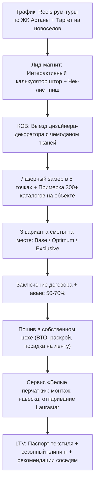

# Стратегия B2C-направления «Первая дверь: Частные резиденции и элитные новостройки»
**Текстильное ателье премиум-класса (Астана / Казахстан)**

---

## 1. Анализ целевой аудитории и контекст рынка Астаны

### 1.1. Портрет клиента и специфика объектов
Как отметила владелица: **«90% наших клиентов — это новостройки и коттеджи»**. В Астане этот сегмент обладает уникальными архитектурными и климатическими особенностями:
* **Локации и жилые комплексы**:
  * *Элитные новостройки*: ЖК Highvill (Park, Ishim, Gold), Ray Residence, Sensata Group (Sensata Park, Sensata Plaza), BI Group (Премьера, Botanical, Talan Towers Apartments, Akbulak Riviera).
  * *Коттеджные городки*: BI Village (Deluxe, Comfort), Family Village, Vela Village, Garden Village, элитные резиденции в мкр. Караоткель, пос. Комсомольский.
* **Архитектурные вызовы**:
  * Высота потолков от 3.0 м до 3.6 м в квартирах и до 6.5–7.0 м в коттеджах (второй свет).
  * Панорамное остекление в пол, угловые и радиусные эркеры.
  * Наличие скрытых потолочных ниш (глубиной 15–25 см) с выводами под LED-подсветку и электрокарнизы.
* **Климатические требования Астаны**:
  * Палящее степное солнце летом + ранний рассвет (в 04:30 утра) требуют 100% светоизоляции (Blackout / Dimout) в спальнях и детских.
  * Суровые зимние ветра и сквозняки от больших оконных проемов требуют плотных термоизолирующих тканей (шенилл, плотный бархат, подкладка).
  * Сухой воздух во время отопительного сезона диктует строгие требования к антистатической обработке и стабильности волокон (чтобы ткани не «подскакивали» и не вытягивались).

---

## 2. Топ-3 продукта B2C-направления

| № | Продукт | Назначение и специфика | Ключевые ткани и технологии |
|---|---|---|---|
| **1** | **Портьеры и тюль в пол с безупречной драпировкой** | Главные помещения: гостиные, мастер-спальни, столовые. Создают вертикаль, визуально поднимают потолок, глушат эхо новостройки. | • **Ткани**: Бельгийский шенилл, итальянский бархат, натуральный умягченный лён, блэкаут на сатиновой основе. • **Складка**: «Волна» (Wave fold 1:2.0) и «Французская тройная» (1:2.5). • **Стандарт навески**: идеальный «поцелуй с полом» (зазор ровно 5–10 мм) либо эстетичный наплыв (20–30 мм). |
| **2** | **Дизайнерские римские шторы** | Окна над кухонной рабочей зоной, кабинеты, ванные комнаты с панорамными окнами, детские комнаты. | • **Конструктив**: фибергласовые ребра жесткости, бесшумные закрытые роторные карнизы Coulisse (Нидерланды) / Somfy. • **Формат**: Одинарные и «День-Ночь» (комбинация полупрозрачной римской шторы и ночного блэкаута). |
| **3** | **Авторские покрывала и подушки-компаньоны** | Завершение текстильного ансамбля мастер-спален и гостевых комнат. Связывают шторы, обивку изголовья кровати и ковер в единый люксовый образ. | • **Стежка**: Индивидуальная художественная стежка (геометрия, капитоне, кант). • **Материалы**: Мебельный шенилл, фактурное букле, бархат со стиркой stonewash, гипоаллергенный микроволоконный наполнитель Swan Down. |

---

## 3. Сквозная воронка привлечения и продаж («Первая дверь»)

### 3.1. Этапы воронки и механика конверсии

1. **Входная точка (Трафик и таргетинг)**:
   * Видео-контент в Instagram/TikTok: «Одели квартиру 160 м² в ЖК Highvill Park: было бетонное эхо — стало пятизвездочный отель».
   * Геотаргетинг по элитным новостройкам Астаны (радиусы вокруг ЖК Sensata, BI Village, Highvill).
   * Коллаборации с дизайнерами интерьера (агентские комиссии 10–15% или взаимный кросс-маркетинг).

2. **Интерактивный лид-магнит (Онлайн-калькулятор)**:
   * Клиент за 60 секунд выбирает тип изделия, параметры (ШхВ), видит разницу между складкой «Волна» и «Французская тройная», выбирает категорию ткани и получает прозрачный расчет.
   * Конверсионный триггер: **«Зафиксировать расчет со скидкой 10% на пошив и забронировать выезд дизайнера с чемоданом тканей»**.

3. **Ключевой этап воронки (КЭВ) — «Выезд с чемоданом тканей»**:
   * *Почему это закрывает 8 из 10 сделок*: В салоне при холодном люминесцентном свете цвет ткани выглядит совершенно иначе, чем в квартире на 18 этаже с окнами на юг или реку Ишим.
   * Дизайнер привозит тяжелые веера реальных бельгийских шениллов, итальянских бархатов и льна, прикладывает их к полу, обоям, плитке и кухонным фасадам.
   * Производится точнейший лазерный замер высот по краям и центру ниши (учитывая неровности стяжки и натяжного потолка).

4. **Цеховое производство с контролем качества**:
   * ВТО (влажно-тепловая обработка) перед раскроем исключает усадку штор после первой чистки.
   * Европейская шторная лента (Bandex, Австрия) с кордовыми нитями.
   * Технологический припуск и потайные боковые швы.

5. **Сервис сдачи «Белые перчатки»**:
   * Доставка в текстильных чехлах без заломов.
   * Монтаж электрокарнизов с подключением к Алисе / умному дому.
   * Навеска и отпаривание вертикальным промышленным парогенератором на весу.
   * Укладка фалд в транспортные складки на 48 часов для фиксации идеальной «памяти формы».

---

## 4. Экономика и логика калькулятора (Ценообразование в тенге ₸)

### Коэффициенты сборки складок:
* **Складка «Волна» (Wave fold)**: коэффициент **1:2.0** (на 1 метр карниза требуется 2.0 метра ткани). Лаконичный, строгий, современный вид.
* **«Французская тройная» (Triple pinch pleat)**: коэффициент **1:2.5** (на 1 метр карниза требуется 2.5 метра ткани). Глубокие складки, зафиксированные вручную у основания, роскошный объем для потолков от 3.2 м.
* **«Бантовая складка» (Box pleat)**: коэффициент **1:2.2** (на 1 метр карниза требуется 2.2 метра ткани). Четкая архитектурная симметрия.

### Категории тканей:
1. **Premium Шенилл (Бельгия)** — от 24 500 ₸ / метр погонный.
2. **Итальянский бархат (Италия)** — от 28 000 ₸ / метр погонный.
3. **Натуральный умягченный лён (Бельгия / Турция)** — от 19 800 ₸ / метр погонный.
4. **Dimout / Blackout Soft Touch (Германия / Турция)** — от 16 500 ₸ / метр погонный.

### Стоимость работы и фурнитуры:
* Пошив портьеры с премиальной лентой Bandex: 4 500 ₸ / метр погонный.
* Пошив тюля: 3 200 ₸ / метр погонный.
* Профессиональная навеска + отпаривание Laurastar: 3 500 ₸ / окно.
* Электрокарниз с тихим мотором (опция): от 65 000 ₸ / окно.
