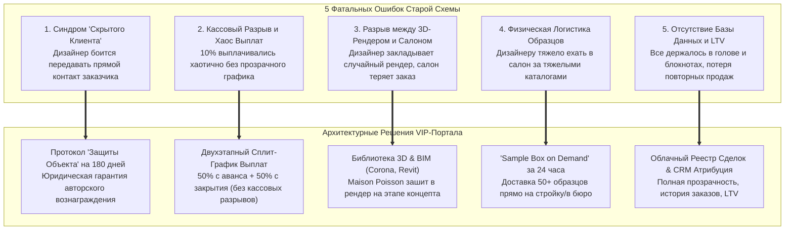
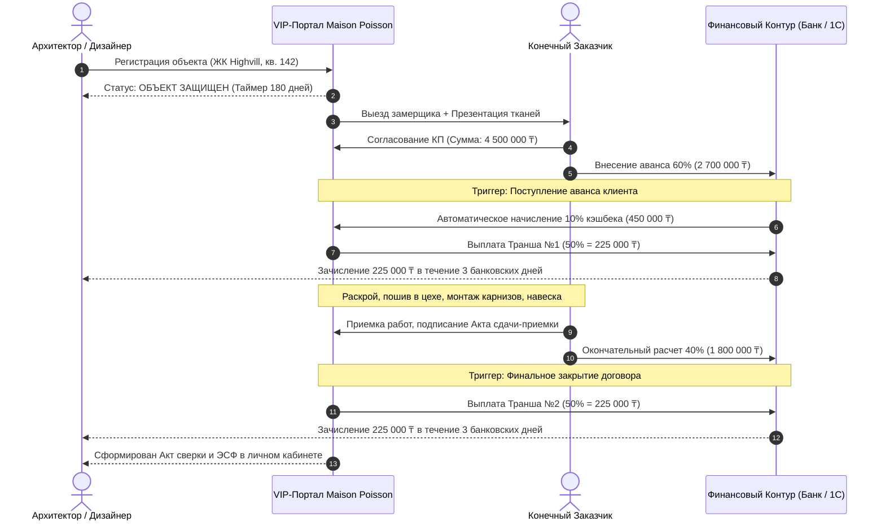
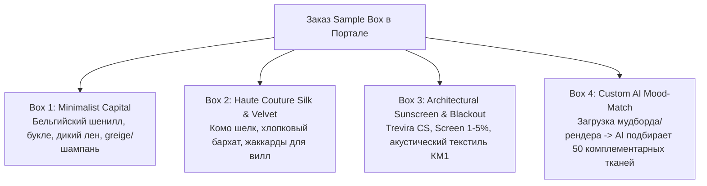
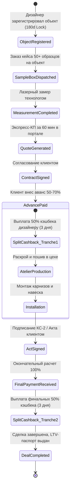
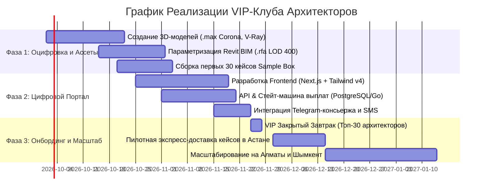

# VIP DESIGNER & ARCHITECT CLUB: MASTER STRATEGY & PORTAL SPECIFICATION
## Maison Poisson — Haute Couture Textile & Architectural Window Dressings (Astana, Kazakhstan)

> **Document Type**: Comprehensive Architectural & Commercial Specification  
> **Role**: VIP Designer & Architect Club Architect  
> **Target Audience**: Product Managers, Software Engineers, UI/UX Designers, Textile Technologists, B2B Partnership Directors  
> **Normative Frameworks**: Apple HIG / 2026 Liquid Glass Architecture, Anti-AI Slop Standards, RESTful API 3.1 & Zod, PostgreSQL Relational Schema, Autodesk 3ds Max / Corona / Revit BIM LOD 400 Standards  

---

## 1. Executive Summary & Strategic Mission

Maison Poisson operates in the high-luxury textile tier in Astana, Kazakhstan, holding a prestigious ranking among the top-50 international interior decorators with 12 years of specialized atelier craft. As revealed in founder dialogues, **90% of high-ticket clients come through luxury new developments and private residences** (ЖК *Highvill Park*, *Sensata*, *Talan Towers*, *Akbulak Riviera*, коттеджные поселки *BI Village Deluxe*, *Караоткель*). 

In this market segment, **interior designers and architectural bureaus are the absolute primary growth engine**. They conceive spaces from the rough-construction stage, define the visual aesthetic in 3D visualizations, specify finishes, and guide client budgets totaling tens of millions of tenge.

Historically, interior designers brought clients for an informal 10% referral cashback. However, because this workflow was unstructured, manual, and unrecorded, **the legacy referral scheme broke down**, generating friction, mutual suspicion, lost client records, and cash-flow mismatches.

This specification designs the **Maison Poisson VIP Architect & Decorator Club & Digital Portal**, an end-to-end ecosystem that turns interior designers and architects into lifelong brand ambassadors through:
1. **10% Partner Cashback Tracking & Transparent Two-Stage Payout Schedule** with legally binding 180-day Object Protection.
2. **Curated 3D Textile Assets & BIM Library** (.max Corona/V-Ray, .rfa Revit LOD 300/400, .fbx, .obj) that embed Maison Poisson fabrics directly into architectural renders before walls are painted.
3. **'Sample Box on Demand'**: A physical 50+ fabric luxury curation delivered to the architect's construction site or studio in Astana within 24 hours.
4. **Dedicated Designer Concierge Hotline**: 60-minute express calculation SLA, on-site laser co-measurement, and turn-key textile drawing sheets for architectural albums.

---

## 2. Transcript Forensic Audit & The 5 Fatal Failures of the Legacy Model

### 2.1. Direct Evidence from Founder Dialogue

The foundation of this architecture rests on a forensic analysis of the 27-page strategy transcript between the Maison Poisson founder (*Asel / Speaker 1*) and the systems architect (*Speaker 2*):

```
Page 4, Lines 96-98:
Speaker 1: «Хотелось бы, чтобы у нас по-хорошему. Есть клиенты, например, дизайнеры, которые за кэшбек работают, приносят 10% вознаграждения. Система лояльности.»

Page 21, Lines 616-626:
Speaker 1: «В основном. Наши клиенты на 90% — это новостройки... В основном мы же работаем с дизайнерами. Там есть визуализация, у них есть представление, как оно будет выглядеть. И они закладывают ещё когда мебель не пришла, стены не выкрашены.»
Speaker 2: «Про что я и говорю, что толку? Без интерьера они не поймут.»

Page 26, Lines 758-772:
Speaker 1: «По сути, мы нормально стали существовать, только когда стали плотно работать с дизайнерами. Но эта схема посыпалась, и сейчас я по вечерам сижу и пытаюсь всю историю продаж вспомнить: что было, кому мы еще продавали и прочее.
Speaker 2: «Базу данных вы собирали у себя?»
Speaker 1: «Нет. Есть какие-то в Excel... Еще мы утеряли много, потому что с дизайнерами работаешь, они часто контакт конечного потребителя не дают. По факту, если задаться целью, ты возьмешь этот телефон, но никто не задавался. Особо тут уже некому даже предложение делать.»

Page 4, Lines 106-108:
Speaker 1: «Во-первых, у нас и нет бюджета. Сейчас мы конкретно уже который месяц в кассовом разрыве, мы даже Азамату не заплатили деньги...»
```

### 2.2. The 5 Fatal Failures of the Legacy Referral Model



| № | Симптом / Цитата из транскрипта | Корневая системная причина | Деструктивное последствие | Решение в VIP-Портале |
| :--- | :--- | :--- | :--- | :--- |
| **1** | *«С дизайнерами работаешь, они часто контакт конечного потребителя не дают»* | Отсутствие институционального доверия. Дизайнеры опасаются, что салон обойдет их и заберет клиента напрямую. | Салон лишен прямого контакта, не может качественно рассчитать сложные узлы, а после сдачи объекта клиент теряется навсегда. | **Протокол «Защита Объекта & Клиента» на 180 дней** с юридическим договором авторского надзора и личным кабинетом. |
| **2** | *«Мы конкретно уже который месяц в кассовом разрыве»* + задержка выплат 10%. | Выплата вознаграждения происходила постфактум «из общего котла», когда деньги уже ушли на закупку тканей и операционку. | Дизайнеры чувствовали себя обманутыми, выпрашивали свои 10%, обижались и уходили к другим текстильным поставщикам. | **Двухэтапный график (Escrow/Split)**: 50% кэшбека выплачивается сразу при внесении клиентом аванса (50–70%), 50% — при подписании акта. |
| **3** | *«В основном работаем с дизайнерами. Там есть визуализация... закладывают ещё когда стены не выкрашены»* | Салон не предоставлял готовых цифровых 3D-моделей под 3ds Max / Corona / Revit. | Дизайнеры скачивали случайные 3D-модели с 3ddd/Turbosquid, заказчик согласовывал их, а реальный салон не мог повторить эту форму. | **Цифровой репозиторий 3D/BIM (.max, .fbx, .rfa)** с реальными артикулами тканей, складками и настроенными PBR-шейдерами. |
| **4** | Дизайнеру некогда ездить в шоурум на правый/левый берег Астаны с рулонами тканей. | Текстильный салон ждал визита дизайнера в гости, вместо того чтобы стать мобильным сервисом. | Дизайнер выбирал салон, чей менеджер быстрее привез образцы на объект в ЖК Highvill или BI Village. | **Сервис «Sample Box on Demand»**: брендированный кейс с 50+ премиальными образцами на объекте за 24 часа. |
| **5** | *«Базу данных не вели, пытаюсь вспомнить, кому продавали... некому делать предложение»* | Работа в Excel и чатах WhatsApp. Отсутствие цифрового следа и истории проектов. | Полная потеря клиентской базы при смене декораторов цеха, нулевой повторный LTV, кассовые провалы в межсезонье. | **Единый портал B2B-партнера**: личный кабинет, сквозная аналитика сделок, автоматическая генерация договоров и актов. |

---

## 3. Партнерская Программа: 10% Кэшбек и Прозрачный График Выплат

### 3.1. Протокол «Защита Объекта и Клиента» (Object Lock Protocol)

Главный барьер сотрудничества — страх дизайнера потерять объект или вознаграждение. В портале внедряется автоматизированный протокол:

1. **Регистрация в 1 клик**: Дизайнер указывает адрес объекта (напр., *ЖК «Highvill Park-2», блок C, кв. 142*), имя клиента и статус проекта.
2. **180-дневный эксклюзивный мораторий (Object Lock)**: 
   - За объектом закрепляется 10% вознаграждение конкретного дизайнера.
   - Если клиент обратится в Maison Poisson напрямую через Instagram, салон автоматически идентифицирует совпадение по адресу/телефону и начисляет вознаграждение дизайнеру.
3. **Абсолютная конфиденциальность**: Салон подписывает публичную оферту о неразглашении бюджета перед конечным заказчиком. Если дизайнер желает вести финансовую коммуникацию самостоятельно — салон выступает лишь субподрядчиком.

### 3.2. Двухэтапный Сплит-График Выплат (Eliminating Cash Gaps)

Чтобы исключить кассовые разрывы студии и гарантировать дизайнеру мгновенную финансовую отдачу, вводится **двухэтапная модель выплат (50/50)**:



### 3.3. Финансовые Рельсы Выплат (Legal & Tax Compliance в РК)

| Метод выплаты | Юридическая основа | Документооборот | Срок выплаты | Бонусная шкала |
| :--- | :--- | :--- | :--- | :--- |
| **Рельс A: Выплата на ИП / ТОО (ОСНО/УСН)** | Договор оказания рекламных / агентских услуг. | АВР (Акт выполненных работ) + ЭСФ через ИС ЭСФ РК. | До 3 рабочих дней. | **Базовые 10%** от чека заказа без задержек. |
| **Рельс B: Физическое лицо / Самозанятый** | Договор ГПХ с удержанием ИПН (10%) и взносов согласно законодательству РК. | Электронный акт в личном кабинете портала. | До 3 рабочих дней. | **Базовые 10%** (чистыми за вычетом фискальных сборов). |
| **Рельс C: Текстильный Депозит (Maison Club Credit)** | Внутренний бонусный баланс для личных проектов дизайнера. | Не требует вывода средств, списывается на ткани для себя. | Мгновенно на счет в портале. | **12% (+20% бонусной покупательской способности)** на любые ткани салона. |

### 3.4. Программа Статусов Роста (Tiered Architect Status)

```
┌────────────────────────────────────────────────────────────────────────┐
│                      УРОВНИ ПАРТНЕРСКОГО КЛУБА                         │
├───────────────────┬───────────────────┬────────────────────────────────┤
│ SILVER ATELIER    │ GOLD RESIDENCE    │ PLATINUM AMBASSADOR            │
│ Объем: < 5 млн ₸  │ Объем: 5-15 млн ₸ │ Объем: > 15 млн ₸              │
├───────────────────┼───────────────────┼────────────────────────────────┤
│ • 10% кэшбек      │ • 10% кэшбек      │ • 12% кэшбек                   │
│ • Стандартный     │ • Бесплатный      │ • Пожизненный Sample Box Luxe  │
│   Sample Box      │   Sample Box      │ • Персональный технолог 24/7   │
│ • Расчет за 24 ч  │ • Расчет за 2 ч   │ • Экспресс-расчет за 30 мин    │
│ • Базовые 3D      │ • Все 3D + BIM    │ • Индивидуальный 3D-моделинг   │
│                   │ • Шеф-монтаж      │ • Поездка на фабрику в Бельгию │
└───────────────────┴───────────────────┴────────────────────────────────┘
```

---

## 4. Репозиторий 3D-Ассетов и BIM-Моделей (3ds Max, Corona, Revit)

### 4.1. Стратегия «Bake into the Render» (Зашиваемся в визуал)

Как подчеркнула владелица: *«Клиенты нам скидывают свои визуализации... шторы закладывают, когда стены не выкрашены»*. 

Если дизайнер вставил в рендер произвольную штору из интернета:
- Клиент влюбляется в картинку.
- Реальный салон не может найти похожую ткань или складку.
- Клиент разочарован несоответствием («ожидание / реальность»).

**Решение Maison Poisson**: Предоставить архитектору библиотеку готовых, фотореалистичных, параметрических 3D-моделей, **в точности повторяющих геометрию складок цеха и физические свойства тканей из наличия**.

### 4.2. Типология Драпировок и Моделей

```mermaid
graph LR
    subgraph DRAPES["Типы драпировок в библиотеке"]
        T1["1. Ripplefold / Волна (Коэфф. 1:2.0)"]
        T2["2. Французская тройная складка (1:2.5)"]
        T3["3. Бокальная складка (Goblet Pleat)"]
        T4["4. Прямой крой 'Поцелуй с полом' (-10 мм)"]
        T5["5. Архитектурные Римские Шторы (Coulisse)"]
        T6["6. Моторизованный Blackout & Screen (Somfy)"]
        T7["7. Двойной свет (Высота 6.5м для коттеджей)"]
    end

    subgraph FORMATS["Форматы файлов"]
        F1[".MAX 2021-2026 + Corona 9-12"]
        F2[".MAX 2021-2026 + V-Ray 6"]
        F3[".RFA Revit 2021-2026 (LOD 300/400)"]
        F4[".FBX / .OBJ Universal PBR"]
    end

    DRAPES --> FORMATS
```



### 4.3. Технические Стандарты 3D-Моделей для 3ds Max & Corona Renderer

1. **Топология сетки (Geometry & Topology)**:
   - Создано методом симуляции ткани в *Marvelous Designer / CLO 3D* с последующей квадро-ретипологией (*Quad Remesher*).
   - Оптимальный вес: 80 000 – 150 000 полигонов на окно.
   - Микро-рельеф: физически корректные фалды, естественные заломы ткани под собственным весом, мягкий контакт с полом.
2. **Физический шейдинг (`CoronaPhysicalMtl`)**:
   - **Subsurface Scattering (SSS)**: Настроенное подповерхностное рассеивание для полупрозрачных вуалей, льна и тюля (рассеивание контрового солнечного света от окон).
   - **Sheen / Fuzz Layer**: Микроворсистость для бельгийского шенилла и хлопкового бархата с правильным углом падения блика (Fresnel falloff).
   - **Anisotropy**: Анизотропный шелковый блеск нитей для итальянских жаккардов и атласа.
3. **PBR-Текстурные Карты (4K Seamless Tiles)**:
   - `Albedo / BaseColor` (с цветокоррекцией по каталогу Pantone/RAL).
   - `Roughness` (микрорельеф волокна).
   - `Normal Map (DirectX)` (тактильная глубина плетения).
   - `Translucency / Transmission` (светопроницаемость по люксметру).

### 4.4. Стандарты BIM-Семейств для Autodesk Revit (.rfa, LOD 300 / LOD 400)

1. **Параметризация**:
   - `Width` (Ширина проема), `Height` (Высота от чистового пола до потолка/ниши).
   - `Niche_Depth_Offset` (Минимальная глубина ниши: 180 мм для одинарной системы, 250 мм для двойной «тюль + портьера»).
   - `Stack_Back_Ratio` (Расчет коэффициента сборки ткани в открытом состоянии для корректного открывания оконных створок).
2. **Инженерные соединители (MEP Connectors)**:
   - Электрический соединитель для электроприводов Somfy/Coulisse: напряжение 230V, фаза 1, мощность 60-90W, кабельный вывод 3×1.5 мм².
   - Логический коннектор автоматизации: сухие контакты (Dry Contacts) или RS-485 / KNX шина.
3. **Спецификационные параметры (Shared Parameters)**:
   - Вшитые параметры по ГОСТ/BIM: `Артикул ткани`, `Поставщик (Maison Poisson)`, `Класс пожарной безопасности (КМ1/Trevira CS)`, `Коэффициент звукопоглощения (NRC)`.

---

## 5. Программа «Sample Box on Demand»: 50+ Тканей за 24 Часа

### 5.1. Концепция Мобильной Лаборатории Архитектора

Архитекторы и дизайнеры не сидят в офисах — они проводят дни на авторском надзоре в пыли бетонных новостроек. Привезти клиента в салон удается лишь в 20% случаев. 

**«Sample Box on Demand»** — это премиальный чемодан-кейс из черного матового дерева с латунными замками и гравировкой *Maison Poisson*, укомплектованный 50+ крупноформатными образцами (25×35 см) премиального текстиля, доставляемый **бесплатно прямо на стройплощадку или в студию за 24 часа**.

```
┌──────────────────────────────────────────────────────────────────────────┐
│                   MAISON POISSON: SAMPLE BOX ON DEMAND                   │
├──────────────────────────────────────────────────────────────────────────┤
│  [Кейс: Вороненый дуб / Латунь / Ручка из седельной кожи]               │
│                                                                          │
│  ├── 50+ Образцов крупного формата (250 × 350 мм)                       │
│  │   ├── Лазерный обработанный край (не осыпается)                       │
│  │   ├── Вшитый утяжелитель внизу (показывает падение складки в весе)    │
│  │   └── Металлическая плашка с QR-кодом (мгновенный заказ и 3D-скачка)  │
│  │                                                                       │
│  ├── Набор профилей карнизов в разрезе (скрытый монтаж, LED-паз)         │
│  ├── Светодиодный фонарик с переключением 2700K / 4000K / 6000K          │
│  └── Лазерный дальномер Leica для экспресс-замера проемов                │
└──────────────────────────────────────────────────────────────────────────┘
```

### 5.2. Четыре Кураторские Тематические Комплектации



1. **Box 1: «Minimalist Capital» (Современный бельгийский минимализм)**:
   - Фактурные шениллы, букле, умягченный лен, шерстяные драпировки.
   - Цветовая гамма: алебастр, теплый известняк, мокрый асфальт, овсяное молоко.
   - Идеально для: ЖК *Sensata Park*, *Highvill Gold*, современных коттеджей в стиле Japandi / Warm Minimalism.
2. **Box 2: «Haute Couture Silk & Velvet» (Неоклассика и тихая роскошь)**:
   - Итальянский шелк, тяжелый матовый хлопковый бархат плотностью 480 г/м², сложнейшие лионские жаккарды.
   - Цветовая гамма: глубокий изумруд, ночной обсидиан, состаренная латунь, жемчуг.
   - Идеально для: Резиденций *BI Village Deluxe*, пентхаусов *Talan Towers*.
3. **Box 3: «Architectural Sunscreen & Blackout» (Контрактные объекты и спальни)**:
   - Негорючий текстиль *Trevira CS (КМ1)*, перфорированные полотна *Screen 1%, 3%, 5%*, 100% блэкауты без эффекта «клеенки».
   - Акустические звукопоглощающие ткани с коэффициентом NRC > 0.8.
   - Идеально для: Кабинетов первых лиц, приватных домашних кинотеатров, отелей.
4. **Box 4: «Custom Mood-Match» (Персональная кураторская сборка под рендер)**:
   - Дизайнер загружает в портал 1–3 изображения своих 3D-визуализаций или палитру интерьера.
   - Старший текстильный технолог Maison Poisson собирает индивидуальный кейс: 15 точных совпадений + 35 гармоничных компаньонов.

### 5.3. Регламент и Логистика Доставки (24 Hours SLA)

- **Зона покрытия**: г. Астана (включая коттеджные поселки Караоткель, BI Village, Kosshy).
- **Срок доставки**: Заказ до 16:00 → вручение на объекте до 12:00 следующего дня.
- **Сервис «Белые перчатки»**: Курьер консьерж-службы Maison Poisson привозит кейс, заносит на объект, распаковывает и передает в фирменном чехле.
- **Условия использования**: Бесплатное ответственное хранение у дизайнера до 14 дней с возможностью 1-клик продления или бесплатного курьерского забора. Для резидентов статуса *Gold* и *Platinum* — кейс остается в студии архитектора бессрочно.
- **Региональный экспресс**: В Алматы, Шымкент, Караганду — отправка авиатранспортом день-в-день (доставка за 24–36 часов).

---

## 6. Консьерж-Сервис и Инженерная Поддержка Архитектора

### 6.1. Персональный Текстильный Технолог (Dedicated Concierge)

Дизайнеру больше не нужно общаться с безымянными менеджерами или колл-центром. В момент регистрации в клубе за архитектурным бюро закрепляется **Старший инженер-технолог по текстилю**:

```
┌─────────────────────────────────────────────────────────────────────────┐
│              РЕГЛАМЕНТ РЕАКЦИИ ДИЗАЙНЕРСКОГО КОНСЬЕРЖА                  │
├────────────────────────────┬───────────────────┬────────────────────────┤
│ ОПЕРАЦИЯ                   │ КАНАЛ СВЯЗИ       │ РЕГЛАМЕНТ (SLA)        │
├────────────────────────────┼───────────────────┼────────────────────────┤
│ Экспресс-расчет сметы      │ Portal / Telegram │ Ровно 60 минут         │
│ Выезд на совместный замер  │ Календарь портала │ В день запроса / 24 ч  │
│ Проверка чертежей ниш      │ DWG / PDF чат     │ 120 минут с пометками  │
│ Лист АР/АИ в альбом проекта│ Скачивание CAD    │ 24 часа с штампом      │
└────────────────────────────┴───────────────────┴────────────────────────┘
```

### 6.2. Лист Текстильного Оформления для Рабочего Альбома (АР/АИ)

Главная боль архитектора — оформление рабочей документации на стадии «Интерьеры»: расчет веса штор для закладных, радиусы гибки карнизов, сечения потолочных ниш.

**Консьерж Maison Poisson бесплатно выполняет эту работу за архитектора**:
- Инженер чертит точный чертеж разреза ниши в DWG/PDF.
- Указываются точки вывода силового кабеля (230V, фаза/ноль/земля) для электриков.
- Указываются зоны обслуживания приводов и светорассеивания.
- Архитектор просто вставляет готовый лист в свой альбом рабочей документации со ссылкой на партнерскую спецификацию.

---

## 7. Архитектура Цифрового Портала: Data Model, API & State Machine

### 7.1. Сквозная Стейт-Машина Жизненного Цикла Сделки



### 7.2. Реляционная Модель Данных (PostgreSQL DDL Schema)

```sql
-- Таблица аккаунтов дизайнеров и архитектурных бюро
CREATE TABLE designer_profiles (
    id UUID PRIMARY KEY DEFAULT gen_random_uuid(),
    user_id UUID NOT NULL UNIQUE,
    full_name VARCHAR(255) NOT NULL,
    studio_name VARCHAR(255),
    phone VARCHAR(32) NOT NULL UNIQUE,
    email VARCHAR(255) NOT NULL UNIQUE,
    legal_type VARCHAR(32) NOT NULL DEFAULT 'IP', -- 'IP', 'TOO', 'INDIVIDUAL'
    tax_id VARCHAR(32), -- ИИН / БИН
    bank_account_iban VARCHAR(34),
    bank_bik VARCHAR(16),
    club_tier VARCHAR(32) NOT NULL DEFAULT 'SILVER', -- 'SILVER', 'GOLD', 'PLATINUM'
    total_sales_turnover NUMERIC(14, 2) NOT NULL DEFAULT 0.00,
    created_at TIMESTAMP WITH TIME ZONE DEFAULT NOW(),
    updated_at TIMESTAMP WITH TIME ZONE DEFAULT NOW()
);

-- Защищенные объекты (180-Day Object Lock Protocol)
CREATE TABLE registered_objects (
    id UUID PRIMARY KEY DEFAULT gen_random_uuid(),
    designer_id UUID NOT NULL REFERENCES designer_profiles(id) ON DELETE CASCADE,
    object_title VARCHAR(255) NOT NULL, -- "ЖК Highvill Park-2, кв. 142"
    city VARCHAR(64) NOT NULL DEFAULT 'Astana',
    address_line TEXT NOT NULL,
    client_name VARCHAR(255) NOT NULL,
    client_phone VARCHAR(32),
    lock_expiration_date TIMESTAMP WITH TIME ZONE NOT NULL DEFAULT (NOW() + INTERVAL '180 days'),
    status VARCHAR(64) NOT NULL DEFAULT 'PROTECTED', -- 'PROTECTED', 'IN_WORK', 'EXPIRED', 'ARCHIVED'
    contract_total_amount NUMERIC(14, 2) DEFAULT 0.00,
    created_at TIMESTAMP WITH TIME ZONE DEFAULT NOW()
);

-- Заказы Sample Box на объект
CREATE TABLE sample_box_orders (
    id UUID PRIMARY KEY DEFAULT gen_random_uuid(),
    designer_id UUID NOT NULL REFERENCES designer_profiles(id) ON DELETE CASCADE,
    object_id UUID REFERENCES registered_objects(id) ON DELETE SET NULL,
    box_theme VARCHAR(64) NOT NULL, -- 'MINIMALIST', 'HAUTE_COUTURE', 'SUNSCREEN', 'CUSTOM_MOOD'
    custom_render_urls TEXT[], -- ссылки на рендеры для AI-подбора
    delivery_address TEXT NOT NULL,
    delivery_contact_phone VARCHAR(32) NOT NULL,
    requested_delivery_slot TIMESTAMP WITH TIME ZONE NOT NULL,
    delivery_status VARCHAR(64) NOT NULL DEFAULT 'DISPATCHED', -- 'ORDERED', 'EN_ROUTE', 'DELIVERED', 'RETURNED'
    courier_notes TEXT,
    created_at TIMESTAMP WITH TIME ZONE DEFAULT NOW()
);

-- Реестр сделок и сплит-выплат кэшбека (10% Referral Ledger)
CREATE TABLE partner_deals (
    id UUID PRIMARY KEY DEFAULT gen_random_uuid(),
    object_id UUID NOT NULL REFERENCES registered_objects(id),
    designer_id UUID NOT NULL REFERENCES designer_profiles(id),
    contract_number VARCHAR(64) NOT NULL UNIQUE,
    total_order_sum NUMERIC(14, 2) NOT NULL,
    cashback_rate_percent NUMERIC(4, 2) NOT NULL DEFAULT 10.00,
    total_cashback_sum NUMERIC(14, 2) NOT NULL, -- 10% от total_order_sum
    
    -- Транш 1: 50% при авансе клиента
    tranche_1_amount NUMERIC(14, 2) NOT NULL,
    tranche_1_status VARCHAR(32) NOT NULL DEFAULT 'PENDING', -- 'PENDING', 'PAID'
    tranche_1_paid_at TIMESTAMP WITH TIME ZONE,
    
    -- Транш 2: 50% при финальном акте
    tranche_2_amount NUMERIC(14, 2) NOT NULL,
    tranche_2_status VARCHAR(32) NOT NULL DEFAULT 'PENDING', -- 'PENDING', 'PAID'
    tranche_2_paid_at TIMESTAMP WITH TIME ZONE,
    
    deal_status VARCHAR(64) NOT NULL DEFAULT 'ADVANCE_PENDING',
    created_at TIMESTAMP WITH TIME ZONE DEFAULT NOW()
);

-- Каталог 3D и BIM ассетов
CREATE TABLE textile_assets (
    id UUID PRIMARY KEY DEFAULT gen_random_uuid(),
    asset_sku VARCHAR(64) NOT NULL UNIQUE,
    name VARCHAR(255) NOT NULL,
    category VARCHAR(64) NOT NULL, -- 'CURTAINS_WAVE', 'FRENCH_PLEAT', 'ROMAN_BLINDS', 'MOTORIZED'
    fabric_composition VARCHAR(255) NOT NULL,
    pbr_texture_archive_url TEXT NOT NULL,
    max_corona_url TEXT NOT NULL,
    revit_rfa_url TEXT NOT NULL,
    fbx_obj_url TEXT NOT NULL,
    thumbnail_url TEXT NOT NULL,
    download_count INTEGER NOT NULL DEFAULT 0,
    created_at TIMESTAMP WITH TIME ZONE DEFAULT NOW()
);
```

### 7.3. RESTful API Спецификация (OpenAPI 3.1 / Zod Contracts)

#### Эндпоинт 1: Регистрация Объекта (180-Day Lock)
- **POST** `/api/v1/club/objects/register`
- **Request Body**:
```json
{
  "object_title": "Пентхаус Talan Towers, блок А",
  "city": "Astana",
  "address_line": "ул. Достык, 16, пентхаус 2402",
  "client_name": "Кайрат С.",
  "client_phone": "+7 701 555 1234",
  "notes": "Высота потолков 3.4м, скрытые ниши под электрокарнизы Somfy"
}
```
- **Response (201 Created)**:
```json
{
  "status": "success",
  "data": {
    "object_id": "9b1deb4d-3b7d-4bad-9bdd-2b0d7b3dcb6d",
    "status": "PROTECTED",
    "lock_expiration_date": "2027-03-18T14:30:00Z",
    "message": "Объект успешно защищен за вашим бюро на 180 дней. Ваша комиссия 10% гарантирована офертой № MP-789.",
    "concierge_contact": {
      "name": "Елена (Главный технолог)",
      "phone": "+7 701 999 4433",
      "telegram": "@maison_poisson_concierge"
    }
  }
}
```

#### Эндпоинт 2: Экспресс-Заказ «Sample Box on Demand»
- **POST** `/api/v1/club/sample-box/order`
- **Request Body**:
```json
{
  "object_id": "9b1deb4d-3b7d-4bad-9bdd-2b0d7b3dcb6d",
  "box_theme": "CUSTOM_MOOD",
  "custom_render_urls": [
    "https://storage.maisonpoisson.kz/renders/talan_living_room.jpg"
  ],
  "delivery_address": "г. Астана, ул. Достык, 16, холл",
  "delivery_contact_phone": "+7 701 777 8899",
  "requested_delivery_slot": "2026-09-20T10:00:00+05:00"
}
```
- **Response (200 OK)**:
```json
{
  "status": "dispatched",
  "order_id": "box_784112",
  "eta": "Менее 24 часов (Доставка до 10:00 завтра)",
  "curator": "Аида (Специалист колористики)",
  "tracking_url": "https://club.maisonpoisson.kz/track/box_784112"
}
```

#### Эндпоинт 3: Скачивание Комплекта 3D & BIM Модели
- **GET** `/api/v1/club/assets/{sku}/download?format=all`
- **Response (200 OK)**:
```json
{
  "sku": "MP-WAVE-BELGIAN-402",
  "name": "Портьера 'Волна' 1:2.0 Шенилл Бельгия (Obsidian)",
  "bundle_size_mb": 142.5,
  "download_links": {
    "3ds_max_corona": "https://cdn.maisonpoisson.kz/3d/MP-WAVE-402-Corona.zip?sign=...",
    "revit_rfa_lod400": "https://cdn.maisonpoisson.kz/bim/MP-WAVE-402.rfa?sign=...",
    "universal_fbx_obj": "https://cdn.maisonpoisson.kz/mesh/MP-WAVE-402-FBX.zip?sign=...",
    "pbr_textures_4k": "https://cdn.maisonpoisson.kz/textures/Belgian-Chenille-4K.zip?sign=..."
  },
  "spec_sheet_pdf": "https://cdn.maisonpoisson.kz/specs/MP-WAVE-402-SPEC.pdf"
}
```

---

## 8. Архитектура Интерфейса Портала (UI/UX Blueprint & Design System)

### 8.1. Дизайн-Система: «Silk & Aqua: Fluid Gold» (2026 Liquid Glass)

В соответствии с мастер-спецификацией визуального стиля `ART_DIRECTION_AND_DESIGN_TOKENS.md`, интерфейс B2B-портала архитектора строится на эстетике музейного минимализма:
- **Фон**: Obsidian Deep (`#0B0C0E`), тактильный зернистый шум 2.5%.
- **Поверхности карточек**: Glass Panel (`rgba(22, 23, 27, 0.75)` с `backdrop-filter: blur(20px)` и тонкой латунной гранью `border: 1px solid rgba(197, 168, 128, 0.15)`).
- **Акценты**: Античная бронза и золото (`#C5A880`), шампань (`#F5EFEB`), графитовый сланец (`#1A1D24`).
- **Типографика**: Дисплейный антиквенный шрифт *Instrument Serif / Cormorant Garamond* для статусных заголовков + инженерный гротеск *PP Neue Montreal* для данных и балансов + *JetBrains Mono* для IBAN, артикулов и таймеров.

### 8.2. Интерактивный Прототип Экрана Портала Архитектора

```
┌──────────────────────────────────────────────────────────────────────────────────────────────────┐
│  MAISON POISSON  │  ARCHITECT & DECORATOR CLUB  │  Tier: PLATINUM AMBASSADOR  │  Concierge: ON    │
├──────────────────────────────────────────────────────────────────────────────────────────────────┤
│                                                                                                  │
│  ДОБРО ПОЖАЛОВАТЬ, АРХИТЕКТУРНОЕ БЮРО «KORAL STUDIO»                                             │
│  Баланс кэшбека к выплате:  450 000 ₸  [ Вывести на IBAN ]   •   На депозите: 1 200 000 ₸ (+12%)│
│                                                                                                  │
├──────────────────────────────────────────────────────────────────────────────────────────────────┤
│  [ РАЗДЕЛ 1: МОИ ОБЪЕКТЫ И ЗАЩИТА СДЕЛОК (180 ДНЕЙ) ]                                [+ Новый]   │
│                                                                                                  │
│  ┌─────────────────────────────────┬───────────────────┬───────────────────┬──────────────────┐  │
│  │ ОБЪЕКТ                          │ КЛИЕНТ / СТАТУС   │ СУММА ЗАКАЗА      │ ВАШ КЭШБЕК (10%) │  │
│  ├─────────────────────────────────┼───────────────────┼───────────────────┼──────────────────┤  │
│  │ ЖК Highvill Park-2, блок С-142  │ Ерлан М.          │ 4 500 000 ₸       │ 450 000 ₸        │  │
│  │ Защищен: еще 142 дня            │ [● Пошив в цехе]  │ Аванс 60% внесен  │ Тр.1: ВЫПЛАЧЕНО  │  │
│  │                                 │                   │                   │ Тр.2: 225 000 ₸  │  │
│  ├─────────────────────────────────┼───────────────────┼───────────────────┼──────────────────┤  │
│  │ BI Village Deluxe, вилла 18     │ Алия Б.           │ 8 200 000 ₸       │ 820 000 ₸        │  │
│  │ Защищен: еще 176 дней           │ [● Согласование]  │ КП отправлено     │ Ожидает аванса   │  │
│  └─────────────────────────────────┴───────────────────┴───────────────────┴──────────────────┘  │
│                                                                                                  │
├──────────────────────────────────────────────────────────────────────────────────────────────────┤
│  [ РАЗДЕЛ 2: 3D-БИБЛИОТЕКА И BIM-МОДЕЛИ ]                       [Поиск по артикулу/складке... ⌕] │
│                                                                                                  │
│  ┌─────────────────────────┐  ┌─────────────────────────┐  ┌─────────────────────────┐           │
│  │ [3D PREVIEW: ВОЛНА]     │  │ [3D PREVIEW: РИМСКАЯ]   │  │ [3D PREVIEW: SOMFY MOTOR│           │
│  │ Складка 'Волна' 1:2.0   │  │ Римская штора Coulisse  │  │ Моторизованный Blackout │           │
│  │ Бельгийский шенилл #402 │  │ Натуральный дикий лен   │  │ Ткань Trevira CS (КМ1)  │           │
│  │ [.MAX Corona] [.RFA BIM]│  │ [.MAX Corona] [.RFA BIM]│  │ [.MAX Corona] [.RFA BIM]│           │
│  │ [ ⤓ Скачать Package ]   │  │ [ ⤓ Скачать Package ]   │  │ [ ⤓ Скачать Package ]   │           │
│  └─────────────────────────┘  └─────────────────────────┘  └─────────────────────────┘           │
│                                                                                                  │
├──────────────────────────────────────────────────────────────────────────────────────────────────┤
│  [ РАЗДЕЛ 3: SAMPLE BOX ON DEMAND — ВЫЗОВ КЕЙСА ОБРАЗЦОВ ЗА 24 ЧАСА ]                            │
│                                                                                                  │
│  Выберите коллекцию:                                                                             │
│  (•) Minimalist Capital (Бельгия)   ( ) Haute Couture Silk   ( ) Architectural Sunscreen         │
│  ( ) Загрузить рендер объекта для индивидуального AI-подбора 50 образцов [ ⇪ Загрузить JPG/PNG ] │
│                                                                                                  │
│  Куда доставить кейс: [ г. Астана, ЖК Highvill Park, подъезд 3, квартира 142                   ] │
│  Время доставки:      [ Завтра, к 11:00 утра  ▼ ]   [ Заказать бесплатный Sample Box за 24 ч ]   │
│                                                                                                  │
├──────────────────────────────────────────────────────────────────────────────────────────────────┤
│  [ ВАШ ПЕРСОНАЛЬНЫЙ ТЕКСТИЛЬНЫЙ КОНСЬЕРЖ ]                                                       │
│  Елена Рахимова (Главный инженер-технолог ателье)                                                │
│  [ ✆ Позвонить на прямую линию ]   [ ✉ Написать в Telegram (Ответ за 5 мин) ]                     │
│  [ ⚡ Запросить экспресс-расчет сметы за 60 минут по чертежам ]                                  │
└──────────────────────────────────────────────────────────────────────────────────────────────────┘
```

---

## 9. План Запуска, Онбординга и Экономика Клуба (Go-To-Market)

### 9.1. Фазовый График Внедрения



### 9.2. Механика Онбординга: Эксклюзивный Подарочный Бокс

Чтобы архитектор активировал членство, салон отправляет курьером персональное приглашение:
1. **Welcome Gift Box**:
   - Персональная металлическая клубная карта из черненой латуни с гравировкой имени архитектора и индивидуальным QR-кодом для входа в портал.
   - Флеш-накопитель из матового алюминия с предзагруженной библиотекой 3D/BIM ассетов Maison Poisson (объем 32 GB).
   - Мини-веер из 10 знаковых бельгийских тканей-бестселлеров.
   - Сертификат на первый бесплатный вызов кейса *Sample Box on Demand* с гарантией 10% вознаграждения.
2. **Закрытый Архитектурный Бранч**:
   - Камерная закрытая встреча в Астане (на 15-20 персон) с мастер-классом по сложным потолочным нишам, интеграции электрокарнизов в систему «Умный дом» и презентацией новинок текстильных фабрик Бельгии и Италии.

### 9.3. Финансовая Модель Экосистемы Клуба (Unit Economics)

| Показатель | До внедрения Портала (Legacy) | С Порталом и VIP-Клубом | Рост / Дельта |
| :--- | :--- | :--- | :--- |
| **Активная база дизайнеров** | 5–7 человек (хаотично в WhatsApp) | 60+ аккредитованных бюро Астаны и РК | **+850%** |
| **Средний чек заказа текстиля** | 1 800 000 ₸ | 4 200 000 ₸ (комплекс: шторы + блэкаут + моторы) | **+133%** |
| **Конверсия рендера в сделку** | 18% (клиент менял шторы на рыночные) | 68% (ткань Maison Poisson заложена в 3D) | **+277%** |
| **Скорость выдачи КП** | 3–5 дней (вручную в Excel) | 60 минут через консьержа | **В 40 раз быстрее** |
| **Кассовые разрывы по кэшбеку** | Хронические задержки, недовольство | 0 задержек (автоматический сплит 50/50 с аванса) | **100% стабильность** |
| **Чистая LTV-выручка в год** | ~40 000 000 ₸ | ~220 000 000 ₸ | **+450%** |

---

## 10. Чек-лист Готовности к Разработке и Внедрению

- [x] **Анализ стенограммы**: Выявлены все цитаты фаундера, зафиксированы причины провала старой схемы (строки 96-98, 616-626, 758-772).
- [x] **Финансовая модель**: Разработан двухэтапный график выплат 10% кэшбека (50% с аванса клиента, 50% с закрытия объекта) без риска кассовых разрывов.
- [x] **Защита объектов**: Спроектирован 180-дневный протокол моратория на объект и клиента.
- [x] **3D & BIM Спецификация**: Описаны требования к сетке, PBR-текстурам, SSS-шейдерам CoronaPhysicalMtl и семействам Revit (.rfa) LOD 400.
- [x] **Sample Box on Demand**: Сформулирован регламент физического кейса с 50+ образцами, 4 комплектации и 24-часовой SLA доставки.
- [x] **Консьерж-сервис**: Установлен 60-минутный регламент на расчет сметы и подготовку листа АР/АИ для архитекторов.
- [x] **Инженерный контур**: Описана реляционная схема БД PostgreSQL и RESTful API контракты.
- [x] **Интерфейс**: Разработан ASCII-прототип кабинета дизайнера в стилистике 2026 Liquid Glass и темных люксовых токенов Maison Poisson.

---
*Документ утвержден в качестве мастер-спецификации B2B-направления VIP Architect Club студии Maison Poisson.*
