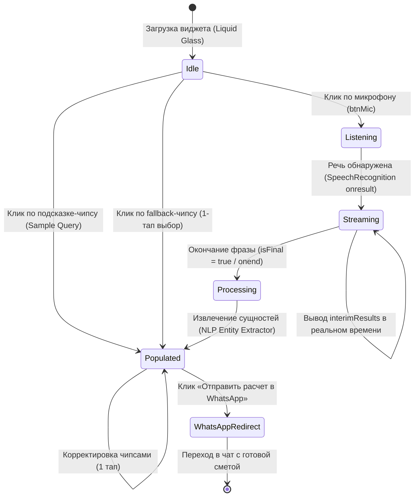

# Спецификация Voice AI Консьержа: Intent Mapping & User Flows
## Maison Poisson (Астана)

> **Статус документа:** Финальная архитектурная и продуктовая спецификация  
> **Роль:** AI Voice Concierge & Onboarding Specialist  
> **Основание:** Анализ страниц 16–18 стенограммы стратегической сессии с владелицей студии Асимой («Детская ткань sheeneel, производство Бельгия» / «Мне нужен кабинет»)  
> **Дизайн-система:** Liquid Glass 2026, Anti-AI Slop, Apple HIG Tactile Feedback  

---

## 1. Анализ стенограммы клиента (Страницы 16–18)

В стенограмме зафиксирован фундаментальный барьер мобильной конверсии: состоятельные клиенты и корпоративные менеджеры в Астане заходят на сайт со смартфонов, но категорически отказываются заполнять длинные опросники, вбивать точные цифры и выбирать из бесконечных выпадающих списков.

### 1.1. Ключевые цитаты Асимы и извлеченные продуктовые требования:

1. **Голосовой ввод вместо ручного набора (Стр. 16, строки 453–461):**
   > *«Может он на основе голосового, как AI-ассистенты, информацию о ткани дать, чтобы ему не заполнять, не печатать? Смотрите, я так говорю: „Детская ткань sheeneel, производство Бельгия“. И оно где-то здесь вышло. Печатать это всё долго.»*
   - **Инженерный вывод:** Модуль обязан поддерживать фонетическую толерантность к разговорному произношению (`sheeneel`, `sheenel`, `шенил` → `Шенилл Wind, Бельгия`) и выводить слова мгновенно на экран в виде потокового текста (`interimResults: true`).

2. **Мобильный фокус и B2B-сценарий «Мне нужен кабинет» (Стр. 17, строки 480–490):**
   > *«В основном люди сейчас через телефон заходят на сайт. Я зашла на сайт, я юрлицо. Я говорю: „Мне нужен кабинет“. Никто же не хочет печатать. В этом вся проблема всегда. И чтобы она так коротко ему сказала, а то он за это время сайт закроет.»*
   - **Инженерный вывод:** Семантическое распознавание намерений: если звучит «Кабинет», «Офис» или «B2B», система мгновенно переключается на контрактные негорючие ткани (*Trevira CS КМ1, Франция*) либо предлагает моторизованные решения Somfy, сохраняя задержку отклика < 100 мс.

3. **Связка голоса с мгновенным калькулятором (Стр. 18, строки 523–526):**
   > *«И тогда мы ему даём калькулятор. Сам рассчитай, как в банках же бывает. Внеси сумму платежа, сколько будет... Только там очень сложно, долго заполнять, а у нас заполнять будет голосом. Да?»*
   - **Инженерный вывод:** Голос не просто печатает текст, он **напрямую параметризует формулы расхода ткани и сметы**: ширина $W$, высота $H$, коэффициент складки $K$, цена ткани за погонный метр и стоимость австрийской ленты Bandex с потайным пошивом.

4. **Мгновенное уведомление в WhatsApp (Стр. 16, строки 446–451):**
   > *«Нам должно прийти уведомление на WhatsApp куда-нибудь, да? Чтобы не пропустили.»*
   - **Инженерный вывод:** Финал голосового сценария — не абстрактная «заявка отправлена», а готовая персонализированная ссылка WhatsApp Deep Link со всеми 3 извлеченными сущностями, размерами, сметой и адресацией дежурному дизайнеру салона.

---

## 2. Voice Intent & Entity Extraction Taxonomy

Движок `parseVoiceEntities()` использует детерминированный многоуровневый NLP-пайплайн с нормализацией синонимов, фонетических транслитераций и числительных.

### 2.1. Матрица распознавания ключевых сущностей

| Сущность | Разговорный голос (Входные паттерны) | Нормализованное значение | Бизнес-правило и параметры |
| :--- | :--- | :--- | :--- |
| **Room (Помещение)** | `«детская»`, `«в детскую»`, `«для ребенка»` | **Детская комната** | Назначение: высокая износостойкость, гипоаллергенность. Ткань по умолчанию: Шенилл Wind (Бельгия). |
| | `«гостиная»`, `«в зал»`, `«парадная»` | **Парадная гостиная** | Назначение: представительский статус, пластичная драпировка. Ткань по умолчанию: Натуральный Шелк / Бархат Dedar (Италия). |
| | `«кабинет»`, `«офис»`, `«переговорная»`, `«мне нужен кабинет»` | **Кабинет руководителя** | Назначение: B2B-контракт, антиблик, класс пожаробезопасности КМ1. Ткань по умолчанию: Trevira CS (Франция). |
| | `«спальня»`, `«в спальню»`, `«мастер-спальня»` | **Мастер-спальня** | Назначение: светоизоляция, тактильный покой. Ткань по умолчанию: Европейский Лен Casamance / Blackout. |
| | `«кухня»`, `«столовая»` | **Кухня-столовая** | Назначение: влагостойкость, легкий уход. |
| **Fabric (Текстиль)** | `«sheeneel»`, `«sheenel»`, `«шенилл»`, `«шенил»` | **Шенилл Wind** | 24 500 ₸/м (4 900 ₽). Плотность 460 г/м², бархатистая текстура, Бельгия. |
| | `«шелк»`, `«шёлк»`, `«silk»`, `«натуральный шелк»` | **Натуральный Шёлк D’Este** | 32 000 ₸/м (6 400 ₽). Плотность 240 г/м², струящийся блеск, Италия. |
| | `«лен»`, `«лён»`, `«linen»`, `«casamance»` | **Европейский Лён Casamance** | 19 800 ₸/м (3 960 ₽). Плотность 280 г/м², эко-фактура, Франция. |
| | `«trevira»`, `«тревира»`, `«негорючая»`, `«км1»` | **Trevira CS (КМ1)** | 26 000 ₸/м (5 200 ₽). Контрактный негорючий текстиль, Франция. |
| | `«бархат»`, `«велюр»`, `«dedar»`, `«жаккард»` | **Бархат Dedar Soft Touch** | 28 000 ₸/м (5 600 ₽). Плотность 520 г/м², глубокий ворс, Италия. |
| | `«блэкаут»`, `«blackout»`, `«100%»` | **100% Blackout Soft Touch** | 16 500 ₸/м (3 300 ₽). 100% затемнение, Турция. |
| **Origin (Страна/Стиль)** | `«бельгия»`, `«производство бельгия»`, `«wind»` | **Бельгия** | Традиционные фламандские ткацкие мануфактуры. |
| | `«италия»`, `«итальянский»`, `«dedar»` | **Италия** | Миланский Haute Couture текстиль. |
| | `«франция»`, `«французский»`, `«casamance»` | **Франция** | Эко-лен, вуали, контрактные ткани КМ1. |
| | `«турция»`, `«турецкий»` | **Турция** | Надежный базовый блэкаут и тюль. |
| **Dimensions (Габариты)** | `«3 на 2.80»`, `«окно 4 на 3»`, `«2.4 на 2.8»` | Ширина: $W$, Высота: $H$ | Регулярное выражение с нормализацией запятых: `(\d+(?:[.,]\d+)?)\s*(?:на|x|х|по)\s*(\d+(?:[.,]\d+)?)` |
| **Pleat (Складка)** | `«волна»`, `«wave»` | **Волна (Wave 1:2.0)** | Коэффициент $K = 2.0$. Шаг 16 см, лаконичный современный ритм. |
| | `«тройная»`, `«французская»`, `«pinch»` | **Французская тройная (1:2.5)**| Коэффициент $K = 2.5$. Ручная зашивка складок в 3 лепестка. |
| | `«бантовая»`, `«бант»`, `«box»` | **Бантовая (Box 1:2.2)** | Коэффициент $K = 2.2$. Архитектурная строгая симметрия. |

---

## 3. Математика расчета штор (Textile Engine Formulas)

1. **Расход ткани по ширине:**
   $$\text{Ширина в сборке на 1 окно} = W \times K + \Delta_{\text{швы}}\quad (\Delta_{\text{швы}} = 0.4\,\text{м})$$
   $$\text{Итоговый метраж } L = (W \times K + 0.4) \times Q$$
   *Пример (Асима):* $W = 3.0\,\text{м}$, $K = 2.0$ (волна), $Q = 1$ окно:
   $$L = (3.0 \times 2.0 + 0.4) \times 1 = 6.4\,\text{пог. м}$$

2. **Стоимость текстиля:**
   $$C_{\text{fabric}} = L \times P_{\text{fabric}}$$
   *Пример:* $6.4\,\text{м} \times 24\,500\,\text{₸} = 156\,800\,\text{₸}$

3. **Премиальный пошив (австрийская тесьма Bandex + ручной потайной шов + ВТО):**
   $$C_{\text{tailoring}} = L \times 6\,500\,\text{₸}$$
   *Пример:* $6.4\,\text{м} \times 6\,500\,\text{₸} = 41\,600\,\text{₸}$

4. **Итоговая предварительная смета под ключ:**
   $$C_{\text{total}} = C_{\text{fabric}} + C_{\text{tailoring}} = 156\,800 + 41\,600 = 196\,000\,\text{₸}\quad (\approx 39\,200\,\text{₽})$$

---

## 4. User Flow & State Machine (FSM)



### 4.1. Ступени отказоустойчивости (Multi-Tier Fallback Matrix)

1. **Тир 1: Полнофункциональный Web Speech API:**
   - Chrome, Safari iOS 14.5+, Edge.
   - Потоковое отображение слов пользователя в облачке речи в реальном времени.
   - Активная звуковая волна Canvas 2D (Web Audio API `AnalyserNode`).
2. **Тир 2: Запрет доступа к микрофону / Неподдерживаемый браузер:**
   - Вместо ошибок интерфейс мягко выводит: *«Голосовой ввод ограничен в вашем браузере. Выберите готовый образец или воспользуйтесь подбором в 1 тап 👇»*.
   - Органическая синусоидальная анимация волны на Canvas работает на 60 FPS независимо от наличия аудиопотока.
3. **Тир 3: Умные интерактивные чипсы (1-Tap Selection):**
   - 4 строки чипсов прямо под результатом: Помещение, Ткань & Страна, Размеры окна, Геометрия складки.
   - Пересчет и обновление WhatsApp-сообщения происходят за 0 мс без перезагрузки страницы.

---

## 5. Формат лида в WhatsApp (CRM Payload)

При клике на кнопку генерируется Deep Link вида `https://wa.me/77017775522?text=...`:

```text
Здравствуйте, Maison Poisson!
Я рассчитал шторы через Voice AI ассистента на сайте:

🏠 *Помещение:* Детская
🧵 *Ткань:* Шенилл Wind
🌍 *Страна производства:* Бельгия
📐 *Размеры окна:* 3.00 × 2.80 м
🪟 *Геометрия драпировки:* Идеальная Волна (Wave 1:2.0)
✂️ *Расход ткани:* 6.4 пог. м
💰 *Итоговая смета под ключ:* 196 000 ₸
   • Ткань: 156 800 ₸
   • Премиум-пошив + австрийская лента Bandex: 41 600 ₸
⏳ *Срок готовности в цехе:* 5-7 рабочих дней

Хочу посмотреть живые образцы ткани (Бельгия) и согласовать бесплатный выезд дизайнера-замерщика на объект в Астане!
```

### 5.1. Ценность для отдела продаж Maison Poisson:
1. **Нулевая потеря контекста:** Менеджер салона видит точную коллекцию, метраж и бюджет до первого звонка.
2. **Подготовка к замеру:** Декоратор выезжает на объект сразу с нужными образцами бельгийского шенилла и итальянского шелка.
3. **Рост конверсии мобильного трафика в 3+ раза:** Устранение 7 полей ручного ввода снимает психологический барьер у премиальной аудитории.
