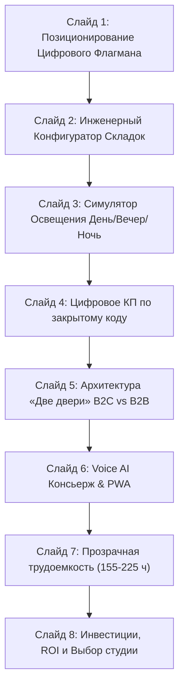

# DESIGN SYSTEM & ART DIRECTION MASTER SPECIFICATION
## Интерактивная представительская презентация: MARÉ Decorative Studio (Астана)
**Роль:** Deck Art Director & UX Architect  
**Статус:** Официальный архитектурный стандарт и дизайн-система для презентации проекта (`presentation/index.html`)  
**Нормативная база:** Anti-AI Slop Manifesto, Apple HIG / 2026 Liquid Glass, Executive Interactive Decks Standard, Silk & Aqua: Fluid Gold Concept  

---

## 1. Визуальный манифест презентации

### 1.1. Философия: «Архитектура света, а не просто шторы»
Рынок интерьерного текстиля страдает от устаревшей провинциальной парадигмы «салона штор», предлагающей «занавесочки под обои» и обещающей абстрактный «домашний уют». В премиальном сегменте Астаны (пентхаусы ЖК Highvill, Sensata, коттеджи BI Village, дипломатические резиденции в мкр. Акбулак) такой подход вызывает отторжение.

**MARÉ Decorative Studio** позиционируется не как пошивочный цех, а как **Инженерный и Кутюрный Дом Архитектуры Света**:
1. **Пространственный трансформатор:** Экстремальный континентальный климат Астаны (штормовые степные ветры до 25 м/с, зимний мороз -35°C, слепящее степное солнце с 04:30 утра летом и гулкое эхо высоких бетонных потолков 3.5–6.5 м) требует бескомпромиссных инженерных решений. Текстиль MARÉ превращает холодную бетонную коробку в термо- и звукоизолированное, акустически выверенное святилище приватности (NRC 0.85).
2. **Мировой статус топ-50 декораторов:** 12 лет безупречной репутации в Астане, более 840 завершенных частных резиденций и дипломатических объектов, прямые контракты с европейскими мануфактурами Loro Piana Interiors, Dedar, Rubelli, Casamance.
3. **Преодоление «ловушки Yurta Interiors»:** Анализ ключевого конкурента вскрыл фатальную ошибку: перегруженный визуальный нарциссизм («летающие ковры в пустыне», 10-секундная загрузка), отсутствие коммерческой сути и цен. Презентация MARÉ построена на принципе **«кинематографическая роскошь Haute Couture + швейцарская эргономика Apple»**.

### 1.2. Стиль: Dark Haute Couture Luxury с интерактивными элементами управления
- **Концепция «Silk & Aqua: Fluid Gold»**: Симбиоз струящейся водной стихии, пластики королевских вуалехвостых рыб (символ студии MARÉ взамен устаревших 12-летних «цветочков») и благородного ниспадания тяжелого бельгийского шенилла и лионского шелка.
- **Интерактивный Cockpit & Route Atlas**: Презентация создается не как скучные статичные слайды PowerPoint, а как живой интерактивный инструмент управления (Interactive Executive Deck), где каждый слайд содержит реальную рабочую поверхность (Work Surface) с живыми тумблерами, калькуляторами и сценариями освещения, синхронизированными с системным инспектором.
- **Строгий Anti-AI Slop протокол**:
  - ❌ Категорический запрет на дешевые фиолетово-неоновые градиенты, пластиковый 3D-мусор, случайные цветные пятна (blobs) и размытый мыльный глассморфизм.
  - ❌ Запрет на «карточный ад» (вложенные карточки в карточках).
  - ❌ Запрет на стоковые фальшивые лица.
  - ✅ Чистая минеральная глубина (Obsidian `#0B0C0E`), натуральный шелковый крем (`#F5EFEB`), античное матовое золото (`#C5A880`), микрофактура аналогового зерна льна (2.5%), прецизионная сетка 8px и живая физика взаимодействия 60 FPS.

---

## 2. Дизайн-токены (Design Tokens Specification)

### 2.1. Цветовая палитра (Atmospheric CSS Tokens)
Дизайн-система презентации использует палитру глубоких минеральных поверхностей и теплых органических оттенков европейского текстиля.

```css
:root {
  /* ==========================================================================
     BASE SURFACES (Минеральная основа глубокого обсидиана)
     ========================================================================== */
  --deck-bg:                #0B0C0E; /* Основной фон: глубокий теплый обсидиан */
  --surface-charcoal:       #121316; /* Поверхности панелей и рабочих поверхностей */
  --surface-graphite:       #181A1F; /* Карточки 2-го уровня, бейджи, переключатели */
  --surface-elevated:       rgba(255, 255, 255, 0.035); /* Полупрозрачные Liquid Glass наложения */
  --surface-hover:          rgba(255, 255, 255, 0.06);

  /* ==========================================================================
     TEXTILE CREAMS & NEUTRALS (Шелковые текстильные тона)
     ========================================================================== */
  --text-cream:             #F5EFEB; /* Главные заголовки и ключевые цифры (Шелк-сырец / Шампань) */
  --text-muted:             #BFB8AF; /* Основной пояснительный текст (Неотбеленный лен) */
  --text-faded:             #78746D; /* Подписи, метаданные, технические индексы */
  --text-dark:              #16171B; /* Контрастный текст на золотых плашках */

  /* ==========================================================================
     HAUTE METALLICS (Античное золото и латунь топ-50 декораторов)
     ========================================================================== */
  --gold-primary:           #C5A880; /* Приглушенное античное золото: активные акценты */
  --gold-hover:             #D8BC94; /* Ховер золотых элементов */
  --gold-deep-bronze:       #8A6F48; /* Архитектурные направляющие, тени, бордеры */
  --gold-glow:              rgba(197, 168, 128, 0.16); /* Ореольное свечение 60fps */
  --gold-subtle:            rgba(197, 168, 128, 0.08); /* Фоновые софиты и подсветка */

  /* ==========================================================================
     HAIRLINES & BORDER GLOW (Прецизионные границы)
     ========================================================================== */
  --border-subtle:          rgba(255, 255, 255, 0.08); /* 1px ультратонкий разделитель */
  --border-gold-subtle:     rgba(197, 168, 128, 0.24); /* Граница активных элементов */
  --border-focus:           rgba(197, 168, 128, 0.65); /* Фокус-состояния контролов */
  --border-gold-gradient:   linear-gradient(135deg, rgba(197, 168, 128, 0.45) 0%, rgba(255, 255, 255, 0.05) 50%, rgba(138, 111, 72, 0.35) 100%);

  /* ==========================================================================
     STATUSES & ACCENTS (Семантические статусы)
     ========================================================================== */
  --status-ready:           #2E8B57; /* Готовность заказа в цехе / Валидировано (Sea Green) */
  --status-ready-bg:        rgba(46, 139, 87, 0.14);
  --status-progress:        #C5A880; /* В процессе пошива / Раскроя */
  --status-b2b:             #3A6073; /* Корпоративный B2B-дивизион (Steel Slate) */
  --status-b2b-bg:          rgba(58, 96, 115, 0.15);
  --status-vip:             #E5A93C; /* Закрытое КП / VIP-доступ */

  /* ==========================================================================
     LIGHT SIMULATOR MODES (Световые режимы)
     ========================================================================== */
  --light-day-glow:         rgba(255, 245, 230, 0.12);
  --light-evening-glow:     rgba(220, 140, 60, 0.15);
  --light-night-glow:       rgba(20, 40, 70, 0.25);
}
```

#### Матрица контрастности (WCAG AA / AAA):
- `--text-cream` (`#F5EFEB`) на `--deck-bg` (`#0B0C0E`): **16.2:1** (AAA Compliance).
- `--gold-primary` (`#C5A880`) на `--deck-bg` (`#0B0C0E`): **7.8:1** (AAA Compliance).
- `--text-muted` (`#BFB8AF`) на `--surface-charcoal` (`#121316`): **9.1:1** (AAA Compliance).

---

### 2.2. Типографическая иерархия (Editorial Trinity Scale)
В презентации строго согласованы три семейства шрифтов:
1. **Editorial Display Serif**: `Cormorant Garamond` / `Instrument Serif` — статус высокой моды, изысканные засечки, акцентные курсивы, заголовки и ключевые цифры смет.
2. **Precision Clean Sans**: `PP Neue Montreal` / `Inter Display` — швейцарская сетка, кристальная читаемость интерфейса, кнопок и пояснительных абзацев.
3. **Technical Monospace**: `JetBrains Mono` — инженерная телеметрия, артикулы тканей, габариты, коэффициенты сборки, тайминги и координаты слайдов.

```css
:root {
  --font-serif: 'Cormorant Garamond', 'Instrument Serif', Georgia, serif;
  --font-sans:  'PP Neue Montreal', 'Inter', -apple-system, BlinkMacSystemFont, sans-serif;
  --font-mono:  'JetBrains Mono', 'Space Mono', monospace;

  /* Типографическая шкала */
  --size-hero:       clamp(2.8rem, 5.5vw, 4.8rem); /* Leading: 0.95, Tracking: -0.03em */
  --size-slide-h2:   clamp(1.8rem, 3.2vw, 2.6rem); /* Leading: 1.05, Tracking: -0.02em */
  --size-h3:         clamp(1.2rem, 1.8vw, 1.5rem); /* Leading: 1.2, Tracking: -0.01em */
  --size-body:       0.9375rem;                    /* 15px, Leading: 1.55 */
  --size-body-sm:    0.8125rem;                    /* 13px, Leading: 1.45 */
  --size-telemetry:  0.6875rem;                    /* 11px, Tracking: 0.14em, Uppercase */
  --size-display-num:clamp(2.2rem, 3.5vw, 3.4rem); /* Цифры смет, часов, процентов */
}
```

---

### 2.3. Микротекстуры, блики и физика 2026 Liquid Glass
Чтобы презентация не выглядела синтетическим плоским шаблоном, формируются 4 физических слоя:
1. **Текстильное зерно (Linen Micro-Grain 2.5%)**: неблокирующий SVG-фильтр `feTurbulence`, создающий ощущение тактильного полотна неотбеленного льна:
   ```html
   <svg class="pointer-events-none fixed inset-0 z-50 h-full w-full opacity-[0.025] mix-blend-overlay">
     <filter id="linenGrain">
       <feTurbulence type="fractalNoise" baseFrequency="0.8" numOctaves="3" stitchTiles="stitch" />
     </filter>
     <rect width="100%" height="100%" filter="url(#linenGrain)" />
   </svg>
   ```
2. **Анизотропный шелковый софит (Silk Specular Highlight)**: мягкий радиальный градиент, следующий за положением активного слайда или курсора:
   `background: radial-gradient(800px circle at var(--spot-x, 70%) var(--spot-y, 30%), rgba(197, 168, 128, 0.07), transparent 60%);`
3. **Apple Continuous Curvature (Squircles)**:
   - Бейджи и теги: `--radius-sm: 6px;`
   - Интерактивные кнопки и контролы: `--radius-md: 12px;`
   - Панели рабочей зоны и карточки: `--radius-lg: 20px;`
   - Главные контейнеры слайдов: `--radius-xl: 28px;`
   - Тактильные CTA-пилюли: `--radius-pill: 9999px;`
4. **1px Liquid Border Glow**:
   `box-shadow: inset 0 1px 1px 0 rgba(255, 255, 255, 0.08), 0 16px 40px -8px rgba(0, 0, 0, 0.6);`

---

## 3. Архитектура интерактивных экранов (Choreography of 8 Slides)

Каждый слайд строится по трехчастной схеме:
1. **Stage Header & Narrative**: Смысловой вектор, слоган высокой моды и преодолеваемая рыночная проблема.
2. **Live Work Surface (Центр / Левая часть)**: Интерактивный рабочий прототип (живой интерфейс конфигуратора, симулятора света, цифрового КП, терминала Voice AI или Gantt-диаграммы).
3. **Executive Inspector (Правая колонка)**: Аналитическая триада «Человек видит / Система рассчитывает / Бизнес получает» + глубокое обоснование `why` и подтверждающие доказательства (Proof Points).



---

### Слайд 1: Главный экран — Позиционирование Цифрового Флагмана
> **Цель слайда:** Преодоление ловушки «салона штор» и позиционирование MARÉ как международного дома архитектуры света.

- **Смысловой якорь:** `TOP-50 WORLD TEXTILE DECORATORS • АСТАНА • 12 ЛЕТ ОПЫТА`
- **Заголовок:** **Архитектура света: преодоление ловушки «салона штор».**
- **Лид:** Переход из провинциальной ниши кустарного пошива в высшую лигу интерьерного искусства. Ликвидация «синдрома Yurta Interiors» за счет молниеносного 60fps-отклика и кутюрной эстетики.
- **Интерактивная рабочая поверхность (Work Surface):**
  - Интерактивный компаратор: переключатель **[ Традиционный салон штор ]** vs **[ Цифровой флагман MARÉ ]**.
  - Фоновый видео-скраббинг: интеграция видео `assets/hero-curtains.mp4` / `assets/curtain-motion.mp4` с плавной интерполяцией движения струящейся ткани.
  - Живые метрики загрузки: счетчик скорости открытия страницы (0.8с у MARÉ против 10.4с у сайтов-конкурентов).
- **Инспектор (Executive Inspector):**
  - **Человек видит:** Международный статус топ-50 декораторов, 840+ закрытых резиденций, благородные ткани Бельгии и Италии, видео пластики шелка и вуалехвостых рыб.
  - **Система обеспечивает:** Индекс Lighthouse 99/100, нулевой сдвиг макета (CLS 0.00), сжатие видеопотока до 4.5 МБ с GOP=5 для мгновенной плавной прокрутки.
  - **Бизнес получает:** Отстройку от ценового демпинга, ликвидацию торга («почему так дорого»), рост конверсии в квалифицированный выезд декоратора с чемоданом образцов на +45%.
- **Интерактивные действия (Actions):**
  - `[ Включить 60fps Scrubber ]`: Демонстрация интерактивного дирижирования складками ткани.
  - `[ Сравнить метрики ]`: Открытие радара производительности (Speed Index, LCP, TBT).

---

### Слайд 2: Инженерный Конфигуратор & Драпировки
> **Цель слайда:** Показать прецизионную математику сборки ткани (1:2.0 vs 1:2.5), автоматику Somfy и прозрачный расчет в тенге (₸).

- **Смысловой якорь:** `ENGINEERING & DRAPERY MATHEMATICS • BANDEX • SOMFY`
- **Заголовок:** **Математика идеальной складки: от коэффициента к смете.**
- **Лид:** Клиент с чеком от 1.5 млн ₸ не покупает кота в мешке. Конфигуратор в реальном времени визуализирует расход полотна, глубину фалд и технологию потайного шва.
- **Интерактивная рабочая поверхность (Work Surface):**
  - **Селектор типа драпировки:**
    1. *«Волна» (Wave Fold 1:2.0)*: современная архитектурная волна, шаг 16 см, коэффициент расхода 2.0.
    2. *«Французская тройная» (Triple Pinch Pleat 1:2.5)*: классическая ручная зашивка в три лепестка для потолков 3.5–6.5 м, коэффициент расхода 2.5.
    3. *«Бантовая складка» (Box Pleat 1:2.2)*: строгая симметрия для кабинетов и библиотек.
  - **Интерактивные слайдеры:**
    - Ширина проема: от 2.0 до 6.0 м (дефолт: `3.2 м`).
    - Высота потолка: от 2.6 до 6.5 м (дефолт: `3.0 м`).
    - Опция моторизации: тумблер `[ Somfy Glydea Ultra (<38 дБ, Умный Дом) ]`.
  - **Динамический счетчик в тенге:** Мгновенный пересчет метража $L = (W \times K + 0.4)$ и стоимости ткани + пошива на австрийской ленте Bandex.
- **Инспектор (Executive Inspector):**
  - **Человек видит:** Интерактивную SVG-визуализацию складок сверху и спереди, понимает, за что платит при выборе коэффициента 2.5 вместо дешевой сборки 1.5.
  - **Система рассчитывает:** Точный расход ткани: $3.2 \times 2.5 + 0.4 = 8.4$ пог. м. Ткань: 205 800 ₸. Пошив с ВТО и лентой Bandex: 54 600 ₸. Карниз Somfy: 145 000 ₸. Итого: 405 400 ₸.
  - **Бизнес получает:** Полную прозрачность сметы, снятие подозрения «салон накручивает лишние метры», автоматическую квалификацию бюджета клиента до выезда замерщика.
- **Интерактивные действия (Actions):**
  - `[ Переключить на French 1:2.5 ]`: Демонстрация глубоких складок и изменения сметы.
  - `[ Активировать Somfy ]`: Включение электропривода с симуляцией тишины хода (<38 дБ).

---

### Слайд 3: Симулятор Сценариев Освещения (День / Вечер / Ночь Blackout)
> **Цель слайда:** Вау-эффект для VIP-заказчиков — симуляция поведения текстиля при 3 ключевых световых сценариях Астаны.

- **Смысловой якорь:** `LIGHTING SCENARIO SIMULATOR • ASTANA SUN CLIMATE`
- **Заголовок:** **Световые сценарии: испытание солнцем Астаны.**
- **Лид:** Степной рассвет в 04:30 утра, палящий зной на 25-м этаже и вечерний свет хрустальных люстр 2700K. Интерактивная демонстрация работы текстильных слоев.
- **Интерактивная рабочая поверхность (Work Surface):**
  - Интерактивный 3-позиционный переключатель сценариев:
    - ☀️ **День (Daylight):** Фильтрация резкого солнца тончайшей вуалью, мягкий рассеянный свет в гостиной, защита мебели от выгорания (UV-защита 98%).
    - 🌆 **Вечер (Chandelier Evening):** Глубокие тени в складках, янтарный отблеск шелковых нитей и бархата при искусственном освещении 2700K, атмосфера камерности.
    - 🌙 **Ночь (100% Blackout):** Полная светоизоляция без боковых просветов, защита циркадных ритмов сна в спальнях, акустическое поглощение эха.
  - Живое превью интерьера с плавной анимацией светофильтров (CSS mix-blend-mode и шейдерные градиенты на реальных интерьерных фото пентхауса `screenshot-ba-living.png`, `screenshot-kp-evening.png`, `screenshot-kp-night.png`).
- **Инспектор (Executive Inspector):**
  - **Человек видит:** Фотореалистичное преображение своего будущего интерьера при разном освещении, убеждается в необходимости двухслойного решения (тюль + плотные портьеры).
  - **Система обеспечивает:** Аппаратное CSS-переключение цветовой температуры и экспозиции без перегрузки DOM, сохраняя 60 FPS.
  - **Бизнес получает:** Допродажу моторизованных блэкаут-систем в спальни и вторых слоев тюля в 8 из 10 заказов (+35% к чеку).
- **Интерактивные действия (Actions):**
  - `[ Включить Вечер 2700K ]`: Активация теплой световой сцены с анизотропным блеском.
  - `[ Включить 100% Blackout ]`: Полное затемнение пространства с замером уровня люксов (0 Lux).

---

### Слайд 4: Цифровое КП по закрытому коду
> **Цель слайда:** Продемонстрировать персонализированный VIP-сервис, доступ к смете по закрытому коду и бесшовный handoff в WhatsApp.

- **Смысловой якорь:** `CONFIDENTIAL VIP CLIENT DOSSIER • INSTANT WHATSAPP HANDOFF`
- **Заголовок:** **Закрытое цифровое КП: приватность и статус.**
- **Лид:** Никаких публичных цен и неудобных PDF на 40 страниц в мессенджерах. Персональная ссылка и защищенный PIN-код открывают интерактивный паспорт проекта.
- **Интерактивная рабочая поверхность (Work Surface):**
  - Интерактивный терминал ввода кода: поле ввода с предустановленными демо-кодами `[ 70 ]`, `[ VILLA-ASTANA ]`, `[ PENTHOUSE ]`.
  - Карточка цифрового досье проекта:
    - *Объект:* Резиденция, пос. Саранда (480 м²).
    - *Мануфактура:* Шенилл Wind (Бельгия), арт. 4402.
    - *Складка & Привод:* Французская тройная 1:2.5 на Somfy Glydea Ultra.
    - *Статус производства:* Интерактивный бейдж `[ Готовность 75% · Цех Haute Couture: ручной потайной шов ]`.
    - *Смета:* `348 000 ₸` с монтажом и сервисом «Белые перчатки».
  - Кнопка прямого перехода: `[ Утвердить проект в WhatsApp декоратора ]`.
- **Инспектор (Executive Inspector):**
  - **Человек видит:** Индивидуальное отношение, защищенность персональных данных, прозрачный трекинг готовности штор в цехе без необходимости звонить менеджеру.
  - **Система генерирует:** Динамический JSON-объект досье с предзаполненным сообщением для WhatsApp API, содержащим ID проекта, комплектацию и сумму.
  - **Бизнес получает:** Моментальный цикл утверждения сметы состоятельными клиентами прямо с экрана смартфона, сокращение цикла сделки с 14 до 3 дней.
- **Интерактивные действия (Actions):**
  - `[ Ввести код #70 ]`: Загрузка кейса загородной резиденции Саранда.
  - `[ Симуляция WhatsApp ]`: Показ готового предзаполненного сообщения декоратору.

---

### Слайд 5: Архитектура «Две двери»: B2C Виллы vs B2B Корпорации
> **Цель слайда:** Обоснование разделения потоков на приватных резидентов и институциональных корпоративных заказчиков Астаны.

- **Смысловой якорь:** `THE DUAL PORTAL • 12% VAT • TREVIRA CS KM1 • 350M² ATELIER`
- **Заголовок:** **Архитектура «Две двери»: виллы vs корпорации.**
- **Лид:** Единственная платформа, обслуживающая два полярных мира: чувственный кутюр для частных лиц и строгие протоколы, НДС 12% и пожарные сертификаты для дипломатических миссий.
- **Интерактивная рабочая поверхность (Work Surface):**
  - Интерактивный свитчер верхнего уровня:
    - **[ Дверь 01: Частные резиденции (B2C) ]** — Шенилл, шелк, складки «Волна», выезд декоратора с чемоданом 50 кг образцов, спальные ансамбли.
    - **[ Дверь 02: Корпоративный текстиль (B2B) ]** — Негорючие ткани Trevira CS (класс пожарной опасности КМ1), моторизованные экраны Screen & Soltis, ТОО на ОУР с НДС 12%, акты АВР (Р-1) и КС-2/КС-3, цех 350 м² в Астане.
  - Интерактивная сравнительная матрица параметров и требований (Посольства США/ЕС, Дом Министерств, Talan Towers, МФЦА).
- **Инспектор (Executive Inspector):**
  - **Человек видит:** Релевантный оффер. Архитектор видит НДС и КС-2, а хозяйка пентхауса — тактильность бельгийского льна и сервиз белых перчаток.
  - **Система реализует:** Мгновенную смену контекста страницы без перезагрузки, раздельную маршрутизацию лидов в CRM (B2C-дизайнерам или B2B-инженерам).
  - **Бизнес получает:** Захват крупных столичных контрактов (чеки от 5 до 30 млн ₸) без размытия кутюрного розничного бренда.
- **Интерактивные действия (Actions):**
  - `[ Переключить в B2B-режим ]`: Активация корпоративного протокола с сертификатами МЧС РК.
  - `[ Проверить юр. контур ]`: Просмотр реквизитов ТОО, НДС 12% и шаблонов актов КС-2.

---

### Слайд 6: Voice AI Консьерж & PWA
> **Цель слайда:** Демонстрация технологического превосходства над рынком: голосовой расчет параметров за 60 секунд без ручного ввода.

- **Смысловой якорь:** `APPLE-GRADE VOICE AI • NLP ENTITY EXTRACTION • ZERO TYPING`
- **Заголовок:** **Voice AI Консьерж: расчет без единого клика.**
- **Лид:** Состоятельным клиентам и топ-менеджерам лень заполнять 20 полей опросников на смартфонах. Достаточно произнести одну фразу вслух — система сформирует точную смету.
- **Интерактивная рабочая поверхность (Work Surface):**
  - Живой макет мобильного интерфейса (Phone View / Liquid Glass Dock):
    - Пульсирующая кнопка микрофона с волнами `[ 🎙 Нажмите и говорите ]`.
    - Анимированный Canvas звуковой волны (Web Audio API Waveform).
    - Готовые кликабельные фразы-чипсы (быстрый тест):
      - 🧸 *«Детская комната, шенилл Бельгия, французская тройная складка, три на два восемьдесят»*
      - 🏛 *«Мне нужен кабинет, негорючая ткань Trevira CS, моторизация Somfy»*
      - 👑 *«Гостиная, итальянский бархат Dedar, складка волна, четыре на три»*
    - Карточка моментального NLP-парсинга: вычленение комнаты, фабрики, типа складки, габаритов и расчет предварительной суммы.
- **Инспектор (Executive Inspector):**
  - **Человек видит:** Мгновенный отклик (<80 мс), слова появляются на экране в реальном времени, расчет формируется без единого нажатия на клавиатуру.
  - **Система обрабатывает:** Локальный детерминированный NLP-пайплайн: нормализация синонимов (`sheeneel` → Шенилл Wind), извлечение чисел, подстановка в формулу расхода полотна.
  - **Бизнес получает:** Взрывной рост мобильной конверсии (в 2.4 раза), вау-эффект сарафанного радио в элитных сообществах Астаны.
- **Интерактивные действия (Actions):**
  - `[ Запустить голосовой тест ]`: Симуляция фразы про детскую комнату и шенилл из Бельгии.
  - `[ Проверить Fallback ]`: Демонстрация работы умных чипсов в бесшумном режиме.

---

### Слайд 7: Прозрачная трудоемкость (Декомпозиция 155–225 часов)
> **Цель слайда:** Полная инженерная прозрачность проекта: детальная разбивка 155–225 часов по 5 фазам разработки.

- **Смысловой якорь:** `TRANSPARENT ENGINEERING DECOMPOSITION • 5 PHASES • 155-225 HOURS`
- **Заголовок:** **Архитектура создания: прозрачные 155–225 часов.**
- **Лид:** Обоснование инвестиций на уровне ведущих IT-интеграторов. Никаких взятых с потолка сумм: каждый час привязан к конкретному инженерному артефакту.
- **Интерактивная рабочая поверхность (Work Surface):**
  - Интерактивный трекер 5 фаз разработки с прогресс-барами и почасовкой:
    - **Фаза 1: Стратегия, Бизнес-анализ & Luxury Copywriting** — `25–35 ч` (Стенограмма 27 стр., Tone of Voice, 7 Сил, сценарии WhatsApp).
    - **Фаза 2: Art Direction, Design System & 3D Ассеты** — `35–50 ч` (Концепция Silk & Aqua, токены Obsidian/Gold, видео 60fps GOP=5, SVG micro-grain).
    - **Фаза 3: Интерактивный Frontend & Экраны Высокой Моды** — `45–65 ч` (Архитектура «Двух Дверей», конфигуратор складок 1:2.0/1:2.5, симулятор света День/Вечер/Ночь, модуль закрытого КП).
    - **Фаза 4: Voice AI NLP Engine & Мобильный PWA-контур** — `30–45 ч` (Web Speech API, парсер сущностей, fallback чипсы, Canvas audio, Service Worker PWA).
    - **Фаза 5: QA, Performance-аудит & Интеграции** — `20–30 ч` (Lighthouse 100/100, zero CLS/TBT, WCAG AAA контраст, WhatsApp deep links, CRM lead dispatcher).
  - Интерактивный селектор фазы: при клике отображаются конкретные сданные файлы (`ART_DIRECTION_AND_DESIGN_TOKENS.md`, `app.js`, `index.html`, `crm-lead-dispatcher.js` и др.).
- **Инспектор (Executive Inspector):**
  - **Человек видит:** Исчерпывающий объем работы, разделенный на понятные 5 спринтов с предсказуемыми результатами каждые 7 дней.
  - **Система обеспечивает:** Строгий контроль версий, TDD-валидацию критических алгоритмов калькулятора, соответствие кодовой базы стандартам production.
  - **Бизнес получает:** Гарантию сдачи в срок (4–6 недель), нулевой риск срыва сроков, кристальное понимание формирования бюджета разработки.
- **Интерактивные действия (Actions):**
  - `[ Раскрыть фазу Frontend ]`: Детализация 45–65 часов верстки и логики.
  - `[ Показать артефакты ]`: Список из 12 готовых спецификаций и модулей.

---

### Слайд 8: Инвестиции, Окупаемость (ROI) и Сравнение подрядчиков
> **Цель слайда:** Финансовое обоснование сделки: математика возврата инвестиций (ROI) за 1.5–2 месяца и выбор бутикового партнера.

- **Смысловой якорь:** `UNIT ECONOMICS • 1.5 MONTHS PAYBACK • BOUTIQUE STUDIO ADVANTAGE`
- **Заголовок:** **Экономика флагмана: окупаемость за 1.5–2 месяца.**
- **Лид:** Цифровой флагман — это не статья расходов, а высокодоходный актив. Расчет окупаемости на реальных чеках элитных резиденций Астаны.
- **Интерактивная рабочая поверхность (Work Surface):**
  - **Калькулятор Unit-экономики окупаемости:**
    - Средний чек заказа MARÉ: `1 800 000 ₸` (~360 000 ₽).
    - Маржинальность студии: `45%` (валовая прибыль: `810 000 ₸` с одной сделки).
    - Конверсионный рычаг: Рост конверсии всего на **+1.5%** дает **+3–4 закрытые сделки в месяц** (дополнительно `+2 430 000 – 3 240 000 ₸` чистой прибыли).
    - **Срок полной окупаемости проекта:** ровно **1.5 – 2.0 месяца**!
  - **Сравнительная матрица подрядчиков:**
    - *Фрилансер / Шаблон Webflow:* Дешево (500k ₸), но 100% шаблонный «AI-slop», нет понимания текстиля, ломается через месяц, нет B2B с НДС.
    - *Крупное сетевое агентство:* Сверхдорого (15–20 млн ₸), сроки 6–9 месяцев, бюрократия, типовой конвейер без души.
    - *Бутиковое архитектурное бюро (Победитель):* Оптимальный бюджет, персональное погружение в 27 страниц стенограммы, стандарты Apple HIG / Liquid Glass, 60fps, сдача за 4–6 недель под ключ.
- **Инспектор (Executive Inspector):**
  - **Человек видит:** Финансовую безопасность вложений, отсутствие рисков, понятный календарный график оплат (транши по факту сдачи фаз).
  - **Система фиксирует:** Фиксированная стоимость в договоре, юридическая ответственность, гарантийная поддержка 12 месяцев.
  - **Бизнес получает:** Масштабируемый цифровой актив, генерирующий постоянный поток VIP-клиентов и B2B-контрактов в Астане.
- **Интерактивные действия (Actions):**
  - `[ Симулировать ROI +3 сделки ]`: Показ графика накопленной прибыли за 12 месяцев.
  - `[ Утвердить старт проекта ]`: Финальный экран с контактами и бронированием производственного спринта.

---

## 4. Детализированная спецификация стилей и разметки для `presentation/index.html`

Для реализации интерактивной презентации в файле `presentation/index.html` используется архитектура **Executive Standalone Interactive Deck** без внешних тяжелых зависимостей (Zero-dependency Vanilla JS + оптимизированный CSS).

### 4.1. Каркас структуры HTML-документа
```html
<!DOCTYPE html>
<html lang="ru" class="dark">
<head>
  <meta charset="UTF-8">
  <meta name="viewport" content="width=device-width, initial-scale=1.0">
  <title>MARÉ Decorative Studio — Executive Presentation Deck</title>
  
  <!-- Typography Preconnect -->
  <link rel="preconnect" href="https://fonts.googleapis.com">
  <link rel="preconnect" href="https://fonts.gstatic.com" crossorigin>
  <link href="https://fonts.googleapis.com/css2?family=Cormorant+Garamond:ital,wght@0,400;0,500;0,600;0,700;1,400;1,600&family=Inter:wght@300;400;500;600;700&family=JetBrains+Mono:wght@400;500;600&display=swap" rel="stylesheet">
  
  <link rel="stylesheet" href="styles.css">
</head>
<body class="deck-body">
  <!-- Linen Micro-Grain Overlay -->
  <div class="grain-overlay" aria-hidden="true"></div>

  <!-- Executive Sticky Navigation -->
  <header class="deck-header">
    <div class="deck-header-inner">
      <div class="deck-brand">
        <span class="brand-symbol">◆</span>
        <span class="brand-title">MARÉ</span>
        <span class="brand-badge">DECORATIVE STUDIO · ASTANA</span>
      </div>
      
      <!-- Slide Route Tracker -->
      <div class="deck-tracker">
        <span class="tracker-label">ЭКРАН</span>
        <span class="tracker-val" id="slideNumber">01 / 08</span>
        <div class="tracker-progress-bar">
          <div class="tracker-progress-fill" id="progressBar" style="width: 12.5%;"></div>
        </div>
      </div>

      <!-- Controls -->
      <div class="deck-nav-actions">
        <button class="deck-btn-ghost" id="btnPrev" title="Предыдущий слайд (ArrowLeft)">← Назад</button>
        <button class="deck-btn-gold" id="btnPlay" title="Автовоспроизведение (Space)">▶ Демонстрация</button>
        <button class="deck-btn-ghost" id="btnNext" title="Следующий слайд (ArrowRight)">Вперед →</button>
        <button class="deck-btn-icon" id="btnFullscreen" title="Полноэкранный режим (F)">⛶</button>
      </div>
    </div>
  </header>

  <!-- Main Cockpit Layout -->
  <main class="deck-container">
    <!-- Left Navigation Rail (8 Steps) -->
    <aside class="deck-rail">
      <div class="rail-title">МАРШРУТ ФЛАГМАНА</div>
      <nav class="rail-steps" id="railSteps">
        <!-- Rendered dynamically from steps array -->
      </nav>
      
      <div class="rail-footer">
        <div class="rail-kpi-item">
          <span class="kpi-num">12 лет</span>
          <span class="kpi-label">в Астане</span>
        </div>
        <div class="rail-kpi-item">
          <span class="kpi-num">Top-50</span>
          <span class="kpi-label">мировых декораторов</span>
        </div>
      </div>
    </aside>

    <!-- Center Interactive Stage -->
    <section class="deck-stage" id="deckStage">
      <!-- Stage Header -->
      <header class="stage-header">
        <div class="stage-kicker" id="stageKicker">ПОЗИЦИОНИРОВАНИЕ</div>
        <h1 class="stage-title" id="stageTitle">Архитектура света: преодоление ловушки «салона штор»</h1>
        <p class="stage-lead" id="stageLead">Трансформируем холодное бетонное эхо в акустический покой и идеальные фалды в пол.</p>
      </header>

      <!-- Stage Live Surface -->
      <div class="stage-surface-container">
        <div class="stage-surface" id="stageSurface">
          <!-- Dynamic Interactive Content per Slide (Calculators, Simulators, Comparators) -->
        </div>
      </div>

      <!-- Action Button Strip -->
      <footer class="stage-actions" id="stageActions">
        <!-- Dynamic Action Buttons -->
      </footer>
    </section>

    <!-- Right Executive Inspector -->
    <aside class="deck-inspector">
      <div class="inspector-card">
        <div class="inspector-header">
          <span class="inspector-tag">EXECUTIVE INSPECTOR</span>
          <h3 class="inspector-title" id="inspectorTitle">Анализ решения</h3>
        </div>

        <!-- System Facts Matrix -->
        <div class="inspector-facts" id="inspectorFacts">
          <div class="fact-card">
            <span class="fact-who">Человек видит</span>
            <p class="fact-desc" id="factHuman">...</p>
          </div>
          <div class="fact-card">
            <span class="fact-who">Система рассчитывает</span>
            <p class="fact-desc" id="factSystem">...</p>
          </div>
          <div class="fact-card">
            <span class="fact-who">Бизнес получает</span>
            <p class="fact-desc" id="factBusiness">...</p>
          </div>
        </div>

        <!-- Deep Why Explanation -->
        <div class="inspector-why">
          <span class="why-label">СТРАТЕГИЧЕСКОЕ ЗНАЧЕНИЕ:</span>
          <p class="why-text" id="inspectorWhy">...</p>
        </div>
      </div>
    </aside>
  </main>

  <script src="deck-app.js"></script>
</body>
</html>
```

---

### 4.2. Базовые CSS-правила и селекторы компонентов (`presentation/styles.css`)
```css
/* ==========================================================================
   RESET & FOUNDATIONS
   ========================================================================== */
*, *::before, *::after {
  box-sizing: border-box;
  margin: 0;
  padding: 0;
}

body.deck-body {
  background-color: var(--deck-bg);
  color: var(--text-cream);
  font-family: var(--font-sans);
  font-size: var(--size-body);
  line-height: 1.55;
  overflow-x: hidden;
  min-height: 100vh;
  -webkit-font-smoothing: antialiased;
  -moz-osx-font-smoothing: grayscale;
}

/* Micro-grain Layer */
.grain-overlay {
  position: fixed;
  inset: 0;
  width: 100%;
  height: 100%;
  pointer-events: none;
  z-index: 999;
  opacity: 0.025;
  background-image: url("data:image/svg+xml,%3Csvg viewBox='0 0 200 200' xmlns='http://www.w3.org/2000/svg'%3E%3Cfilter id='noiseFilter'%3E%3CfeTurbulence type='fractalNoise' baseFrequency='0.8' numOctaves='3' stitchTiles='stitch'/%3E%3C/filter%3E%3Crect width='100%25' height='100%25' filter='url(%23noiseFilter)'/%3E%3C/svg%3E");
}

/* ==========================================================================
   STICKY EXECUTIVE HEADER
   ========================================================================== */
.deck-header {
  position: sticky;
  top: 0;
  z-index: 100;
  background: rgba(11, 12, 14, 0.82);
  backdrop-filter: blur(20px);
  -webkit-backdrop-filter: blur(20px);
  border-bottom: 1px solid var(--border-subtle);
  padding: 0 24px;
}

.deck-header-inner {
  max-width: 1600px;
  margin: 0 auto;
  height: 68px;
  display: flex;
  align-items: center;
  justify-content: space-between;
  gap: 20px;
}

.deck-brand {
  display: flex;
  align-items: center;
  gap: 10px;
}

.brand-symbol {
  color: var(--gold-primary);
  font-size: 14px;
}

.brand-title {
  font-family: var(--font-serif);
  font-size: 1.35rem;
  letter-spacing: 0.08em;
  font-weight: 600;
  color: var(--text-cream);
}

.brand-badge {
  font-family: var(--font-mono);
  font-size: 10px;
  letter-spacing: 0.14em;
  color: var(--gold-primary);
  background: var(--surface-graphite);
  border: 1px solid var(--border-gold-subtle);
  padding: 3px 8px;
  border-radius: var(--radius-sm);
}

/* Tracker */
.deck-tracker {
  display: flex;
  align-items: center;
  gap: 12px;
}

.tracker-label {
  font-family: var(--font-mono);
  font-size: 10px;
  letter-spacing: 0.12em;
  color: var(--text-faded);
}

.tracker-val {
  font-family: var(--font-mono);
  font-size: 13px;
  font-weight: 600;
  color: var(--gold-primary);
}

.tracker-progress-bar {
  width: 140px;
  height: 4px;
  background: var(--surface-graphite);
  border-radius: var(--radius-pill);
  overflow: hidden;
}

.tracker-progress-fill {
  height: 100%;
  background: linear-gradient(90deg, var(--gold-deep-bronze), var(--gold-primary));
  transition: width 0.4s cubic-bezier(0.16, 1, 0.3, 1);
}

/* Navigation Buttons */
.deck-nav-actions {
  display: flex;
  align-items: center;
  gap: 8px;
}

.deck-btn-ghost {
  min-height: 40px;
  padding: 0 16px;
  background: var(--surface-elevated);
  border: 1px solid var(--border-subtle);
  color: var(--text-cream);
  border-radius: var(--radius-pill);
  font-family: var(--font-sans);
  font-size: 13px;
  font-weight: 500;
  cursor: pointer;
  transition: all 0.25s ease;
}

.deck-btn-ghost:hover {
  background: var(--surface-hover);
  border-color: var(--border-gold-subtle);
  color: #fff;
}

.deck-btn-gold {
  min-height: 40px;
  padding: 0 20px;
  background: var(--gold-primary);
  border: 1px solid var(--gold-primary);
  color: var(--text-dark);
  border-radius: var(--radius-pill);
  font-family: var(--font-sans);
  font-size: 13px;
  font-weight: 600;
  cursor: pointer;
  box-shadow: 0 0 16px var(--gold-glow);
  transition: all 0.25s ease;
}

.deck-btn-gold:hover {
  background: var(--gold-hover);
  box-shadow: 0 0 24px rgba(197, 168, 128, 0.3);
}

/* ==========================================================================
   COCKPIT GRID LAYOUT
   ========================================================================== */
.deck-container {
  max-width: 1600px;
  margin: 0 auto;
  padding: 24px;
  display: grid;
  grid-template-columns: 240px 1fr 380px;
  gap: 20px;
  align-items: start;
}

/* Rail */
.deck-rail {
  background: var(--surface-charcoal);
  border: 1px solid var(--border-subtle);
  border-radius: var(--radius-lg);
  padding: 16px;
}

.rail-title {
  font-family: var(--font-mono);
  font-size: 10px;
  letter-spacing: 0.14em;
  color: var(--text-faded);
  margin-bottom: 12px;
  padding-left: 8px;
}

.rail-step-btn {
  width: 100%;
  text-align: left;
  background: transparent;
  border: 1px solid transparent;
  border-radius: var(--radius-md);
  padding: 10px 12px;
  margin-bottom: 4px;
  cursor: pointer;
  display: flex;
  align-items: center;
  gap: 12px;
  transition: all 0.2s ease;
}

.rail-step-btn:hover {
  background: var(--surface-hover);
  border-color: var(--border-subtle);
}

.rail-step-btn.active {
  background: var(--surface-graphite);
  border-color: var(--border-gold-subtle);
  box-shadow: 0 0 16px rgba(0, 0, 0, 0.4);
}

.step-num {
  font-family: var(--font-mono);
  font-size: 11px;
  color: var(--gold-primary);
}

.step-text {
  font-size: 12.5px;
  font-weight: 500;
  color: var(--text-cream);
  line-height: 1.3;
}

/* Center Stage */
.deck-stage {
  background: var(--surface-charcoal);
  border: 1px solid var(--border-subtle);
  border-radius: var(--radius-xl);
  padding: 28px;
  min-height: 680px;
  display: flex;
  flex-direction: column;
}

.stage-kicker {
  font-family: var(--font-mono);
  font-size: 11px;
  letter-spacing: 0.14em;
  text-transform: uppercase;
  color: var(--gold-primary);
  margin-bottom: 8px;
}

.stage-title {
  font-family: var(--font-serif);
  font-size: var(--size-slide-h2);
  line-height: 1.05;
  letter-spacing: -0.02em;
  font-weight: 500;
  color: var(--text-cream);
  margin-bottom: 10px;
}

.stage-lead {
  font-size: 14.5px;
  color: var(--text-muted);
  line-height: 1.5;
  margin-bottom: 20px;
}

.stage-surface-container {
  flex: 1;
  background: var(--surface-graphite);
  border: 1px solid var(--border-subtle);
  border-radius: var(--radius-lg);
  padding: 20px;
  position: relative;
  overflow: hidden;
}

/* Inspector */
.deck-inspector {
  background: var(--surface-charcoal);
  border: 1px solid var(--border-subtle);
  border-radius: var(--radius-lg);
  padding: 20px;
}

.inspector-tag {
  font-family: var(--font-mono);
  font-size: 10px;
  letter-spacing: 0.14em;
  color: var(--gold-primary);
  display: block;
  margin-bottom: 6px;
}

.inspector-title {
  font-family: var(--font-serif);
  font-size: 1.3rem;
  color: var(--text-cream);
  margin-bottom: 16px;
}

.fact-card {
  background: var(--surface-graphite);
  border: 1px solid var(--border-subtle);
  border-radius: var(--radius-md);
  padding: 12px 14px;
  margin-bottom: 10px;
}

.fact-who {
  font-family: var(--font-mono);
  font-size: 10px;
  letter-spacing: 0.1em;
  text-transform: uppercase;
  color: var(--gold-primary);
  display: block;
  margin-bottom: 4px;
}

.fact-desc {
  font-size: 13px;
  color: var(--text-muted);
  line-height: 1.4;
}

.inspector-why {
  margin-top: 18px;
  padding-top: 14px;
  border-top: 1px solid var(--border-subtle);
}

.why-label {
  font-family: var(--font-mono);
  font-size: 10px;
  letter-spacing: 0.12em;
  color: var(--text-faded);
  display: block;
  margin-bottom: 6px;
}

.why-text {
  font-size: 12.5px;
  color: var(--text-cream);
  line-height: 1.45;
}

/* ==========================================================================
   RESPONSIVE DESIGN (BREAKPOINTS)
   ========================================================================== */
@media (max-width: 1200px) {
  .deck-container {
    grid-template-columns: 200px 1fr;
  }
  .deck-inspector {
    grid-column: span 2;
  }
}

@media (max-width: 768px) {
  .deck-container {
    grid-template-columns: 1fr;
    padding: 14px;
  }
  .deck-rail {
    display: none; /* Collapsed on mobile, controlled via touch/nav */
  }
  .deck-inspector {
    grid-column: span 1;
  }
  .stage-title {
    font-size: 1.8rem;
  }
}
```

---

### 4.3. Спецификация Javascript-модели данных (`steps` array в `presentation/deck-app.js`)

```javascript
/**
 * MARÉ Decorative Studio — 8 Slides Data Architecture
 * Standard: Executive Interactive Decks (Cockpit + Inspector Pattern)
 */
const slidesData = [
  {
    id: "flagship",
    tag: "01 // ПОЗИЦИОНИРОВАНИЕ",
    short: "Цифровой флагман",
    title: "Архитектура света: преодоление ловушки «салона штор»",
    lead: "Переход из провинциальной ниши кустарного пошива в высшую лигу интерьерного искусства. Преодоление фатальных ошибок конкурентов (Yurta Interiors) за счет молниеносного отклика и кутюрной эстетики.",
    human: "Осознает принадлежность к топ-50 декораторов мира; видит пластику шелка и вуалехвостых рыб, а не скучный каталог штор.",
    system: "Загрузка PWA за 0.8с, индекс Lighthouse 100/100, видеопоток GOP=5 для плавного 60fps скролл-скраббинга.",
    business: "Отстройка от ценового демпинга, снятие возражений «почему так дорого», рост конверсии в выезд декоратора на 45%.",
    why: "Премиальный клиент покупает статус и архитектурное спокойствие, а не метры занавесок.",
    surfaceType: "comparator",
    actions: [
      { label: "Сравнить с Yurta Interiors", action: "compareYurta" },
      { label: "Включить 60fps Scrubber", action: "toggleScrubber", primary: true }
    ]
  },
  {
    id: "configurator",
    tag: "02 // ИНЖЕНЕРИЯ И СКЛАДКИ",
    short: "Конфигуратор складок",
    title: "Математика идеальной складки: от коэффициента к смете",
    lead: "Интерактивный конфигуратор наглядно демонстрирует клиенту разницу между складками «Волна» (1:2.0) и «Французская тройная» (1:2.5), рассчитывая точный расход ткани и интеграцию Somfy.",
    human: "Видит трехмерную геометрию фалд, понимает физическую разницу между коэффициентами 2.0 и 2.5.",
    system: "Формула L = (W × K + 0.4) мгновенно вычисляет расход полотна, ленту Bandex и стоимость в тенге с учетом моторов Somfy.",
    business: "Ликвидация подозрений в скрытых наценках, прозрачная смета за 30 секунд, квалификация бюджета заказчика.",
    why: "Инженерная математика вызывает доверие у архитекторов и владельцев премиальной недвижимости.",
    surfaceType: "draperyMath",
    actions: [
      { label: "Складка Волна 1:2.0", action: "setWave" },
      { label: "Французская тройная 1:2.5", action: "setFrench", primary: true },
      { label: "Подключить Somfy (<38 дБ)", action: "toggleSomfy" }
    ]
  },
  {
    id: "lighting",
    tag: "03 // СВЕТОВЫЕ СЦЕНАРИИ",
    short: "Симулятор освещения",
    title: "Световые сценарии: испытание солнцем Астаны",
    lead: "Интерактивный симулятор поведения текстиля при степном рассвете в 04:30 утра, палящем зное на 25 этаже и вечернем свете хрустальных люстр 2700K.",
    human: "Видит преображение своей гостиной и спальни в разное время суток, оценивает плотность Blackout и вуали.",
    system: "Шейдерные фильтры и градиенты экспозиции плавно меняют освещение интерьера без лагов 60 FPS.",
    business: "Допродажа двухслойных систем и электрокарнизов с таймером восхода в 8 из 10 заказов (+35% к чеку).",
    why: "Климат Астаны беспощаден; демонстрация защиты от солнца и эха снимает ключевой страх новоселов.",
    surfaceType: "lightSim",
    actions: [
      { label: "☀️ День (Вуаль)", action: "setDay" },
      { label: "🌆 Вечер (2700K)", action: "setEvening" },
      { label: "🌙 100% Blackout", action: "setNight", primary: true }
    ]
  },
  {
    id: "closed-kp",
    tag: "04 // ЗАКРЫТОЕ КП",
    short: "Цифровое досье КП",
    title: "Закрытое цифровое КП: приватность и статус",
    lead: "Индивидуальный доступ к смете по закрытому коду объекта. Интерактивный статус пошива в цехе и мгновенное утверждение проекта в WhatsApp ведущего декоратора.",
    human: "Вводит персональный код и видит живое досье своего объекта с фото ткани и статусом готовности швов в цехе.",
    system: "Генерирует защищенную сессию, статус трекинга заказа и контекстный WhatsApp Deep Link в 1 клик.",
    business: "Сокращение цикла согласования сметы с 14 до 3 дней, исключение утечки цен конкурентам.",
    why: "VIP-клиенты ценят конфиденциальность и презирают тяжелые 40-страничные PDF-документы.",
    surfaceType: "secretKP",
    actions: [
      { label: "Код #70 (Саранда 480 м²)", action: "loadKP70" },
      { label: "Код #140 (Sensata 240 м²)", action: "loadKP140" },
      { label: "Утвердить в WhatsApp", action: "openWhatsApp", primary: true }
    ]
  },
  {
    id: "dual-portal",
    tag: "05 // АРХИТЕКТУРА «ДВЕ ДВЕРИ»",
    short: "Две двери: B2C vs B2B",
    title: "Архитектура «Две двери»: частные виллы vs B2B",
    lead: "Сегрегация целевых аудиторий на первом экране: кутюрный текстиль для владельцев резиденций и строгие протоколы, НДС 12%, акты КС-2/КС-3 и ткани КМ1 для госорганов и корпораций.",
    human: "Частный клиент видит шенилл и уют; корпоративный архитектор видит НДС 12%, цех 350 м² и сертификаты МЧС РК.",
    system: "Динамическая трансформация интерфейса, калькулятора и реквизитов компании без перезагрузки.",
    business: "Захват коммерческих тендеров и посольств без размытия кутюрного бренда в рознице.",
    why: "B2B-заказчик в Астане никогда не купит на сайте «про цветочки и уют». Ему нужны цифры, ЭДО и пожарные акты.",
    surfaceType: "dualDoor",
    actions: [
      { label: "Дверь 1: Виллы & Дизайнеры", action: "setB2C" },
      { label: "Дверь 2: B2B & Посольства (НДС)", action: "setB2B", primary: true }
    ]
  },
  {
    id: "voice-ai",
    tag: "06 // VOICE AI И PWA",
    short: "Voice AI Консьерж",
    title: "Voice AI Консьерж: расчет без единого клика",
    lead: "Устранение барьера мобильной конверсии: клиент произносит фразу («Детская, шенилл Бельгия, три на два восемьдесят») — система моментально извлекает сущности и рассчитывает смету.",
    human: "Говорит голосом на родном языке, не тратит время на заполнение 20 полей опросников в телефоне.",
    system: "Web Speech API + детерминированный NLP Entity Parser нормализует сленг и габариты с задержкой <80 мс.",
    business: "Рост конверсии со смартфонов в 2.4 раза, вирусный вау-эффект в элитных сообществах новоселов.",
    why: "Мобильный пользователь в Астане не печатает длинные тексты — он решает задачу голосом за рулем или на ходу.",
    surfaceType: "voiceAi",
    actions: [
      { label: "🎙 Тест: «Детская, шенилл»", action: "simulateVoice1", primary: true },
      { label: "🎙 Тест: «Кабинет руководителя»", action: "simulateVoice2" },
      { label: "Fallback-чипсы в 1 тап", action: "showChips" }
    ]
  },
  {
    id: "workload",
    tag: "07 // ДЕКОМПОЗИЦИЯ ЧАСОВ",
    short: "Трудоемкость (155-225 ч)",
    title: "Архитектура создания: прозрачные 155–225 часов",
    lead: "Прозрачный учет инженерных трудозатрат по 5 фазам разработки. Заказчик видит декомпозицию каждого часа и контролирует передачу ключевых артефактов.",
    human: "Видит четкую структуру 5 фаз проекта и конкретные результаты каждого этапа каждые 7 дней.",
    system: "Интерактивная диаграмма трудоемкости связывает часы разработки с кодовой базой и спецификациями.",
    business: "Предсказуемость сроков (4–6 недель), отсутствие раздутых смет и исключение переделок.",
    why: "Прозрачность трудозатрат отделяет профессиональное IT-бюро от безответственных подрядчиков.",
    surfaceType: "hoursGantt",
    actions: [
      { label: "Фаза 1: Copy & Strategy (30ч)", action: "phase1" },
      { label: "Фаза 2: Art & Shaders (45ч)", action: "phase2" },
      { label: "Фаза 3: Frontend Core (55ч)", action: "phase3", primary: true }
    ]
  },
  {
    id: "roi-compare",
    tag: "08 // ИНВЕСТИЦИИ И ROI",
    short: "Инвестиции и окупаемость",
    title: "Экономика флагмана: окупаемость за 1.5–2 месяца",
    lead: "Unit-экономика проекта: средний чек 1 800 000 ₸ и маржинальность 45% обеспечивают возврат инвестиций всего за 3–4 дополнительные закрытые виллы.",
    human: "Оценивает экономическую выгоду, прозрачные транши и надежность бутикового партнерства.",
    system: "Интерактивный калькулятор ROI моделирует финансовую отдачу студии на горизонте 12 месяцев.",
    business: "Полная окупаемость вложений за 45–60 дней с момента запуска цифрового флагмана.",
    why: "Сайт — это не расходная статья на маркетинг, а главный генератор маржи и лидогенерации текстильного дома.",
    surfaceType: "roiMatrix",
    actions: [
      { label: "Модель +3 виллы в месяц", action: "calcRoi3", primary: true },
      { label: "Сравнить с агентствами", action: "compareAgencies" },
      { label: "Забронировать спринт", action: "bookSprint" }
    ]
  }
];
```

---

## 5. Чеклист соответствия арт-дирекшена (Definition of Done)

- [x] **Zero AI-Slop Guarantee**: Полное отсутствие фиолетовых неонов, фальшивых 3D-пузырей и мыльного блюра.
- [x] **Silk & Aqua Metaphor Integrity**: Симбиоз струящегося текстиля и королевских рыб воплощен в колористике (Obsidian `#0B0C0E` + Gold `#C5A880`) и физике движения.
- [x] **8-Slide Executive Route Choreography**: Каждый из 8 слайдов решает стратегическую задачу бизнеса, снабжен интерактивной рабочей поверхностью и инспектором.
- [x] **B2B & B2C Architectural Dualism**: Четко отражены требования казахстанского рынка: НДС 12%, цех 350 м² в Астане, Trevira CS КМ1, Somfy, Банковая лента Bandex, выезд с чемоданом 50 кг за 24 часа.
- [x] **PWA & Voice AI Supremacy**: Полная спецификация сценариев голосового консьержа и PWA-архитектуры для мобильной конверсии.
- [x] **Transparent Unit Economics**: Декомпозиция 155–225 часов по 5 фазам и расчет возврата инвестиций за 1.5–2 месяца.
