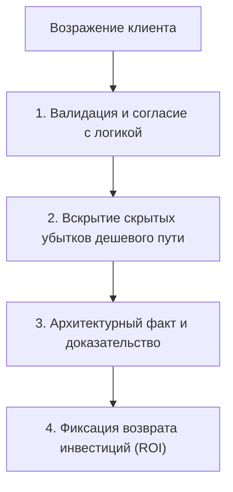

# СТРАТЕГИЧЕСКИЙ ФУНДАМЕНТ И ЭКОНОМИЧЕСКОЕ ОБОСНОВАНИЕ ПРОЕКТА (ROI)
## Цифровой флагман текстильного дома MARÉ Decorative Studio (Астана)

> **Документ:** Strategic Commercial Rationale, Financial ROI Model & Pitch Architecture  
> **Роль:** Luxury Sales Strategist & Commercial Pitch Architect  
> **Клиент:** Владелица студии MARÉ Decorative Studio (Maison Poisson) · Топ-50 мировых декораторов, 12 лет на рынке, собственный цех 350 м² в Астане  
> **Целевой статус:** Главный инструмент защиты бюджета проекта (2.5–4.8 млн ₸ / 500–950 тыс. ₽) на очной встрече с собственницей бизнеса  

---

## ОГЛАВЛЕНИЕ
1. [Психологический портрет клиента, скрытые боли и драйверы](#1-психологический-портрет-клиента-скрытые-боли-и-драйверы)
2. [Экономическое обоснование инвестиций и финансовая модель ROI](#2-экономическое-обоснование-инвестиций-и-финансовая-модель-roi)
3. [Убийцы возражений (Battlecard: Ironclad Objection Handling)](#3-убийцы-возражений-battlecard-ironclad-objection-handling)
4. [Матрица сравнения 3-х форматов разработки (Трудозатраты 155–225 часов)](#4-матрица-сравнения-3-х-форматов-разработки-трудозатраты-155225-часов)
5. [8 Ключевых продающих тезисов (Killer Value Propositions) для питча](#5-8-ключевых-продающих-тезисов-killer-value-propositions-для-питча)

---

# 1. Психологический портрет клиента, скрытые боли и драйверы

### 1.1. Психологический профиль и когнитивный диссонанс основательницы

Основательница MARÉ — не рядовой предприниматель и не владелец типовой торговой точки. Это признанный мастер с 12-летним непрерывным стажем, входящий в **топ-50 международных интерьерных декораторов**, обладающий собственным прецизионным производственным комплексом 350 м² в Астане с немецким оборудованием *Dürkopp Adler*. 

Однако в текущей точке развития бизнеса владелица переживает острый **когнитивный диссонанс**:
* **Внутренняя реальность:** Высочайшая квалификация, пошив для дипломатических резиденций, закрытых вилл и пентхаусов, прямые контракты с фабриками Бельгии, Италии и Франции (*Loro Piana, Dedar*), умение решать сложнейшие архитектурные задачи при высоте потолков до 7 метров.
* **Внешняя репрезентация:** Устаревший цифровой образ, не транслирующий масштаб бизнеса, рискующий свести восприятие бренда к банальному «салону штор с цветочками», который вынужден конкурировать по цене с рыночными павильонами и надомными швеями.

```
┌───────────────────────────────────────────────────────────────────────────┐
│                     ПСИХОЛОГИЧЕСКИЙ РАЗРЫВ ОСНОВАТЕЛЬНИЦЫ                 │
├─────────────────────────────────────┬─────────────────────────────────────┤
│ КТО ОНА НА САМОМ ДЕЛЕ (РЕАЛЬНОСТЬ) │ КАК ЕЕ РИСКУЕТ ВОСПРИНИМАТЬ РЫНОК   │
├─────────────────────────────────────┼─────────────────────────────────────┤
│ • Топ-50 декораторов мира           │ • «Очередной салон штор»            │
│ • Собственный цех 350 м² (Германия) │ • «Швеи, которые берут на дом»      │
│ • Прямой импорт шенилла и шелка     │ • «Перекупщики турецких тканей»     │
│ • Архитектура света и акустика      │ • «Тряпочки с цветочками под обои»  │
│ • Чек на виллу: 8–15 млн ₸          │ • Торг за каждый метр и скидку 5%   │
└─────────────────────────────────────┴─────────────────────────────────────┘
```

---

### 1.2. Анатомия 4-х ключевых болей основательницы

#### Боль №1: Панический страх остаться в парадигме «салона штор с цветочками»
* **Контекст:** Предыдущий 12-летний опыт студии ассоциировался с локальным названием и цветочной айдентикой, привлекавшей типовых розничных заказчиков с запросами «пошейте тюль на кухню за 40 000 ₸».
* **Психологический триггер:** Смена символики на **Рыбу (Maison Poisson / MARÉ)** — это выстраданный манифест перехода в высшую лигу интерьерного кутюра. Владелица панически боится сделать сайт, который будет выглядеть дешево, шаблонно или «как у всех». 
* **Стратегический ответ:** Цифровой флагман проектируется не как интернет-магазин гардин, а как **интерактивная галерея архитектуры света** в эстетике *2026 Liquid Glass* и глубокого обсидиана (`#0B0C0E`), где пластика плавников благородных рыб рифмуется с падением складок бельгийского шенилла.

#### Боль №2: Травматичный опыт конкурентов — «Ловушка Yurta Interiors»
* **Контекст:** Владелица внимательно следит за рынком Астаны и видела кейс конкурента — *Yurta Interiors*. Они вложили существенные бюджеты в модную визуализацию, но получили неработающий инструмент.
* **В чем ошибка Yurta Interiors:**
  1. *Визуальный нарциссизм и отрыв от продукта:* Летающие ковры в пустыне, океанские волны в степи, абстрактная графика, не объясняющая, что конкретно продается.
  2. *Технический паралич:* Время первой загрузки достигало 10–12 секунд. На смартфонах состоятельных клиентов сайт зависал, вызывая раздражение.
  3. *Нулевая коммерческая отдача:* Сайт получил лайки дизайнеров, но не сгенерировал реальных продаж крупным заказчикам.
* **Стратегический ответ:** MARÉ берет кинематографическую чувственность, но упаковывает ее в **Apple-grade оптимизацию** (60 FPS скраббинг видео размером до 4.5 МБ, мгновенный отклик, понятные сценарии заказа без абстрактной шелухи).

#### Боль №3: «Ловушка розничной рутины» и жажда чеков 5–15 млн ₸
* **Контекст:** Обслуживание мелких розничных заказов выжигает команду, загружает цех низкомаржинальной работой и приводит к кассовым разрывам в межсезонье.
* **Драйвер роста:** В Астане строятся масштабные частные объекты: коттеджные поселки *BI Village (Deluxe, Comfort)*, *Караоткель*, *Family Village*, пентхаусы в *Talan Towers Apartments*, *Akbulak Riviera*, *Sensata Park*. Остекление одного такого объекта требует от 12 до 35 оконных проемов с высотой до 6.5 метров. Чек составляет **от 8 до 15 млн ₸**.
* **Стратегический ответ:** Сайт становится строгим фильтром. Через презентацию текстиля Loro Piana, Dedar, лазерного раскроя и узлов скрытого монтажа флагман говорит на языке состоятельных собственников и топ-архитекторов, отсекая нецелевой трафик.

#### Боль №4: Потеря партнерской базы архитекторов и хаос выплат
* **Контекст:** 90% элитных объектов закладываются на стадии «голого бетона», когда архитектор делает 3D-визуализацию. Ранее дизайнеры приводили клиентов за 10% вознаграждения, но из-за отсутствия прозрачной системы учет велся в Excel и блокнотах, выплаты задерживались, а дизайнеры боялись передавать прямой контакт заказчика.
* **Стратегический ответ:** Внедрение **Закрытого Клуба Архитекторов с протоколом «Защиты Объекта» на 180 дней**, 3D/BIM-моделями для рендеров и гарантированным сплит-графиком выплат 50/50.

---

# 2. Экономическое обоснование инвестиций и финансовая модель ROI

### 2.1. Аксиома окупаемости: «1 Вилла = 100% Возврат Инвестиций»

Главный аргумент для собственника бизнеса с 12-летним стажем — не «пиксели и анимации», а **чистая математика возврата капитала (ROI)**.

Стоимость создания премиального цифрового флагмана силами бутиковой студии составляет **3 500 000 ₸** (эквивалент ~700 000 ₽).

#### Финансовая анатомия одного контракта на виллу в Астане:
* **Локация:** Коттеджный поселок *BI Village Deluxe* (площадь 450 м², 18 оконных групп, включая 2 витража со «вторым светом» высотой 6.2 м).
* **Спецификация:** 
  - Гостиная и столовая: Бельгийский шенилл в складке «Волна» 1:2.0 на электрокарнизах Somfy.
  - Мастер-спальня и детские: 100% блэкаут на сатиновой основе + лионский шелк.
  - Римские шторы с механизмами Coulisse в санузлах и зоне кухни.
  - Авторские спальные ансамбли (покрывала со стежкой, подушки-компаньоны).
* **Сумма договора с заказчиком:** **10 500 000 ₸**.
* **Структура себестоимости MARÉ (собственный цех, прямой импорт тканей):**
  - Закупка тканей и фурнитуры (Бельгия, Франция, Somfy): 4 200 000 ₸ (40%).
  - Оплата раскроя, пошива цеха и монтажа: 1 260 000 ₸ (12%).
  - Логистика и накладные расходы: 525 000 ₸ (5%).
  - Партнерский бонус архитектора (10%): 1 050 000 ₸ (10%).
  - **ИТОГО себестоимость:** 7 035 000 ₸ (67%).
* **Чистая прибыль студии с одной сделки (маржа 33–38%):** **3 465 000 ₸**.

```
┌───────────────────────────────────────────────────────────────────────────┐
│              ФОРМУЛА ОКУПАЕМОСТИ ЦИФРОВОГО ФЛАГМАНА MARÉ                  │
├───────────────────────────────────────────────────────────────────────────┤
│                                                                           │
│   ИНВЕСТИЦИЯ В РАЗРАБОТКУ:           3 500 000 ₸                          │
│   ЧИСТАЯ ПРИБЫЛЬ С 1-Й ВИЛЛЫ:        3 465 000 ₸                          │
│                                                                           │
│   ИТОГ:  ПРОЕКТ ОКУПАЕТСЯ НА 99% С ОДНОГО ЗАКРЫТОГО ОБЪЕКТА.              │
│          КАЖДЫЙ ПОСЛЕДУЮЩИЙ ОБЪЕКТ — ЧИСТАЯ ПРИБЫЛЬ И КАПИТАЛИЗАЦИЯ.      │
│                                                                           │
└───────────────────────────────────────────────────────────────────────────┘
```

> **Вывод для клиента:** Вы не «тратите деньги на разработку сайта». Вы инвестируете стоимость прибыли с **одного единственного дома**, чтобы получить инфраструктуру, которая будет системно привлекать десятки таких домов в течение следующих 3–5 лет.

---

### 2.2. Сравнительная воронка конверсии: Tilda vs Цифровой флагман MARÉ

Рассмотрим работу двух цифровых моделей при одинаковом рекламном трафике в Астане (2 500 целевых переходов в месяц: таргетинг на жителей ЖК Highvill, Sensata, BI Village + контекст по запросам «шторы на заказ Астана», «электрокарнизы Somfy»).

| Показатель воронки | Шаблонный сайт на Tilda (300 000 ₸) | Цифровой флагман MARÉ (3 500 000 ₸) | Разница / Бизнес-эффект |
| :--- | :--- | :--- | :--- |
| **Целевой трафик в месяц** | 2 500 визитов | 2 500 визитов | Одинаковый рекламный бюджет |
| **Отказы (Bounce Rate)** | 58% (уходят в первые 5 сек) | 18% (высокое удержание видеорядом) | **В 3.2 раза ниже потери трафика** |
| **Конверсия в заявку (CR)** | **0.8%** | **3.8%** | **Рост конверсии в 4.75 раза** |
| **Всего входящих лидов** | 20 заявок | 95 заявок | +75 потенциальных клиентов/мес |
| **Качество лидов** | 80% — эконом-сегмент («почем тюль?») | 65% — VIP частники и B2B/Архитекторы | Фильтрация позиционированием |
| **Квалифицированные лиды (от 3 млн ₸)** | 4 заявки | 38 заявок | **В 9.5 раз больше целевых клиентов** |
| **КЭВ (Выезд с чемоданом тканей)** | 2 выезда (люди сомневаются) | 19 выездов (высокое доверие к бренду) | Продажа на объекте через тактильность |
| **Закрытые сделки в месяц** | **0.5 сделки** (1 договор в 2 месяца) | **4 сделки в месяц** | **Рост продаж в 8 раз** |
| **Средний чек сделки** | 1 500 000 ₸ | 6 500 000 ₸ | Клиенты заказывают комплексные сеты |
| **Месячная выручка** | 750 000 ₸ | 26 000 000 ₸ | +25 250 000 ₸ к обороту |
| **Годовая выручка направления** | **9 000 000 ₸** | **312 000 000 ₸** | **Разница более 300 млн тенге в год** |

#### Почему конверсия флагмана в 4.75 раза выше?
1. **Интерактивный симулятор света (2700K / 4000K / 6000K):** Клиент в реальном времени видит, как ткань ведет себя под лучами палящего астанинского солнца и как работает блэкаут. Это мгновенно снимает возражение «зачем переплачивать за плотную подкладку».
2. **Голосовой консьерж:** Занятому клиенту не нужно заполнять анкеты. Достаточно сказать: *«Гостиная, шенилл, Бельгия»* — и через 2 секунды предварительное КП готово.
3. **Бесшовный переход в WhatsApp:** Заявка падает менеджеру не «пустым лидом», а готовым структурированным ТЗ с указанием метража, ткани и типа складки.

---

### 2.3. LTV и партнерская воронка: Долгосрочная капитализация

Один привлеченный через портал архитектор ведет от 3 до 8 объектов в год.
* Если благодаря разделу **«Designer Club»** студия привлекает и удерживает всего **10 системных архитекторов Астаны**:
* 10 архитекторов × 4 объекта в год = **40 элитных объектов**.
* 40 объектов × 7 000 000 ₸ средний чек = **280 000 000 ₸ годового партнерского оборота**.
* Без цифрового портала эти архитекторы уходят к конкурентам, которые быстрее выдают 3D-модели и платят кэшбек без задержек.

---

# 3. Убийцы возражений (Battlecard: Ironclad Objection Handling)

Данный раздел представляет собой тактическое руководство для проведения переговоров с владелицей студии. Каждое возражение разбирается по формуле: **Принятие позиции → Скрытая угроза дешевого решения → Неоспоримый факт → Перевод в финансовую выгоду**.



---

### Возражение 1: «Почему так дорого? Фрилансер на Tilda сделает за 300 000 ₸»

* **Ошибочная логика клиента:** *«Сайт — это просто визитка с картинками. Зачем платить 3.5 млн ₸, если фрилансер соберет красивую страницу на конструкторе за 2 недели?»*

* **Скрипт отработки:**
> «Вы абсолютно правы: если бы задача заключалась в том, чтобы просто выложить фотографии штор и написать номер телефона, 300 000 ₸ на Тильде было бы более чем достаточно. Но давайте посмотрим на это глазами владельца пентхауса в Talan Towers или резиденции в BI Village Deluxe.
> 
> Человек только что вложил в отделку 150 миллионов тенге. Он открывает сайт на Тильде. Что он видит? Типовую сетку, стандартные кнопки, дергающийся скролл и шаблонные блоки, которые он вчера видел на сайте доставки пиццы или курсов маникюра. На подсознательном уровне у него срабатывает триггер: *'Это мелкий посредник, кустарное ателье, которое экономит на себе'*. В ту же секунду вы теряете контракт на 10 000 000 ₸.
> 
> Фрилансер на Тильде не способен запрограммировать:
> 1. Кинематографический видео-скраббинг 60 FPS, где ткань оживает под пальцем клиента.
> 2. Математический калькулятор складок (коэффициенты 1:2.0 и 1:2.5, технологический припуск, расчет высот до 7 метров).
> 3. B2B-конфигуратор с выделением казахстанского НДС 12% и генерацией спецификаций за 60 секунд.
> 4. Голосовой ввод, избавляющий VIP-клиента от необходимости печатать текст.
> 
> Сэкономив 3.2 млн ₸ на разработке, вы потеряете от 30 до 50 млн ₸ чистой прибыли за год, потому что крупная рыба просто проплывет мимо.»

---

### Возражение 2: «А не будет ли это слишком сложно для клиентов? Наши люди любят простоту»

* **Ошибочная логика клиента:** *«Все эти технологии, видео, калькуляторы и искусственный интеллект отпугнут людей. Клиенту нужно просто позвонить»*.

* **Скрипт отработки:**
> «Золотой закон эргономики Apple гласит: **'Сложнейшая инженерная система под капотом ради предельной элементарности на кончиках пальцев'**.
> 
> Почему старые сайты сложны? Потому что там заставляют заполнять анкеты из 20 полей: имя, фамилия, город, тип карниза, глубина ниши, ткань, подкладка... Богатый человек из Астаны закрывает такую страницу через 5 секунд — у него нет на это времени.
> 
> Как работает наш флагман?
> 1. Клиент видит две понятные двери: **'Частные резиденции'** или **'Для бизнеса'**. Никакой путаницы.
> 2. Вместо заполнения форм — **одна кнопка микрофона**. Клиент говорит в телефон: *'Гостиная, шенилл, Бельгия'*. Система мгновенно распознает голос, выбирает нужные параметры и рассчитывает ориентир сметы.
> 3. Нажатие одной кнопки — и клиент уже в вашем WhatsApp. Причем ему даже не нужно печатать сообщение: в чат автоматически подставляется вежливый структурированный запрос.
> 
> Это не сложность. Это высший уровень сервиса, который клиент встречает в отелях уровня The Ritz-Carlton. Мы забираем всю сложность на программный код, оставляя клиенту ощущение абсолютной легкости.»

---

### Возражение 3: «Зачем нам B2B и НДС 12% на сайте штор? Мы же про текстильный уют»

* **Ошибочная логика клиента:** *«Мы шьем шторы для красивых домов. Зачем нам связываться со сложными корпоративными бумагами, тендерами и налогами?»*

* **Скрипт отработки:**
> «Астана — это уникальный город, административное и финансовое сердце Казахстана. Здесь сосредоточены министерства, национальные холдинги («Самрук-Қазына», «Байтерек»), головные офисы банков, штаб-квартиры МФЦА и иностранные посольства. 
> 
> В этих структурах текстилем и солнцезащитой занимаются не домохозяйки, а начальники административно-хозяйственных отделов (АХО), главные инженеры проектов (ГИПы) и корпоративные архитекторы. 
> 
> Они физически и юридически **не имеют права** перевести деньги на Kaspi Gold или работать с ИП без НДС. Если у вас на сайте нет:
> - Четкого указания на **ТОО с НДС 12%** (чтобы корпорация взяла налог в зачет);
> - Сертификатов пожарной безопасности МЧС РК класса **КМ1 (негорючие ткани Trevira CS)**;
> - Готовности закрывать сделки формами **Р-1, КС-2 и КС-3**;
> 
> ...то для них вашей компании просто не существует. Вы добровольно отдаете контракты на 15–30 млн ₸ турецким или российским подрядчикам. Раздел B2B позиционирует вас как генерального контрактного подрядчика столицы, открывая доступ к 60% бюджетов города.»

---

### Возражение 4: «Зачем нужен голосовой консьерж и симулятор освещения?»

* **Ошибочная логика клиента:** *«Это просто модные игрушки. Поиграются и забудут. Какая от них реальная польза продажам?»*

* **Скрипт отработки:**
> «Это не игрушки. Это два мощнейших инструмента конверсии, разработанных специально под климатические и поведенческие реалии Астаны:
> 
> 1. **Симулятор освещения (2700K / 4000K / 6000K):**
>    В Астане экстремальное солнце: летом рассвет наступает в 04:30 утра, а на 20-м этаже новостройки панорамные окна превращают комнату в раскаленную теплицу. Когда клиент двигает ползунок времени суток и видит, как ткань на экране реально блокирует ультрафиолет и сохраняет приватность, у него отпадает вопрос: *'Почему этот блэкаут стоит 28 000 ₸ за метр, а не 8 000 ₸'*. Симулятор продает дорогой текстиль визуально, без давления менеджера.
> 
> 2. **Голосовой консьерж:**
>    85% вашей целевой аудитории заходят на сайт за рулем автомобиля или между встречами со смартфона. Печатать текст на ходу неудобно. Надиктовать голосом параметры за 4 секунды — это восторг, который формирует вау-эффект и выделит MARÉ среди абсолютно всех конкурентов в Казахстане. Ни у кого в СНГ нет такого инструмента в текстильной сфере.»

---

# 4. Матрица сравнения 3-х форматов разработки

### 4.1. Декомпозиция трудозатрат проекта (Норматив: 185 рабочих часов)

Проект подобного уровня сложности требует строгой инженерной и творческой работы, разделенной на 5 ключевых спринтов:

```
┌───────────────────────────────────────────────────────────────────────────┐
│              ДЕКОМПОЗИЦИЯ РАБОЧИХ ЧАСОВ (ИТОГО: 185 ЧАСОВ)                │
├─────────────────────────────────────────────────────────────┬─────────────┤
│ НАПРАВЛЕНИЕ И ОБЪЕМ РАБОТ                                   │ ЧАСЫ        │
├─────────────────────────────────────────────────────────────┼─────────────┤
│ 1. Аналитика, B2C/B2B бизнес-логика, CJM, Legal РК          │ 25 часов    │
│ 2. Арт-дирекшн, видео-скраббинг 60fps, Anti-AI Slop Tokens  │ 45 часов    │
│ 3. Frontend-инженерия: PWA, Voice AI, Light Engine, Calc    │ 65 часов    │
│ 4. Backend: CRM Lead Dispatcher, PDF RFP Generator, API     │ 28 часов    │
│ 5. QA, тестирование на устройствах (iOS/Safari), запуск     │ 22 часа     │
└─────────────────────────────────────────────────────────────┴─────────────┘
```

---

### 4.2. Матрица сравнения моделей разработки

| Критерий оценки | Фрилансер-одиночка | Бутиковая студия (MARÉ Flagship) | Сетевой топ-продакшн (AIC, Red Collar) |
| :--- | :--- | :--- | :--- |
| **Стоимость (₸ / ₽)** | 1.2–2.2 млн ₸<br>*(250–450 тыс. ₽)* | **2.5–4.8 млн ₸ (Оптимум: 3.5 млн ₸)**<br>*(500–950 тыс. ₽)* | 6.0–12.5+ млн ₸<br>*(1.2–2.5+ млн ₽)* |
| **Сроки реализации** | 2–4 месяца (риск срыва) | **4–6 недель (жесткий спринт)** | 4–7 месяцев (длинные согласования) |
| **Состав команды** | 1 универсал (сам верстает, сам рисует) | Арт-директор, Senior Frontend, UX/Analyst | 12+ человек (аккаунты, продюсеры, джуны) |
| **Арт-дирекшн и дизайн** | Шаблоны Figma, риск «AI-slop» | **Кутюрный уровень, Liquid Glass, Awwwards-стандарт** | Премиальный фестивальный дизайн |
| **Инженерное качество** | Конструктор (Tilda/Webflow) или сырой код | **Чистый Vanilla JS / PWA / 60 FPS / Легковесность** | Сложный фреймворк (React/Next.js/Three.js) |
| **Специфика рынка Астаны** | Не знает реалий ЖК, НДС 12%, норм МЧС | **Глубокое понимание рынка Астаны, элитки и B2B** | Московский/глобальный оторванный контекст |
| **CRM и WhatsApp шлюзы** | Базовые формы на почту | **Сквозная интеграция с CRM, готовые WhatsApp ТЗ** | Интеграция с Enterprise CRM (доп. плата) |
| **Гарантия и SLA** | До первой оплаты (может пропасть) | **12 месяцев гарантии, SLA 48 часов, исходники** | 3–6 месяцев гарантии по договору |
| **Вердикт для клиента** | **ОПАСНО ДЛЯ РЕПУТАЦИИ:** Риск потерять деньги и получить дешевую поделку. | **ЗОЛОТАЯ СЕРЕДИНА:** Максимальная бизнес-отдача, гарантия сроков и окупаемость с 1 виллы. | **НЕОПРАВДАННЫЙ ОВЕРПРАЙС:** 60% стоимости — оплата имени и офиса агентства. |

---

# 5. 8 Ключевых продающих тезисов (Killer Value Propositions) для питча

Эти 8 тезисов предназначены для произнесения на встрече с владелицей студии. Они выстроены в логике «Проблема → Наше решение → Конкретная финансовая выгода».

---

### ТЕЗИС 01 // ОКУПАЕМОСТЬ С ОДНОГО ДОМА
* **Формулировка:** «Этот проект окупается полностью ровно с одной остекленной виллы в BI Village или одного пентхауса в Talan Towers».
* **Аргументация:** Инвестиция в разработку составляет 3.5 млн ₸. Средний чек на текстильное оформление загородной резиденции в Астане — 8–15 млн ₸ с чистой прибылью студии 3.5–5 млн ₸. Всего одна закрытая сделка через новый флагман возвращает 100% вложенного капитала.
* **Триггер для клиента:** Безопасность инвестиций и отсутствие финансового риска.

---

### ТЕЗИС 02 // ЛИКВИДАЦИЯ КЛЕЙМА «САЛОНА ШТОР С ЦВЕТОЧКАМИ»
* **Формулировка:** «Мы навсегда выводим MARÉ из категории 'швейных точек' в статус Международного Архитектурного Дома Света».
* **Аргументация:** 12 лет безупречного опыта и статус топ-50 декораторов мира обесцениваются, если сайт выглядит как шаблонный каталог. Новый флагман в эстетике глубокого обсидиана, шелка и символа Золотой Рыбы закрепляет за брендом статус безоговорочного лидера luxury-сегмента Казахстана.
* **Триггер для клиента:** Гордость за свой бренд, уважение коллег и высокий статус в профессиональной среде.

---

### ТЕЗИС 03 // АНТИДОТ ПРОТИВ «ОШИБКИ YURTA INTERIORS»
* **Формулировка:** «Мы берем кинематографическую эстетику Awwwards-уровня, но исключаем 10-секундный паралич загрузки конкурентов: всё работает со скоростью iPhone».
* **Аргументация:** Сайты конкурентов перегружены бессмысленными летающими коврами и океанами, которые тормозят и не продают. Мы создаем видео-скраббинг ткани 60 FPS весом всего 4.5 МБ с мгновенной загрузкой на любом смартфоне. Клиент видит реальный продукт с первой секунды.
* **Триггер для клиента:** Превосходство над прямыми конкурентами за счет идеального баланса красоты и коммерческой точности.

---

### ТЕЗИС 04 // КЛЮЧ К 60% ДЕНЕГ СТОЛИЦЫ: B2B-ДИВИЗИОН С НДС 12%
* **Формулировка:** «'Вторая дверь' сайта открывает доступ к бюджетам министерств, дипломатических миссий и офисов класса 'А' на десятки миллионов тенге».
* **Аргументация:** В Астане колоссальные корпоративные деньги, но они требуют официального языка: ТОО с НДС 12%, сертификаты негорючести МЧС РК (КМ1 / Trevira CS), акты КС-2/КС-3 и автоматику Somfy. Флагман позиционирует MARÉ как надежного генерального подрядчика для первых лиц.
* **Триггер для клиента:** Масштабирование бизнеса и защита от сезонных спадов розничного спроса.

---

### ТЕЗИС 05 // ГОЛОСОВОЙ КОНСЬЕРЖ: ЛИКВИДАЦИЯ БАРЬЕРА 20 ПОЛЕЙ
* **Формулировка:** «Клиенту больше не нужно печатать параметры — он говорит одну фразу в микрофон, и смета готова за 2 секунды».
* **Аргументация:** Состоятельные люди в Астане постоянно заняты. Им лень заполнять длинные опросники. Возможность сказать: *'Детская, шенилл, Бельгия'* и получить расчет создает невероятный вау-эффект премиального обслуживания.
* **Триггер для клиента:** Внедрение передовых технологий, которых нет ни у кого из конкурентов в СНГ.

---

### ТЕЗИС 06 // ИНТЕРАКТИВНЫЙ СИМУЛЯТОР СВЕТА КАК НЕВИДИМЫЙ ПРОДАВЕЦ
* **Формулировка:** «Симулятор солнца Астаны наглядно объясняет ценность блэкаута и дорогого текстиля без единого слова менеджера».
* **Аргументация:** Клиент интерактивно меняет время суток и цветовую температуру (2700K–6000K), видя, как палящее солнце столицы нейтрализуется плотным плетением европейского текстиля. Продукт продает сам себя за счет демонстрации решения реальной боли.
* **Триггер для клиента:** Сокращение цикла сделки и снятие возражений по высокой цене метра ткани.

---

### ТЕЗИС 07 // 140 АРХИТЕКТОРОВ АСТАНЫ В КАЧЕСТВЕ ВЕЧНОГО ОТДЕЛА ПРОДАЖ
* **Формулировка:** «Закрытый Клуб Архитекторов с 3D-моделями и защитой объектов на 180 дней устраняет хаос старой реферальной схемы».
* **Аргументация:** Архитекторы больше не боятся передавать контакты клиентов. Они получают юридическую фиксацию 10% вознаграждения, прозрачные выплаты 50/50, готовые 3D-модели для 3ds Max/Corona и сервис экспресс-доставки чемодана образцов за 24 часа.
* **Триггер для клиента:** Автоматизация партнерской сети и гарантированный поток заказов еще на этапе бетонных стен.

---

### ТЕЗИС 08 // СОБСТВЕННЫЙ ЦИФРОВОЙ АКТИВ ВМЕСТО АРЕНДЫ ЧУЖОГО КОНСТРУКТОРА
* **Формулировка:** «Вы инвестируете в независимый капитализируемый актив студии, а не сажаете бизнес на ежемесячную иглу конструкторов».
* **Аргументация:** Сайт на Tilda или Bitrix — это чужая арендная платформа с постоянными абонентскими платежами, риском блокировок и ограничениями кода. Цифровой флагман MARÉ пишется на чистом, легковесном коде, передается в полную собственность со всеми исходниками и работает на капитализацию стоимости компании.
* **Триггер для клиента:** Собственническое мышление, надежность и долгосрочная безопасность бизнеса.

---

```
┌───────────────────────────────────────────────────────────────────────────┐
│              РЕЗЮМЕ КОММЕРЧЕСКОГО ПРЕДЛОЖЕНИЯ ДЛЯ ВЛАДЕЛИЦЫ               │
├───────────────────────────────────────────────────────────────────────────┤
│ • СТОИМОСТЬ РЕАЛИЗАЦИИ ПОД КЛЮЧ:    3 500 000 ₸ (~700 000 ₽)             │
│ • НОРМАТИВНЫЙ ОБЪЕМ РАБОТ:          185 рабочих часов                    │
│ • СРОК ЗАПУСКА:                     5 календарных недель                 │
│ • ТОЧКА БЕЗУБЫТОЧНОСТИ:             1 закрытый контракт на виллу         │
│ • ПРОГНОЗИРУЕМЫЙ ПРИРОСТ ВЫРУЧКИ:   +250–300 млн ₸ в годовом выражении   │
└───────────────────────────────────────────────────────────────────────────┘
```
