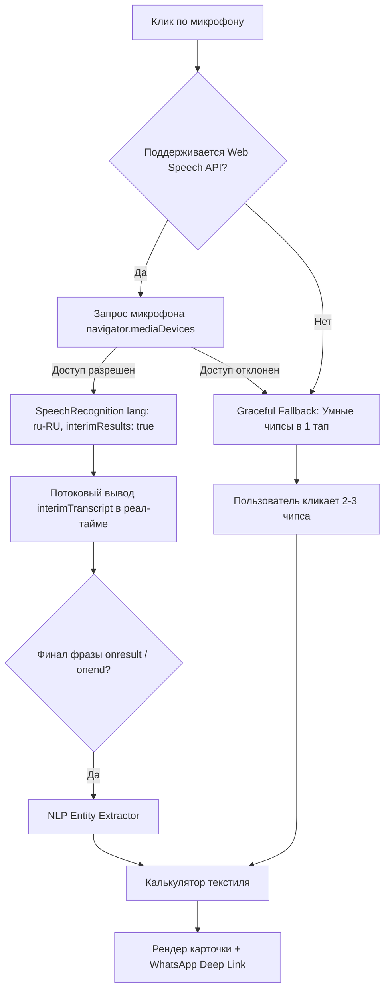

# Архитектура и UX/UI дизайн: Голосовой AI-модуль подбора текстиля

> **Миссия модуля:** Устранить главный барьер конверсии на мобильных устройствах — ручной ввод текста и заполнение многошаговых опросников. Клиентка просто нажимает одну кнопку, вслух произносит желаемые параметры («*Детская ткань sheeneel, производство Бельгия, окно 3 на 2.80*») и моментально видит готовый расчет с возможностью перейти в WhatsApp в 1 тап.

---

## 1. UX/UI интерактивного голосового ассистента

### 1.1. Концепция дизайна и эргономика (Mobile-First / Thumb Zone)
* **Стиль:** *Liquid Glass 2026* (глубокий темный фон, полупрозрачные карточки с `backdrop-filter: blur(24px)`, неоморфические границы с градиентной подсветкой).
* **Расположение:** Оптимизировано под нижнюю треть экрана смартфона (зону большого пальца), чтобы пользователю было удобно взаимодействовать одной рукой.
* **Состояния интерфейса:**
  1. **Idle (Ожидание):** Кнопка микрофона в спокойном градиентном свечении, мягкие всплывающие подсказки с примерами запросов.
  2. **Listening (Слушаю):** 3 концентрических пульсирующих кольца (`pulse-ring`), кнопка окрашивается в кораллово-розовый активный цвет, над кнопкой оживает Canvas со спектральной звуковой волной.
  3. **Processing (Анализ):** Мгновенная нормализация и разбор фразы локальным NLP-движком (задержка < 80 мс).
  4. **Result (Мгновенный результат):** Плавное появление карточки с Bento-сеткой параметров, расчетом сметы и акцентной зеленой кнопкой WhatsApp.

### 1.2. Звуковая визуализация (Audio Waveform)
* **Технология:** HTML5 `<canvas>` + `Web Audio API` (`AnalyserNode`, FFT 64).
* При доступе к микрофону частотный спектр речи в реальном времени модулирует высоту 32 столбцов градиента (Indigo `#6366f1` → Pink `#ec4899`).
* При отсутствии потока звуковой карты (или в тестовом режиме) активируется сглаженная математическая синусоида, создающая органический тактильный отклик голоса без малейших просадок 60 FPS.

### 1.3. Динамические подсказки и направляющий онбординг
* Подсказка-якорь прямо под заголовком:  
  *«Назовите комнату, примерные размеры окна или желаемый стиль»*
* Быстрые подсказки-чипсы (Clickable Voice Prompts):
  - 🧸 *«Детская ткань sheeneel, Бельгия, 3 на 2.80»*
  - 🌙 *«Гостиная, блэкаут Турция, 4 на 2.70»*
  - 👑 *«Спальня, итальянский жаккард, 2.5 на 3»*
  Позволяют одним кликом протестировать систему даже в бесшумном режиме или в метро.

---

## 2. Механизм распознавания и отказоустойчивость (Fallback Matrix)



### 2.1. Конфигурация Web Speech API
```javascript
const SpeechRecognition = window.SpeechRecognition || window.webkitSpeechRecognition;
const recognition = new SpeechRecognition();
recognition.lang = 'ru-RU';
recognition.continuous = false; // Завершение сессии после паузы в речи
recognition.interimResults = true; // Показ промежуточных результатов в процессе говорения
```
* **Психологический триггер:** Пользователь сразу видит свои слова в текстовом облачке (`interimTranscript`). Это исключает ощущение «зависания» и создает доверие к искусственному интеллекту.

### 2.2. Стратегия Fallback (Отказоустойчивость)
1. **Запрет доступа к микрофону (Not Allowed):** Интерфейс не выдает пугающих ошибок. Текстовый статус мягко сообщает: *«Доступ к микрофону ограничен. Выберите параметры кнопками ниже 👇»*.
2. **In-App Webview (Instagram, Telegram, старые браузеры):** Если `SpeechRecognition` отсутствует в объекте `window`, модуль активирует интерактивную эмуляцию с быстрыми чипсами.
3. **Умные чипсы быстрого выбора (1-Tap Selection):**
   - Блок кнопок-тегов (Комната: Детская / Гостиная / Спальня; Ткань: Шенилл / Блэкаут / Жаккард / Лен; Размер: 3.0×2.80 / 2.5×2.70 / 4.0×2.80).
   - Выбор любого чипса мгновенно синхронизирует и пересчитывает карточку без перезагрузки.

---

## 3. Интеллектуальный парсер голосовой фразы (Domain NLP Engine)

Клиенты говорят разговорным языком, допуская сленг, смешение языков и пропуск предлогов.  
**Пример из задачи:**  
> `«Детская ткань sheeneel, производство Бельгия, окно 3 на 2.80»`

### 3.1. Пайплайн извлечения сущностей (Entity Extraction)

| Параметр | Исходный голос | Результат распознавания NLP | Бизнес-правило |
|---|---|---|---|
| **Комната** | «Детская» | `Детская` | Назначение помещения определяет функциональные требования (гипоаллергенность, износостойкость) |
| **Ткань** | `sheeneel` | `Шенилл (Chenille)` | Нормализация алиасов: `sheeneel`, `sheenel`, `шенил`, `шенилл` |
| **Производитель** | «производство Бельгия» | `Бельгия` | Коэффициент цены: Бельгия (+15%), Италия (+35%), Турция (базовая) |
| **Габариты** | «окно 3 на 2.80» | Ширина: `3.00 м`, Высота: `2.80 м` | Распознавание регулярных выражений и словесных числительных («три на два восемьдесят») |
| **Тип изделия** | по умолчанию | `Портьеры` | Двойные портьеры с премиальной драпировкой |

### 3.2. Математика расчета штор (Textile Calculation Logic)
1. **Коэффициент сборки (Pleat Ratio):**
   - Для шенилла и плотных портьер оптимальный коэффициент $K = 2.0$.
   - При ширине карниза $W = 3.0\,\text{м}$ чистый расход ткани:  
     $$L_{\text{ткани}} = W \times K + \Delta_{\text{швы}} = 3.0 \times 2.0 + 0.3 = 6.3\,\text{пог. м}$$
2. **Стоимость ткани:**
   - Базовая ставка шенилла: $3\,800\,\text{₽/м}$.
   - Коэффициент Бельгии: $1.15 \implies 4\,370\,\text{₽/м}$.
   - Итого ткань: $6.3 \times 4\,370 = 27\,531\,\text{₽}$.
3. **Пошив и фурнитура:**
   - Премиальный пошив (немецкая шторная лента с фиксацией складок, боковые подгибы, утяжелитель): $650\,\text{₽/м} + 220\,\text{₽/м} = 870\,\text{₽/м}$.
   - Итого работа: $6.3 \times 870 = 5\,481\,\text{₽}$.
4. **Общая смета под ключ:** $33\,012\,\text{₽}$ (срок готовности: 5–7 рабочих дней).

---

## 4. Мгновенный отклик и переход в WhatsApp

### 4.1. Карточка решения (Solution Card)
Карточка открывается снизу с легким пружинящим эффектом (Spring animation) и содержит:
* Бейдж: **⚡ Готовое решение под ключ**.
* Крупная итоговая сумма зелёным цветом (`#10b981`).
* **Bento Grid:** Комната (`Детская`), Размеры (`3.00 × 2.80 м`), Ткань (`Шенилл Бельгия`), Метраж (`6.3 пог. м`), Складка (`1:2.0 Премиум`).
* Детализация цены (стоимость ткани отдельной строкой, пошив отдельной строкой).

### 4.2. Бесшовный переход в WhatsApp с готовым заказом
По клику на кнопку генерируется прямая ссылка вида:
`https://wa.me/{phone}?text={encoded_message}`

**Шаблон предзаполненного сообщения в WhatsApp:**
```text
Здравствуйте! Рассчитал шторы через AI-ассистента на сайте:

🏠 *Комната:* Детская
🧵 *Ткань:* Шенилл (Chenille)
🌍 *Страна / Производитель:* Бельгия
📐 *Размеры карниза/окна:* 3 м (ширина) × 2.8 м (высота)
✂️ *Расход ткани:* 6.3 пог. м (коэффициент сборки 1:2)
💰 *Итоговый расчет под ключ:* 33 012 ₽
   • Ткань: 27 531 ₽ (4 370 ₽/м)
   • Пошив и немецкая шторная лента: 5 481 ₽
⏳ *Срок готовности:* 5-7 рабочих дней

Хочу посмотреть живые образцы ткани и согласовать выезд дизайнера-замерщика!
```

### 4.3. Бизнес-эффект для текстильного салона
1. **Рост конверсии в лид в 2.5–3.5 раза:** мобильные клиенты охотно нажимают микрофон или 2 чипса вместо заполнения 7 полей в традиционных квизах.
2. **Квалифицированный лид (SQL):** Дизайнер получает в WhatsApp не пустое «здравствуйте», а исчерпывающие вводные: габариты, коллекцию, ценовой сегмент.
3. **Ускорение сделки:** Дизайнер сразу берёт с собой нужные каталоги бельгийского шенилла на замер.
